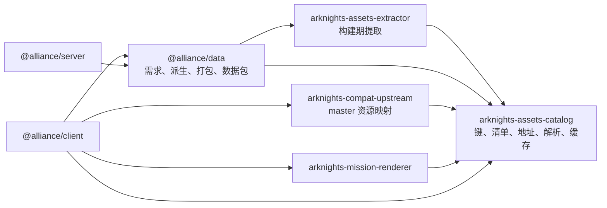
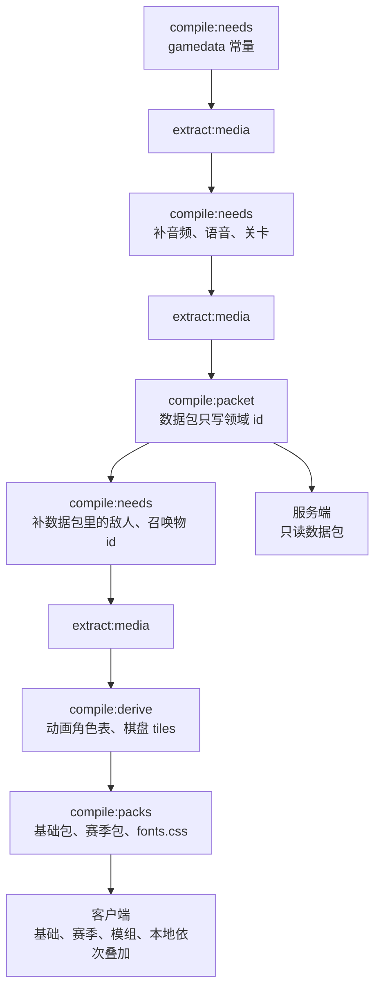

# 资源从哪里来

卫戍协议不自带官方美术与音频。构建时，`app/data` 先算出这一季要用的资源键，交给 [资源提取](../../assets-extractor/index.md) 从社区仓库取回文件，再写出基础包与赛季包两份清单。运行时，客户端用 [资源目录](../../assets-catalog/index.md) 把清单叠成覆盖层，按键加载。

服务端只读取赛季数据包，不读取任何资源清单或媒体文件。

## 包之间的关系



- `assets-catalog` 没有运行时依赖，浏览器与 Node 都能用。
- `assets-extractor` 只被 `app/data` 的构建脚本使用，不进入客户端与服务端的构建产物。
- 明日方舟语义（干员、敌人、语音槽位、赛季）只在 `app/data`；两个资源库只认识键。

## 上游来源

资源全部来自 GitHub 上的社区仓库，每个「仓库@分支」浅克隆一次，只检出用到的目录，见 [来源与传输](../../assets-extractor/02-sources.md)。

| 来源 | 仓库 | 提供 |
| --- | --- | --- |
| `yuanyan` | `yuanyan3060/ArknightsGameResource@main` | 干员头像与立绘、皮肤立绘、敌人与召唤物图标、技能图标、物品与稀有度背景 |
| `fexli` | `fexli/ArknightsResource@main` | 干员、皮肤、召唤物的战斗 Spine |
| `ark-models` | `isHarryh/Ark-Models@main` | 敌人 Spine，以及由敌人充当的召唤物的正面 Spine |
| `arknights-assets` | `ArknightsAssets/ArknightsAssets2@cn` | 职业、阵营、稀有度与精英化图标，战斗通用界面，自走棋界面、表情、引导、加载插画、入口图、陷阱道具图，盟约与羁绊图标 |
| `voice` | `ArknightsAssets/ArknightsAssets2@voice` | 全部音频：语音、BGM、模式音效、通用战斗与界面音效 |
| `fonts` | `TimWangZi/The-font-of-Arknights@master` | Bender 与 Novecento Wide 字体，转为 WOFF2 |
| `gamedata` | `Kengxxiao/ArknightsGameData@master` | `zh_CN/gamedata` 的官方数据表，供数据包编译与需求推导 |

棋盘贴图、网格、材质与 prefab 只存在于官方客户端，没有社区来源。见下文「本机客户端」。

## 流水线

流水线是有向无环图：每一步只读上一步写出的文件。



| 阶段 | 命令 | 输入 | 输出 |
| --- | --- | --- | --- |
| 需求 | `compile:needs` | 研究表、已提取的 gamedata、数据包 | `.cache/needs/base.json`、`season-<id>.json` |
| 提取 | `extract:media` | 全部需求清单 | `.cache/assets/` 下的文件、`catalog.json`、`ledger.json`、`report.json` |
| 数据包 | `compile:packet` | 提取缓存中的 gamedata、`compiler/input/` | `product/season/<id>/*.json` |
| 派生 | `compile:derive` | 原始目录、Spine 侧车、棋盘贴图 | `.cache/derived/` 下的 `json:` 文件与它们的 `catalog.json` |
| 打包 | `compile:packs` | 原始目录、派生目录、`compiler/input/` 的版本 | `product/base/manifest.json`、`fonts.css`、`product/season/<id>/manifest.json` |

三遍 `compile:needs` 与 `extract:media` 的原因见 [编译](./02-compiler.md#流程)：关卡与音频需求要先有 gamedata，敌人与召唤物 id 要先有数据包。三遍共用一个账本，后两遍只写入新增的文件。

`compile:packet` 不读任何媒体文件、原始目录或清单，派生步骤也不写数据包。删除提取缓存中的媒体后，数据包字节不变。

## 命令

在 `app/data/` 内执行，先 `pnpm build`：

```bash
cd app/data
pnpm build
pnpm compile:needs --season act2autochess
pnpm extract:media
pnpm compile:needs --season act2autochess
pnpm extract:media
pnpm compile:packet --season act2autochess
pnpm compile:needs --season act2autochess
pnpm extract:media
pnpm compile:derive --season act2autochess
pnpm compile:packs --season act2autochess
```

- `extract:media` 把 `.cache/needs/` 下的全部清单交给提取器，其余参数原样转交，例如 `--offline`、`--force`、`--refresh-index`、`--proxy <url>`。有必需键缺失时退出码为 1。
- `compile:needs` 默认只取一种语言（中文）的战斗语音槽位；`--voice-lang cn|jp|en|kr` 换语言，`--voice-all` 取该语言的全部槽位；`--full` 另按 gamedata 全表列出全部干员、皮肤、召唤物与敌人，见 [全量基础需求](./02-compiler.md#全量基础需求)。
- `compile:packs` 发现键集合比上一版缩水时失败；确有意删除时加 `--allow-shrink`。

## 基础包与赛季包

键的命名空间决定它进哪一包，键本身不带赛季 id。

| 包 | 内容 | 例子 |
| --- | --- | --- |
| 赛季包 | 这个模式专属的资源 | `image:season/*`、`image:ui/*`、`image:band/*`、`image:bond/*`、`audio:bgm/*`、`audio:sfx/autochess/*`、`json:anim-roles/*`、`json:board/*`、`json:material/*`、`json:prefab/*`、全部 `texture:` 与 `model:` |
| 基础包 | 其余命名空间：不绑定模式、可以复用的资源 | `image:char/*`、`image:skin/*`、`image:enemy/*`、`image:skill/*`、`image:prof/*`、`image:camp/*`、`spine:*`、`audio:voice/*`、`audio:sfx/battle/*`、`audio:sfx/ui/*`、`font:*` |

- 划分写在 `compiler/media/pack/manifest.ts` 的 `SEASON_PREFIXES`。`json:gamedata/*` 只在构建时使用，不进任何包。
- 打包时守卫检查：基础包出现赛季命名空间、或赛季包出现基础命名空间都会失败。
- 基础包的版本是 `<官方资源版本>+r<修订号>`，如 `78.0.0+r1`。官方资源版本来自 gamedata 仓库的 `excel/data_version.txt`，修订号写在 `compiler/input/base/pack.json`。
- 赛季包的版本写在 `compiler/input/season/<id>/pack.json`。
- 字段与示例见 [编译](./02-compiler.md#资源包) 与 [清单](../../assets-catalog/02-schema.md#包清单)。

## 数据包里的资源

- 数据包只写领域 id，不写资源地址或键。客户端经清单的 `refs` 把 id 换成键，例如 `chars.char_002_amiya.avatar` → `image:char/avatar/char_002_amiya`。敌人的 Spine 按敌人记录的 `spine` 查 `enemies[spine].spine`。
- `ResourceStore.refs` 是各层合并后的 `refs`，类型为 `@alliance/data/refs` 的 `ResourceRefs`；某层给已知名字换了形状时，加载失败。
- 精英二头像缺失时回退到精英零头像，由清单条目的 `fallbackId` 表示，解析器沿回退链加载。
- 敌人的 `attackAnim` 是必填字段，值为 `DEFAULT_ATTACK_ANIM`（`null`，定义在 `compiler/packet/record/enemy.ts`）。`mission-core` 在没有动画片段时停顿 0.35 秒，演算结果与此一致。Spine 侧车只供画面使用，不进入数据包。

## 研究表 07-assets.json

`compiler/input/research/07-assets.json` 是 2026-09-27 由工具从上游仓库的 git 树生成的快照，不再重新生成，改动都是手工编辑。

- `compile:needs` 据它判断干员有没有精英二头像与立绘（有才请求 `image:char/avatar/<id>_2`、`image:char/portrait/<id>_2`），并枚举干员、召唤物及其皮肤变体、敌人、物品稀有度、盟约与羁绊（`bonds`、`bands`）以及陷阱道具 id。
- 文件里的上游地址不被构建读取。上游位置只由提取器的适配器规则与路径表给出。

## 本机客户端

棋盘贴图、网格、材质与 prefab 只能从官方客户端提取。`assets-extractor` 的 `pnpm extract:local` 用 Python 与 UnityPy 读取客户端的 AssetBundle，见 [命令](../../assets-extractor/03-command.md#extract-local)。它是可选的，独立于 `extract:media` 运行。

`extract:media` 中这些键没有来源：三张棋盘贴图（`texture:map/autochess/TX_autochessi_*`）记为可选键缺失，出现在 `report.json` 的 `needs.unexplained` 中；`compile:derive` 不写棋盘 tiles，渲染器隐藏三维地形。其余资源照常。

## 目录

```text
app/data/
  compiler/input/
    base/pack.json                      基础包修订号
    season/<id>/pack.json               赛季包版本
    season/<id>/tuning.json             这一季手写的结算配置
    research/                           研究表，含 07-assets.json
  .cache/
    needs/base.json                     基础需求
    needs/season-<id>.json              赛季需求
    assets/                             提取缓存，见下
    derived/catalog.json                派生文件的原始目录
    derived/<address>                   派生 json：json/anim-roles/<id>.json、json/board/<theme>/tiles.json
    build-data-report.json              compile:packet 的报告
  product/
    base/manifest.json                  基础包清单
    base/fonts.css                      字体声明
    season/<id>/manifest.json           赛季包清单
    season/<id>/*.json                  数据包：chess、enemies、waves、config、tuning…
```

提取缓存（`app/data/.cache/assets/`）：

```text
repos/<owner>/<repo>@<branch>/          浅克隆工作区，只检出命中的目录
sources/<sourceId>/                     适配器派生索引的位置
files/<address>                         规范化文件：image/…png、spine/<path>/<name>、audio/…mp3、font/…woff2、json/…json
catalog.json                            原始目录
ledger.json                             文件账本
report.json                             报告
```

## 地址与发布布局

地址只由 `assets-catalog` 的地址模块计算，开发与部署用同一套：

```text
/res/files/<address>?v=<hash 前 12 位>
/res/packs/base/<version>/manifest.json
/res/packs/season/<seasonId>/<contentHash>/manifest.json
/res/packs/mod/<modId>/<version>/manifest.json
/res/local/manifest.json
```

- 文件用可读路径加 `?v=`。基础包与赛季包的 `fileRoot` 都指向共享的 `/res/files/`，同一份文件只存一次。
- 音频与其他种类同一格式：`/res/files/audio/<path>.mp3`。
- 缓存策略在 `deployment/client/config/static-policy.ts`：`/res/` 下带 `?v=` 的文件 `immutable`，`/res/files/` 其余文件长缓存，`/res/packs/` 的清单缓存几分钟并带 ETag，`/res/local/` 与页面不缓存。

开发服务器（`app/client/vite-plugins.ts` 的 `devResourcesPlugin`）按同一布局提供文件：

| 地址 | 文件 |
| --- | --- |
| `/res/files/<address>` | 先找 `app/data/.cache/derived/`，再找 `app/data/.cache/assets/files/` |
| `/res/packs/base/<任意>/<file>` | `app/data/product/base/<file>` |
| `/res/packs/season/<id>/<任意>/<file>` | `app/data/product/season/<id>/<file>` |
| `/res/local/manifest.json` | `app/client/local/manifest.json`；缺失时返回空的本地清单 |
| `/data/seasons/<id>/<file>` | `app/data/product/season/<id>/<file>`（数据包） |

## 客户端加载

`app/client/resource/store.ts` 的 `loadResourceStore` 加载清单并建立解析器：

```ts
const store = await loadResourceStore({
  base: "/res/packs/base/78.0.0+r1/manifest.json",
  season: "/res/packs/season/act2autochess/<contentHash>/manifest.json",
  mods: [],
})

const key = store.ref("chars.char_002_amiya.avatar")
const image = key ? await store.image(key) : null
```

- 叠加顺序为基础 < 赛季 < 模组（按顺序）< 本地。本地清单缺失时是空的覆盖层。
- 清单请求失败时按 `retryDelays`（默认 250、1000 毫秒）重试。
- `image`、`preload(group)`、`release` 管理图片缓存与引用；`preload` 按清单条目的 `preloadGroup` 一次加载一组。
- 渲染器通过 `createRendererResourcePort` 按键请求图片、Spine、模型与 JSON，见 [资源端口](../../mission-renderer/05-port.md)。

## 连接 master 后端

传入 `compat` 选项时，客户端不加载基础包与赛季包，而是读 master 后端的 `data/assets.json`，由 `arknights-compat-upstream` 生成一份 `upstream` 清单：

```text
next 基础包（可选，compat.nextBase） < upstream < 本地
```

next 基础包只补 master 缺的键；赛季包不参与。映射规则与无法映射的地址见 [连接 master 后端](../compat/index.md)。
