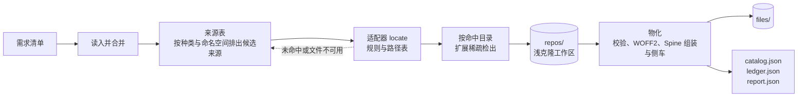

# 资源提取

`arknights-assets-extractor` 是构建期使用的资源工具库和命令。输入是一份或多份需求清单（只有资源键与 `required`），输出是缓存目录里的规范化文件、原始目录 `catalog.json`、文件账本 `ledger.json` 和报告 `report.json`。

它只认识资源键和上游来源，不认识干员、敌人或赛季，也不写包清单。运行时代码不引用它，浏览器和服务端的构建产物里不会出现它的依赖。

## 职责

- 来源：七个 GitHub 来源的适配器把键映射到上游文件；来源表规定每个命名空间按什么顺序尝试哪些来源。
- 传输：每个「仓库@分支」做一次浅克隆（`--depth 1 --filter=blob:none --sparse`），只按命中文件所在目录做 cone 模式稀疏检出。
- 校验与转换：按格式校验每个复制出的文件；字体转为 WOFF2；Spine 图集补页尺寸与 pma、页名换成安全名，并解析骨架生成 `SpineMeta` 侧车。
- 原始目录：条目按键排序、文件按角色与名字排序，同一输入两次运行字节一致。
- 本机客户端：`source/local-client/python/` 下的 Python 脚本，用 UnityPy 从官方客户端提取棋盘、网格、召唤物和敌人模型。这是本包唯一需要 Python 的部分，默认的 `pnpm extract` 与 `pnpm test` 不依赖它。

## 输入与输出

| | 文件 | 说明 |
| --- | --- | --- |
| 输入 | 需求清单 `NeedsList` | `{ schemaVersion: 1, pack: { type, id }, needs: [{ key, required, absent? }] }`，类型见 [清单](../assets-catalog/02-schema.md#需求清单) |
| 输出 | `<cache>/files/<address>` | 规范化文件，地址与 `assets-catalog` 的 `fileAddress` 一致 |
| 输出 | `<cache>/catalog.json` | 原始目录 `RawCatalog`：命中的条目与 `missing` |
| 输出 | `<cache>/ledger.json` | 文件账本，用于下次运行复用 |
| 输出 | `<cache>/report.json` | 统计、回退、同名多候选、问题与克隆信息 |

## 一次提取

候选来源依次尝试，前一个未命中、不可用或文件校验失败时换下一个；全部失败的键写进 `missing`。细节见 [命令](./03-command.md#一次提取的过程)。
