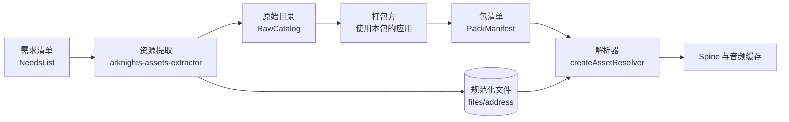

# 资源目录

`arknights-assets-catalog` 是运行时的资源库。它回答一个问题：**给我一个资源键，我该去哪里取哪些文件**。

- 零运行时依赖，能直接在浏览器里运行，不引用 `node:*`。
- 不做网络和文件读写：清单由调用方加载，`fetch` 由调用方注入。
- 不认识赛季、干员或敌人。领域 id 到键的映射写在清单的 `refs` 里，形状由打包方决定。

构建期的下载、转换与原始目录生成在 [资源提取](../assets-extractor/index.md) 中。

## 快速上手

```ts
import { createAssetResolver, isPackManifest, spineSource } from "arknights-assets-catalog"

const baseUrl = new URL("/res/packs/base/78.0.0+r1/manifest.json", location.href)
const base = await (await fetch(baseUrl)).json()
if (!isPackManifest(base)) throw new Error("bad base manifest")

const resolver = createAssetResolver([
  { manifest: base, url: baseUrl },
  // 赛季、模组、本地清单依次叠在上面
])

const key = resolver.ref("chars.char_002_amiya.avatar") // "image:char/avatar/char_002_amiya"
const avatar = key ? resolver.resolve(key) : null
avatar?.files[0]?.url // "https://…/res/files/image/char/avatar/char_002_amiya.png?v=c2a1…"
```

## 在资源系统中的位置

四种清单的类型都在本包。构建期与运行时的代码各取所需，只通过键与这些清单交接：



| 阶段 | 读 | 写 | 用到本包的 |
| --- | --- | --- | --- |
| 提取 | 需求清单 | 规范化文件、原始目录、Spine 侧车 | 键、守卫、`fileAddress` |
| 打包 | 原始目录 | 包清单 | 键、守卫、发布布局 |
| 运行时 | 包清单 | — | 解析器、地址、缓存 |

## 核心概念

| 概念 | 说明 | 页面 |
| --- | --- | --- |
| 资源键 `AssetKey` | `<kind>:<path>`，资源的唯一身份，跨包只传键 | [资源键](./key.md) |
| 清单与类型守卫 | 需求清单、原始目录、包清单、Spine 侧车的类型，以及逐字段报错的守卫 | [清单](./schema.md) |
| 地址 | 键与文件到相对地址、包清单的发布位置；所有种类同一格式 | [地址](./address.md) |
| 解析器 | 多份清单叠成覆盖层，按键查找，沿 `fallbackId` 回退 | [解析](./resolver.md) |
| 缓存 | Spine 句柄与解码音频，以键为缓存键 | [缓存](./cache.md) |

## 阅读顺序

1. [资源键](./key.md)
2. [清单](./schema.md)
3. [地址](./address.md)
4. [解析](./resolver.md)
5. [缓存](./cache.md)
6. [目录](./layout.md) — 包里每个目录做什么。
7. [设计](./design.md) — 为什么用键作身份、为什么清单只放引用。
