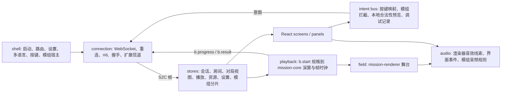

- [目标与前提](#目标与前提)
- [分层与 ECS](#分层与-ecs)
- [运行时框架](#运行时框架)
- [模组模型](#模组模型)
    - [数据、文案与资源层](#数据文案与资源层)
    - [行为层](#行为层)
    - [表现层](#表现层)
    - [清单与握手](#清单与握手)
    - [哈希锁定与自由内容](#哈希锁定与自由内容)
    - [FEATURE 模组的落点](#feature-模组的落点)
- [服务端下发界面](#服务端下发界面)
- [前端](#前端)
- [多语言](#多语言)
- [可复现与可测试](#可复现与可测试)
- [客户端数据流](#客户端数据流)
- [探索项](#探索项)
- [待决事项](#待决事项)

本文汇总架构讨论中已经确定的方向。每节先写决定，再写简短理由；没有定论的放在「待决事项」。需求来源见 [FEATURE.md](FEATURE.md)。

## 目标与前提

- 这是一次重写。master（`legacy/`）只作为正确行为的参照和机制清单，不保留它的代码结构。
- 作战机制引擎保持高扩展性：官方规则更新时，新机制通过注册接入，不改核心类型和分支。
- 应用层支持类似游戏的模组系统。官方特性之外的需求都由模组实现。
- 核心库（`mission-core`、`mission-renderer`、`assets-catalog`）保持简单，不引入额外运行时依赖，其他项目复用时不被迫带上框架。
- 后端接口兼容 master，增加协商与扩展信道。
- 资源按游戏的做法分包：基础包、赛季包、模组包各自下载、各自缓存，按内容哈希寻址。
- 后端服务一次只启用一个赛季，启动时指定

## 分层与 ECS

决定：任何一层都不引入 ECS 库，但借鉴思想。

`mission-core` 只借鉴 ECS 思想：

- 组件：每个模块用 `defineComponent<T>(id)` 声明自己的类型化数据，取代 `ctx.moduleData` 的 `Record<string, unknown>`。
- `UnitState` 中只服务单一机制的字段（`boomerangsOut`、`boomerangEpoch`、`overhealShield`、`hitLimit`、`elementCredit`、`bursting`、`shiftRun` 等）移到所属模块的组件。
- 标签：`flags` 改为注册制标签，声明语义（不可选中、不可行动、不阻挡等）。`battle/unit/aim.ts` 这类查询读取标签语义，不再匹配字面量。
- 系统：阶段系统显式排序。
- 事件：类型化事件表，命名统一为 AGENTS.md 规定的风格。
- 规格：`SkillSpec` 的 `onStart`、`onTick` 等函数改为注册 id，`BattleSpec` 成为纯数据，可序列化、可哈希、可回放。
- 增益：采用类似 GAS（Gameplay Ability System）的属性、修饰器、标签模型表达 buff 与状态。
- 确定性：迭代顺序稳定（插入序、按 id 排序），模块安装顺序固定。

`mission-renderer` 采用轻量 ECS 风格的视图层：每个单位一个视图对象，按特性注册视图系统（Spine 本体、血条、SP 与护盾、状态图标、朝向、离场淡出），特效按 kind 注册到特效表。Three 的场景图仍是显示树。

`app/server` 的对局层不使用 ECS：休整、商店、经济是回合制规则，采用类型化钩子注册表和显式阶段状态机。`content/` 中带 `@ts-nocheck` 的 master 内容与 `content/support/legacy-battle.ts` 适配层，改写为类型化的 `MissionModule` 与对局钩子。

理由：单场战斗只有几十个单位，性能不是瓶颈；确定性、可读规则和零依赖更重要。真正的扩展压力来自干员、首领、召唤物的个别机制和大量特效种类，这需要类型化注册表与模块自有状态，而不是高性能实体数据库。

## 运行时框架

决定：

- 任何一层都不引入 Effect。
- 使用自建的小型类型化 `ModContext` 与宿主，生命周期分为 server、room、match 三级作用域，作用域结束时自动释放注册。
- `ModContext` 的形状对齐 Cordis：`ctx.on`、自动释放的 `ctx.effect`、`inject`、事件分发模式 `emit`、`parallel`、`serial`、`bail`（用于否决意图）、`waterfall`（用于变换）。日后若需要 Cordis 的加载器或服务依赖等待，可在 `ModContext` 之后替换实现，模组代码不变。
- 叶子库使用社区方案：`valibot`（Standard Schema）用于消息、配置与清单校验，`zustand` 用于客户端状态。
- 服务端不做热重载：配置写在 YAML，修改后重启。同一进程里有多场进度不同的对局，热重载会带来状态迁移与资源泄漏的复杂度。
- 每场对局在开局时绑定一份不可变的 `ContentSnapshot`：数据包、文案、模组集合与哈希、作战模块、对局钩子、配置、`contentHash`。
- 暂不考虑平滑重启和优雅关闭
    - 服务器主拥有最高管理权
    - 服务器启动后不应热重载，同一时刻可能有多个对局，热更新会增加大量复杂度
    - 如有必要，关机前发送全员通告（类似游戏内横幅），通过模组来扩展

理由：Effect 改变整套代码的写法，浏览器体积 31 至 92 KB（gzip），模组作者学习成本高。Cordis v4 仍是 RC，且上游与 DeepSeek 分支并存；它最大的优势是原地热重载，而这里的需求是按对局冻结、多版本并存。内容快照与作用域释放纪律保证日后要加「下一局生效」的重载时不需要重构。

## 模组模型

官方内容本身也是包，与模组使用同一格式，模组是排在官方包之后的包。模组分三层。

### 数据、文案与资源层

- 赛季编译为包。补丁使用标准 JSON Patch（RFC 6902）；简单的整条合并可写 JSON Merge Patch（RFC 7396），加载时转换为 6902 操作。补丁按 `(table, id)` 定位记录。
- 数据包编译时考虑可补丁性：有语义的列表（技能、路线、成员、装置）编译为带 `order` 字段的键值表；只有位置本身就是数据的数组（格子图、阶梯阈值）保留为数组，针对它们的补丁必须带 `test` 操作。
- 服务端启动时按规范顺序合成一次：依赖深度、id，以及 `loadBefore`、`loadAfter`。合成结果按数据包 schema 校验，记录每个字段由哪个包修改，重叠路径报告为冲突。
- 客户端收到合成结果与哈希，不在本地重放补丁。
- 提供变基工具：官方更新后，对新数据包重放所有补丁，报告失败的 `test`，并列出补丁路径下的上游变化。

### 行为层

- `MissionModule`：服务端与客户端都加载，计入 `contentHash`，保证确定性与 `b.result` 校验。
- 对局钩子：只在服务端运行，类型化，只能使用环境提供的时钟与随机数。
- 房间命令与角色策略：转让房主、移除掉线玩家、重开、谁能暂停。
- 扩展信道：消息 `{ t: "x", mod, type, rid?, data }`，按模组 id 命名空间路由，每个模组为自己的消息类型注册 schema，路由时检查角色权限。服务端只向声明了 `x` 能力的连接发送扩展消息。
- 可扩展 id：只有用 `defineExtensible(id, { version, contract })` 标记的注册 id 允许 `replace` 与 `wrap`，并逐步开放更多 id。每个 id 独立语义化版本；模组在清单中声明所需范围，运行时用 `ctx.has(id, range)` 检测；构建时生成 `extensible-ids` 目录与类型声明；弃用先警告一个次版本，下一个模组 `api` 大版本移除。`wrap` 按加载顺序串联，同一 id 的第二个 `replace` 报告为冲突。
- 不对 `mission-core` 和对局核心做运行时打补丁。

### 表现层

- 每个界面组件按 id 注册，通过 `<Part id>` 渲染。模组可以 `replace`、`wrap`、`insert`（在某 id 前后插入），每个部件都是扩展点。
- 屏幕布局是数据（部件 id 树），可由数据层补丁修改。
- 部件的 props 有类型和版本；被移除的 id 在模组加载时直接报错。
- 权限封闭：界面只读状态仓库，只能经意图总线发出意图，由服务端校验。替换后的组件做不到用户本身做不到的事。

### 清单与握手

清单字段：

| 字段 | 含义 |
|---|---|
| `id`、`version` | kebab-case 的唯一 id 与语义化版本 |
| `api` | 模组 API 版本，同时约束宿主 React 大版本 |
| `sides` | `server`、`client`、`both` |
| `scope` | `server`（常驻）、`room`（房主开关）、`local`（玩家本地安装，仅客户端） |
| `permissions` | `battle`、`match`、`catalog`、`client`、`room`、`channel` |
| `dependencies` | 依赖与版本范围 |
| `config` | Standard Schema 配置，值来自服务端 YAML 或房间设置 |
| `entries` | `server`、`client`、`battle` 入口 |
| `assets` | 资源覆盖、文案、默认按键 |

握手：`hello` 与 `welcome` 增加 `ext` 字段。客户端发送 `{ client, build, protocol, caps, localMods }`；服务端回复 `{ protocol, seasonId, contentHash, dataHash, mods: [{ id, version, hash, sides, scope, url, config }], roles }`。master 服务端忽略未知字段；`welcome` 没有 `ext` 时，客户端进入兼容模式，只运行基础内容与本地外观模组。`room.state` 携带房间启用的模组与配置，开局后固定。`b.start` 的规格携带 `contentHash`。

### 哈希锁定与自由内容

- 计入 `contentHash`：规则数据（属性、价格、卡池、波次、地图几何、调参）、作战模块、对局钩子、服务端 YAML 中的对局设置。
- 客户端本地自由：文案与翻译、主题与设计令牌、界面组件与布局、音频与 BGM 规则、外观资源、按键与手柄映射。
- 编译器需要把数据包拆成规则字段与表现字段（例如 `chess.json` 的 `name`、`appellation` 与 `tier`、`price` 分开），否则文案包和皮肤包会改变哈希。
- 信息公平：界面模组只能展示客户端已经收到的数据，隐藏信息由服务端视图（`m.public`、`m.private`）控制。

### FEATURE 模组的落点

| 模组 | 落点 | 范围 |
|---|---|---|
| 对局中看队友作战 #76 | 放宽 `g.watch` 的对局钩子，客户端观战界面 | 服务端下发，带界面 |
| 一键重抽 #77 | 房间命令（投票或房主）、扩展信道、按钮 | 服务端下发，带界面 |
| 文字聊天 #125 | 扩展信道、服务端限流钩子、可拖动面板 | 服务端下发，带界面 |
| 房间优化 #154 | 房间命令、扩展信道、房间屏幕部件 | 服务端下发，带界面 |
| 主动替换特勤干员 #172 | 卡池与商店钩子、扩展意图、休整界面，计入 `contentHash` | 服务端下发，带界面 |
| 对局冻结（房主） | `g.pause` 的角色策略与控件 | 服务端下发，带界面 |
| 计分板 | 读取对局视图的面板；视图缺数据时由对局钩子经扩展信道补充 | 服务端下发，带界面 |
| 双击查看队友 #131 | 输入绑定 | 仅客户端 |
| 手柄操作 | 输入映射到意图总线 | 仅客户端 |
| 按最高阵营播放 Boss BGM #206 | 音频规则与资源覆盖 | 仅客户端 |

N 人联机涉及 `MAX_SEATS`、棋盘几何与波次表，作为核心特性设计。

## 服务端下发界面

决定：服务端下发的模组可以携带界面代码。

保护措施：

- 哈希固定与 CSP：`fetch` 模组包，用 SubtleCrypto 校验 SHA-256，存入 Cache Storage，由 Service Worker 在同源的 `/mods/<hash>.js` 提供，`script-src 'self'` 保持成立。后端地址由用户在运行时指定，静态 CSP 无法列出模组来源，所以走同源。
- 按服务端激活：模组只在固定它的服务端连接下启用；本地存储按服务端与模组划分命名空间。
- `connect-src` 只允许后端与资源 CDN。
- 进入时确认：列出模组、哈希与权限。规则模组必须接受，否则无法加入；界面模组可以拒绝，拒绝时使用默认界面。可记住选择，并在设置中撤销。
- 按部件的安全模式：每个部件包一层错误边界，出错时恢复默认组件并标记该模组；交给模组的事件回调和定时器也由上下文包装。玩家可以按模组或按部件恢复默认组件。
- 观众没有 `m.private`，部件契约声明哪些视图字段可缺省，模组必须能在缺省时渲染。

## 前端

- 使用 React 19，无障碍基础组件使用 React Aria。官方代码用 TSX。
- SDK 导出绑定到 `React.createElement` 的 `htm`，模组可以不经构建直接编写。
- 模组通过 SDK 共享宿主的 React 实例，构建时把 `react` 设为外部依赖；模组 `api` 版本固定 React 大版本。
- 30 Hz 的作战数据留在 React 之外：渲染器直接读取，界面通过节流的状态选择器订阅。
- 样式：W3C Design Tokens（2025.10 格式）编译为 CSS 自定义属性，以 master 的 `public/css/theme.css` 为初始值。宿主基础组件只使用令牌，并导出给模组，模组由此继承统一风格；主题模组就是一组令牌覆盖。
- 层叠顺序：`@layer reset, tokens, base, components, mods, overrides`。
- 使用普通 CSS 或 CSS Modules，不使用运行时 CSS-in-JS。
- 模组样式隔离使用带前缀的类名或 CSS Modules；`@scope` 的浏览器基线尚不满足。
- 浏览器基线为 2021 年以后的版本，由 browserslist 与 Lightning CSS 处理。

理由：模组友好取决于三点：不需要编译器、运行时公开 API 稳定、作者熟悉。Svelte 预编译产物与运行时精确版本绑定；Solid 依赖编译器且 2.0 正在大改。React 的 JSX 运行时在大版本内稳定，React Aria 最完善，体积相对 Three 与 Spine 可以接受。

## 多语言

- 使用命名空间键：`core:`（界面）、`data:`（数据包文本，由编译器生成，如 `data:chess.<id>.name`）、`server:`（服务端消息）、`<modId>:`（模组）。上下文写进键名。
- 消息格式使用 ICU MessageFormat 子集，打包时预编译，运行时格式化器约 2 KB（Lingui 的做法）。
- 从源目录生成类型化键：`t<K extends Key>(key, params: Params<K>)`；模组通过声明合并扩展。
- 目录条目携带中文 `source`、说明、占位符与可选长度上限，导出给 Weblate 或 Crowdin 等支持 ICU 的工具。
- 回退链：玩家语言、基础语言、语言包声明的回退、模组默认语言、源文本。
- 其他模组的翻译包是不含代码的 `lang` 包，提供目标模组命名空间下的键。
- 服务端消息为 `{ key, params }`。连接 master 服务端时，用中文 msgid 到新键的对照表翻译 `{ text, msgid, params }`，查不到时显示 `text`。对照表由新目录的 `source` 生成。
- 迁移：`legacy/public/i18n/en.json` 按 msgid 映射到新键；`ja`、`ko`、`zh-TW` 为机器翻译，重新生成。

## 可复现与可测试

确定性模拟加输入日志。

对局记录：

- 头部：格式与服务端版本、协议版本、`seasonId`、`contentHash`、`dataHash`、模组集合与哈希及配置、对局选项（模式、难度、座位、阵容）、种子、`matchNo`、YAML 对局设置。
- 输入日志：按序号排列，每条带回合、阶段与对局时间。包括已接受的 `g.*`、`room.*` 意图，被钩子处理的 `x` 消息，连接、断开、重连、离开，定时器触发，作为意图记录的机器人决策，客户端战报 `b.progress`、`b.result`，暂停与恢复。
- 检查点：每次阶段切换或每回合的状态哈希，以及每隔若干回合的完整状态。
- 模组包按哈希归档，保证回放不会因模组丢失而失效。

两级回放：

- 意图回放：用记录的环境（`VirtualScheduler`、种子随机数）在无界面环境重建对局，用于测试与问题复现。
- 画面回放：客户端按记录的 `m.public`、`m.private`、`b.start` 帧流驱动正常的状态仓库，战斗画面由 `mission-core` 按 `b.start` 重新演算。

确定性规则：时间只来自 `env.clock`，随机只来自 `env.random(stream)`；不使用 `Date.now`、`performance.now`、`Math.random`；迭代顺序稳定；浮点按固定顺序累加；用 lint 禁止上述全局。状态导出与导入要求 `MatchState` 是纯数据。

对局核心采用函数式核心与命令式外壳：`step(state, input, env) -> { state, outputs }`，`outputs` 为发送、广播、定时、取消、结束、日志。`Match` 类成为薄适配层，保留现有大厅契约（`match/flow/index.ts` 头部的接口说明）。阶段流转使用手写的类型化状态转移表，键为 `PHASE`，不使用 XState。

测试：

- 黄金回放：用记录的日志断言检查点哈希；规则有意变更时重新确认。
- 模糊与属性测试：沿用 `match/test/harness.ts` 与 `fuzz.spec.ts` 的不变量检查。
- 线路契约：在 `app/contract` 用 valibot 定义 C2S、S2C 与扩展信道的 schema，推导 TS 类型；用 master 服务端录制的帧作为黄金样例做契约测试。
- 客户端：状态仓库与选择器用录制的帧流测试；React 组件用 Testing Library 按语义查询测试；作战播放用 `mission-core` 的帧时钟与 `mission-renderer` 的本地喂数配合假时钟测试。
- `app/scenario`：整页端到端测试，由脚本座位回放日志驱动；`shell/` 暴露的全局 API 同时作为测试与 Browser Use 的入口。
- 模组：在无界面对局中按 YAML 夹具加载模组，与黄金回放一起运行。

## 客户端数据流

模组通过 `ModContext` 接入：注册部件、动作与按键、收发扩展消息、只读选择器与自有状态分片、音频规则、文案与资源覆盖；作战入口在 `playback` 创建战斗时安装。

## 探索项

按降低风险的程度排序：

1. 数据包 schema 与补丁：键值化集合、规则与表现字段拆分、带 `test` 的 JSON Patch 合成、schema 校验、`contentHash`，并对模拟的官方更新做一次变基。
2. 客户端模组加载：Service Worker 完整性校验、`script-src 'self'`、按服务端激活与存储命名空间、经 SDK 共享 React；同时做一个 remote-dom 沙箱层原型作对比，该层让服务端下发的界面只能渲染宿主组件。
3. 部件注册表：以商店卡片为例做替换与包装，配合错误边界安全模式、设计令牌与 axe 检查。
4. 多语言流水线：ICU 目录、键类型生成、`en.json` 迁移、master msgid 对照表、翻译工具导出。
5. 可扩展 id 目录：生成目录与类型、`ctx.has`、版本策略。
6. 模组开发套件：类型化 SDK、`create-mod` 脚手架、`mod validate`（清单、schema、补丁试运行与 `test`、多语言覆盖、无障碍检查、可扩展 id 范围）、客户端热更新的本地开发服务、带模组集合的黄金回放。
7. 加入与确认流程：必需模组与可选模组、拒绝后的路径。

## 待决事项

- 内容快照的绑定时机：本文写开局时绑定；remaining.md 写创建房间时固定 `seasonId + contentHash`。
- 日后 P2P 的信任细节：主机分发模组，信任锚转移到主机；对等端如何校验 `contentHash` 与固定哈希。
- 客户端战报的信任策略：抽样重算还是始终重算，以及是否把战报全部写入记录。
- 聊天模组的治理钩子：服务端过滤、限流、静音与举报，由服务器主负责。
