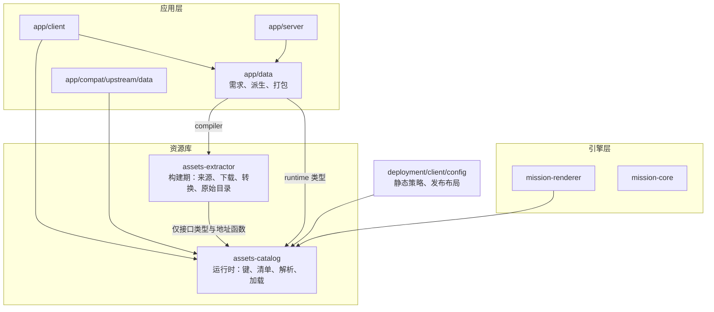
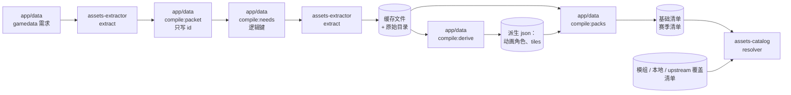
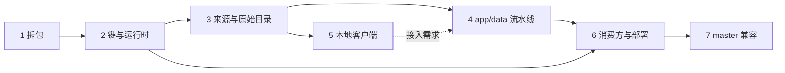

- [目标与前提](#目标与前提)
- [现状问题](#现状问题)
    - [已完成与测试状态](#已完成与测试状态)
    - [各域的资源遗留](#各域的资源遗留)
- [包边界与依赖方向](#包边界与依赖方向)
    - [assets-catalog](#assets-catalog)
    - [assets-extractor](#assets-extractor)
    - [app 层](#app-层)
- [流水线](#流水线)
- [攻击时序](#攻击时序)
- [资源键](#资源键)
    - [种类](#种类)
    - [路径语法](#路径语法)
    - [命名空间](#命名空间)
    - [身份与哈希](#身份与哈希)
- [Schema 草案](#schema-草案)
    - [需求清单](#需求清单)
    - [原始目录](#原始目录)
    - [包清单](#包清单)
    - [Spine 侧车](#spine-侧车)
- [来源适配器](#来源适配器)
    - [接口](#接口)
    - [来源表](#来源表)
    - [本地客户端来源](#本地客户端来源)
    - [传输](#传输)
- [磁盘与缓存布局](#磁盘与缓存布局)
- [地址布局](#地址布局)
- [连接 master 后端](#连接-master-后端)
- [文件去向](#文件去向)
    - [assets-catalog 现有文件](#assets-catalog-现有文件)
    - [app/data 现有文件](#appdata-现有文件)
    - [其他包的改动点](#其他包的改动点)
- [实施步骤](#实施步骤)
    - [共同约定](#共同约定)
    - [步骤 1：拆出 assets-extractor](#步骤-1拆出-assets-extractor)
    - [步骤 2：资源键与运行时目录](#步骤-2资源键与运行时目录)
    - [步骤 3：来源适配器与原始目录](#步骤-3来源适配器与原始目录)
    - [步骤 4：app/data 资源流水线](#步骤-4appdata-资源流水线)
    - [步骤 5：本地客户端来源](#步骤-5本地客户端来源)
    - [步骤 6：运行时消费方与部署](#步骤-6运行时消费方与部署)
    - [步骤 7：master 后端资源兼容](#步骤-7master-后端资源兼容)
    - [依赖顺序](#依赖顺序)
- [不在范围内](#不在范围内)
- [探索项](#探索项)
- [待决事项](#待决事项)

本文是资源问题的专门文档，也是资源相关计划的唯一来源：REMAIN.md 与 MIGRATE.md 中的资源事项已经并入本文，原处只留简述与链接。本文是资源层的重构计划：把现在的 `assets-catalog` 拆成构建期的 `assets-extractor` 与运行时的 `assets-catalog`，定义资源键、清单格式、来源适配器与地址布局，并给出可以分别指派的实施步骤。架构方向见 [ARCH.md](ARCH.md)，需求见 [FEATURE.md](FEATURE.md)，遗留问题见 [REMAIN.md](REMAIN.md)，客户端迁移见 [MIGRATE.md](MIGRATE.md)。本文与它们冲突时，以 ARCH 与 FEATURE 为准，并在「待决事项」里记录。

现状描述基于 2026-10-09 对 `next/` 的盘点。文件路径都相对 `next/`。

## 目标与前提

- 核心库不引入额外运行时依赖（ARCH「目标与前提」）。运行时的 `assets-catalog` 零运行时依赖，能在浏览器中运行，不引用 `node:*`。
- 资源按游戏的做法分包：基础包、赛季包、模组包各自下载、各自缓存，按内容哈希校验（ARCH「目标与前提」）。官方内容也是包，模组包排在官方包之后；资源覆盖层构成虚拟文件系统，解析器自上而下查覆盖层，再沿 `fallbackId` 回退（ARCH「数据、文案与资源层」）。
- 资源属于客户端本地自由的内容，不计入 `contentHash`；资源清单与数据包属于不同的哈希域（ARCH「哈希锁定与自由内容」「数据、文案与资源层」）。
- 社区没有一个项目能提供全部资源。本地开发和 CI 中由初始化脚本从社区库拉取，放在 `.cache`，已有就不再下载；存在本地客户端时单独提取，避免引入 Python（FEATURE「拆分静态资源」）。本文对此有一个明确、隔离的例外：`local-client` 来源暂时保持 master 的 Python 实现（UnityPy），见「本地客户端来源」；替代方案列入「探索项」。
- 「assets-catalog 理念不变」：编译期只提供工具库，只关注通用数据；干员、敌人、语音等都来自官方，放到哪里都统一。app/data 的编译期提取本 app 所需的资源，运行时负责解析与加载（FEATURE「拆分静态资源」）。本文把「工具库」落成独立的 `assets-extractor`。
- 基础数据包可用官方版本作为发行版本号，只被前端使用，只通过资源句柄耦合，句柄来自声明文件；赛季包被客户端和服务端共同使用（FEATURE「拆分静态资源」）。
- 每个模块只负责自身的初始化和构建脚本，命令原子化；本地开发通过 Vite 插件抹平资源路径（FEATURE「部署和分发」）。
- 地址解析只允许出现在 `app/compat/upstream/data`（REMAIN 第 2 节）。
- REMAIN 第 5 节原计划从 Spine 的 Attack 动画时长和 OnAttack 时间推导 `enemies.attackAnim`。本文改为：暂不从骨骼动画推导，数据包写显式默认值，官方数据来源列入「探索项」，见「攻击时序」。
- 基础包只含不绑定任何模式的基础信息，任何项目都能复用：干员、语音、皮肤、敌人等；赛季包放模式专属内容：赛季界面、棋盘与地图、模式表情与引导、标志等。划分见「命名空间」。
- 服务端只读取内容包，不读取媒体文件；删除 `assets.json` 不影响服务端运行（原 REMAIN 第 9 节验收，现为步骤 6 的验收）。
- 静态文件的 gzip、ETag、Range 与缓存策略归 `deployment/client/config`（REMAIN 第 9 节）。资源路径格式统一，不保留 master 的 `/media/...` 无扩展名音频路由，见「地址布局」。

## 现状问题

本节只列促成本计划的问题，细节在「文件去向」逐条处理。

- 一个包两种身份：`assets-catalog/package.json` 的 `.` 入口（`index.ts`）是浏览器运行时，`./compile` 入口（`compile.ts`）是下载、字体、Spine 解析工具；`@pixi-spine/runtime-3.8` 只被 `compiler/spine/skel.ts` 使用，却列在运行时依赖；`pngjs`、`wawoff2` 在源码中没有引用。
- `.` 入口导出 `node-files.ts`、`fetch-http.ts`、`static-policy.ts`：Node 文件系统、网络与服务器缓存策略都不是浏览器运行时的职责。
- 真正生成 `catalog.json`、`resources.json`、`assets.json` 的是 `app/data/compiler/scripts/assets.ts`，不是 `assets-catalog` 自己的 `fetch:media`；后者丢弃 `processModels` 的结果（`compiler/scripts/fetch-media.ts`），只在 `.cache/spine-info.json` 留下解析信息。
- 上游地址写死在多处：`compiler/download/source.ts` 的 `RAW_BASES`、`app/data/compiler/media/fetch/plan.ts` 的地址拼接、`app/data/compiler/input/research/07-assets.json`；`GAMEDATA_URL` 定义三次，gamedata 有两份缓存。
- 资源身份用内容哈希：`catalog.json` 中有 59 个重复 id（不同路径的同一份字节）。`resources.json` 用哈希 id，`assetRefFromAddress` 用地址 id，`findById` 线性扫描。`kindOf` 实现了三份。
- 循环依赖：`app/data/compiler/packet/record/enemy.ts` 从 `assets.json` 读取攻击时序，而 `assets.json` 由读取赛季数据包的资源编译写出；当前产物没有 `attackAnim`。`app/server/entry/packet.ts` 的 `DATA_FILES` 仍包含 `assets`。
- `app/client/resource/store.ts` 读取的基础清单与赛季清单没有任何构建命令产出。
- 本地提取：`compiler/extraction/extract.py` 是 Python；它在内存里构建的清单从不写盘；与 master 的 `legacy/tools/local-extract/` 相比，少了 `TOKEN_SPINES` 与召唤物模型导出、清单写盘（master 写 `data/local-assets.json`）和 `enemy_model_offsets.py`。棋盘贴图、网格、材质与 prefab 只由它产出，不进计划，没有 AssetRef。`input/spine/local-enemy-spines.json` 没有消费方，`.cache/assets-report.json` 记录对应条目已被丢弃。
- `app/data/compiler/media/board/atlas.ts` 把 `tiles.json` 直接写进媒体目录，不进清单。
- 地址方案 `/assets/`、`/fonts/`、`/media/` 散落在九处以上；`app/client/vite.config.ts` 的构建输出 `dist-web/assets/` 与媒体的 `/assets/` 同名冲突；`app/client/vite-plugins.ts` 不提供 `catalog.json`。
- `app/server/vite.config.ts` 经 `@alliance/data/compiler` 间接引入 `assets-catalog/compile`，服务端构建因此带上 Spine 解析工具。
- `CatalogFiles`、`CatalogHttp`、`CatalogReadError` 被 `app/data` 当作通用文件与网络端口使用，包括运行时的 `app/data/runtime/packet/packet-store.ts`。

### 已完成与测试状态

原 REMAIN 第 8 节的记录：

- 已完成：资源引用、编译、Spine 与音频缓存、静态策略、manifest 测试。产物 `app/data/product/season/act2autochess` 与 `assets-catalog/product/{media,font,catalog.json}` 都存在。
- 2026-10-08 两个包的全量测试：`app/data` 9 个文件通过、1 个跳过；`assets-catalog` 14 个文件通过、5 个用例跳过。跳过的是 `app/data/compiler/media/board/atlas.test.ts` 的派生法线像素，以及 `assets-catalog/test/extract.spec.ts` 的 5 个用例（清单、网格组、webp 副本、棋盘材质）。它们读磁盘上的棋盘与网格产物，缺哪一项未逐个核对。断言不为变绿而改，产物补齐后再跑（步骤 5）。
- 资源层：catalog 能声明 Spine 同目录依赖；client 能对 base、season 清单的临时失败重试；resolver 支持 `fallbackId`。`app/client/resource/store.ts` 没有读取本地覆盖层；开发时由 `app/client/vite-plugins.ts` 从本地目录提供 `/assets/`、`/fonts/` 与赛季文件。renderer 尚未把依赖展开成一次完整的 Spine 加载请求。
- 地址解析：`app/data/runtime/media/address.ts` 的面向 URL 解析实现已经删除；client、renderer、audio 不得重新依赖。唯一例外是 `app/compat/upstream/data`，见「连接 master 后端」。

### 各域的资源遗留

下表汇总原来散在 REMAIN.md 与 MIGRATE.md 中的资源事项，按本文的决定给出处理方式与负责的步骤。

| 项 | 原位置 | 现状 | 处理 | 步骤 |
|---|---|---|---|---|
| 数据包里的 `assets.json`、`resources.json` | REMAIN 第 1 节「数据包」 | master 的 `assets.json` 含大量角色与召唤物条目；next 用 `resources.json` 与 AssetRef | 两者都由基础清单与赛季清单取代；连接 master 时由兼容层读取 master 的 `assets.json` | 4、7 |
| `enemies.attackAnim` | REMAIN 第 1、2、5 节 | 没有数据来源 | 显式默认值，见「攻击时序」 | 4 |
| 数据包记录中的 `assets` 逻辑引用 | REMAIN 第 5 节「运行时数据边界」 | `app/server/match/flow` 读 `rec.assets.spine`、`rec.assets.avatar` 下发 | 数据包只写领域 id，`match/flow` 下发 id，客户端经清单 `refs` 换成键 | 4、6 |
| 服务端不读媒体 | REMAIN 第 5、9 节 | 运行时不解析 `.skel`、`.atlas`、PNG、音频；`DATA_FILES` 仍含 `assets` | 删除 `assets`；删除媒体文件或 `assets.json` 不影响服务端启动、建房与演算 | 6 |
| `app/season/<id>/media/` | REMAIN 第 5 节「赛季 app/season」 | 目录未建 | 只放非官方的赛季标志与入口图，键为 `image:season/<seasonId>/<name>`，由 `app/data` 打包时登记进赛季清单（`source.id` 为 `app-season`）；干员骨骼与地图模型仍按键从 extractor 取得 | 4 |
| `content/token/test/summons.spec.ts` 的音效依赖 | REMAIN 第 8 节 | 依赖赛季 `assets.json` 的 `audio.sfx`（死亡音 `b_char_tokendead.mp3`），当前数据包没有这份文件 | 死亡音进基础清单 `refs`（`audio:sfx/battle/b_char_tokendead`）；用例中 `public/js/` 的依赖属于 REMAIN 第 5 节；不改断言 | 4 |
| `compiler/input/research/` | REMAIN 第 8 节 | 敌人集合与技能下标的输入，不依赖产物 | 保持为 `app/data` 的输入，供需求推导与动画角色表使用；其中 `07-assets.json` 是冻结的上游快照，继续作为精英二立绘存在性的依据，见「文件去向」 | 4 |
| 棋盘图集裁图 | REMAIN 第 8 节、MIGRATE「不迁移」`boardArt.js` | `app/data/compiler/scripts/board-atlas.ts` | 并入 `compile:derive`，输出 `json:board/<theme>/tiles` | 4 |
| `input/spine/local-enemy-spines.json` | REMAIN 第 8 节 | 记为「由资源编译命令改写」，实际无消费方 | 删除，由 `SpineMeta` 侧车取代 | 5 |
| Spine 角色表 `resolveRoles` | REMAIN 第 7 节「未迁移：单位」 | 未接入 renderer | `app/data` 产出 `json:anim-roles/<seasonId>`；renderer 端口支持 `json` 种类；演员如何使用角色表属于 REMAIN 第 7 节 | 4、6 |
| `createSpineCache` 未被使用、端口没有失败重试 | REMAIN 第 7 节 | renderer 未用 catalog 的 Spine 缓存 | renderer 端口用 `assets-catalog` 的 `cache/spine.ts`（键为 `AssetKey`），按清单条目的 `files` 一次展开 Spine 依赖，文件级重试在端口内；Spine 加载器的 LRU、引用计数、内存预算属于 renderer 端口 | 6 |
| `render/textures.js` 的加载缓存 | REMAIN 第 7 节「目录设计」 | 未迁 | 并入 renderer 端口对 catalog 句柄的使用，纹理对象留在 `actor/` 与 `ground/terrain` | 6 |
| `TerrainPackPort` | REMAIN 第 7 节「契约与宿主接口」 | 地面绕过 `RendererResourcePort` | 并入 `RendererResourcePort`，地形槽位改为键 | 6 |
| 音频资源与 renderer 端口 | REMAIN 第 7 节「契约与宿主接口」 | `RendererAssetKind` 只有 image、spine、model | renderer 不加载音频，只抛语义音效线索；`app/client/audio` 按清单 `refs` 把线索映射到 `audio:` 键，经 `cache/audio.ts` 加载。线索映射文件放在 `port/` 还是 `stage/` 属于 REMAIN 第 7 节 | 6 |
| 贴图颜色空间、各向异性、mipmap | REMAIN 第 7 节「已迁移部分的缺陷」 | 由外部加载器决定 | renderer 按种类决定：`texture` 走材质贴图设置，`image` 走界面与精灵设置 | 6 |
| 客户端资源生命周期 | REMAIN 第 8 节「后续位置」、MIGRATE「audio 与 resource」 | `store.ts` 能加载清单并重试；没有图片缓存、预加载、句柄释放，没有本地覆盖层 | `app/client/resource` 接收 master `public/js/assets.js` 的图片缓存、预加载组、句柄释放与资源级重试，并读取本地覆盖清单 | 6 |
| 音频地址策略 | MIGRATE「audio 与 resource」「共享逻辑」、REMAIN 第 9 节 | master `public/js/media.js`、`shared/media.js` 用 `/media/...` 规避下载管理器 | 不保留。资源路径格式统一，音频与其他单文件种类一样是 `/res/files/audio/<path>.mp3`，见「地址布局」；`/media/...` 只在连接 master 时由兼容层使用 | 2、7 |
| 表情图 | MIGRATE「panel」 | 36 条表情已编译，`emoteArtPath` 返回地址 | 改为返回键 | 6 |
| 静态站点的资源发布 | REMAIN 第 9 节 | `deployment/client/config` 未有 | 见「地址布局」 | 6 |
| 初始化、检查、资源总命令 | REMAIN 第 8 节「后续位置」 | 各包命令已有，统一工具未有 | 属于 `deployment/tool`，不在本文范围 | — |
| 0.2.x 的发行形态 | REMAIN 第 9、10 节 | master 有完整包、精简包、更新包与文件校验，next 未做 | 暂不迁移；以后尽量复用 master 的发行形式，见「不在范围内」 | — |

## 包边界与依赖方向



规则：

- `assets-catalog` 不引用任何包；`assets-extractor` 只引用 `assets-catalog` 的类型与纯函数（键、schema、地址），反向禁止。
- `mission-core` 不引用资源库。`mission-renderer` 只引用 `assets-catalog`。
- `assets-extractor` 只出现在 app 层的构建期：`app/data/compiler/**` 与 `app/data/package.json` 的脚本。`app/data` 的运行时入口、`app/server`、`app/client` 的打包产物都不得包含它。`app/server/vite.config.ts` 不再经 `@alliance/data/compiler` 拉入它。
- 明日方舟语义（职业、精英化、敌人别名、动画角色、语音槽位）只在 `app/data`；纯表现语义可以在 `mission-renderer`。

### assets-catalog

运行时资源库。零运行时依赖，浏览器安全。

| 目录 | 职责 |
|---|---|
| `key/` | `AssetKind`、`AssetKey`，键的解析、格式化与校验 |
| `schema/` | 原始目录、包清单、Spine 侧车的类型，以及不依赖第三方库的类型守卫 |
| `address/` | 唯一的地址模块：键与文件到相对地址，所有种类同一格式 |
| `resolver/` | 按键建 `Map`，多个清单按覆盖层叠加，沿 `fallbackId` 回退 |
| `cache/` | Spine 句柄缓存与音频 buffer 缓存，以键为缓存键、内容哈希为校验 |

不包含：文件系统、网络适配器（调用方注入 `fetch`）、服务器缓存策略、明日方舟语义、任何上游地址。

### assets-extractor

构建期资源提取库与命令。新包，`private`，只被 app 层构建使用。

| 目录 | 职责 |
|---|---|
| `source/` | 来源适配器接口、各来源实现、来源表（优先级与回退） |
| `download/` | 上游仓库的浅克隆与更新、重试、格式校验、账本 |
| `spine/` | 图集规范化、二进制骨骼解析（`@pixi-spine/runtime-3.8`）、Spine 侧车生成 |
| `font/` | 字体转换（WOFF2） |
| `source/local-client/python/` | master 的本地提取脚本（Python、UnityPy），由 extractor 命令作为外部进程调用；是「不使用 Python」的唯一例外 |
| `catalog/` | 由需求清单与来源结果写出原始目录与报告 |
| `port/` | 构建期的文件端口、git 进程端口及 Node 实现 |
| `script/` | `extract` 命令 |

输入只有两样：需求清单（逻辑键）与缓存目录。输出只有三样：缓存目录中的规范化文件、原始目录、报告。不认识赛季、干员、敌人，也不写包清单。

### app 层

- `app/data`：从数据包推导需求清单；调用 `assets-extractor`；派生步骤生成动画角色表与棋盘 `tiles.json`（不改数据包）；打包基础清单与赛季清单。运行时提供数据包读取与 refs 类型。
- `app/client`：用 `assets-catalog` 加载基础、赛季、模组、本地清单并叠加；开发插件按清单布局提供文件。
- `app/server`：只读赛季数据包，不读清单与媒体。
- `app/compat/upstream/data`：把 master 的 `/assets/...` 地址映射成键，生成一份指向 master 静态目录的覆盖清单。
- `deployment/client/config`：静态缓存策略与发布布局。

## 流水线

流水线是有向无环图。每一步只读上一步的产物文件，不回读下游。



| 阶段 | 位置 | 输入 | 输出 |
|---|---|---|---|
| gamedata 需求 | `app/data` | 编译所需的表名（常量） | `json:gamedata/...` 需求清单 |
| 提取 | `assets-extractor` | 需求清单、缓存目录 | 缓存文件、`catalog.json`、`report.json` |
| 数据包编译 | `app/data` | gamedata 缓存、`compiler/input/` | `product/season/<id>/*.json`，资源只写 id 与变体，不写地址和键；`attackAnim` 写显式默认值 |
| 需求推导 | `app/data` | 数据包、`compiler/input/research/` | `base.json`、`season-<id>.json` 需求清单 |
| 派生 | `app/data` | 原始目录、Spine 侧车、棋盘贴图 | `json:` 派生文件（动画角色表、棋盘 tiles）；不改数据包 |
| 打包 | `app/data` | 原始目录、派生文件、refs 规则 | `product/base/manifest.json`、`product/season/<id>/manifest.json` |
| 解析 | `assets-catalog` | 一组清单 | 键到文件地址、回退链 |

以后减少上游依赖时，只改来源表的优先级与覆盖范围，需求清单与包清单不变。

数据包编译不读取任何媒体产物、原始目录或清单，派生步骤也不写数据包，所以现在 `assets.json` 与数据包之间的循环不再存在。

## 攻击时序

现状：`app/data/compiler/packet/record/enemy.ts` 的 `enemyAttackAnim` 从 `assets.json` 的 Spine 信息推导 `attackAnim`，`compiler/packet/compile/context.ts` 找不到该文件时只警告，当前产物没有 `attackAnim`。`mission-core/battle/unit/attack.ts` 在没有动画片段时停顿 `ATTACK_PAUSE`（0.35 秒）且没有前摇；master 也是这样（`legacy/server/sim/constants.js`、`ai.js`）。

决定：

- 不从骨骼动画推导。Attack 时长与 OnAttack 事件不一定等于官方的攻击判定时序，官方资源里很可能有更可靠的信息，留到 extractor 的后续探索（「探索项」第 2 项）。
- 数据包为每个敌人写显式默认值。默认值只定义在一处：`app/data/compiler/packet/record/enemy.ts` 的 `DEFAULT_ATTACK_ANIM` 常量，注释写明取值依据。`enemies.json` 的每条记录都写 `attackAnim`，数据包 schema 中该字段改为必填。
- 取值要让 `mission-core/battle/unit/attack.ts` 得到与当前「无动画片段」分支相同的时序（停顿 0.35 秒，无前摇），因此现有演算结果不变。具体字段值在实现时对照 `attack.ts` 确定，并用测试锁定。
- `attackAnim` 是规则数据，计入 `contentHash`。以后换成官方来源的值，会改变 `contentHash` 与演算结果，按 REMAIN 第 2 节的「迁移」处理。
- Spine 侧车只供表现使用，不进入数据包。

## 资源键

键是资源的身份：`<kind>:<path>`，不带扩展名。

```text
image:char/avatar/char_002_amiya
spine:enemy/enemy_1007_slime
audio:bgm/m_bat_autochess_loop
font:bender/regular
texture:map/autochess/TX_autochessi_D
model:mesh/autochess/board_frame
json:spine-meta/enemy/enemy_1007_slime
```

### 种类

| kind | 用途 | 文件 | 说明 |
|---|---|---|---|
| `image` | 界面与二维图：头像、立绘、图标、表情、引导图 | 单文件 png 或 webp | 来自现有 `CatalogKind` 的 `image` |
| `texture` | 三维棋盘的材质贴图：颜色、法线、粗糙度、遮罩 | 同一贴图可有 png 与 webp 两种格式 | 与 `image` 分开：色彩空间与 mipmap 由渲染器按种类决定，不进界面预加载 |
| `spine` | Spine 3.8 模型：骨骼、图集、图集页 | 多文件，同目录 | 一个键对应一个可加载模型；图集页文件名由图集决定 |
| `audio` | BGM、音效、语音 | 单文件 mp3 | 来自 `CatalogKind` 的 `audio` |
| `font` | 字体 | woff2，可附原始 otf 或 ttf | 来自 `CatalogKind` 的 `font`；只在基础包（FEATURE：模组不重载字体） |
| `model` | 网格 | 单文件 obj | 来自 `CatalogKind` 的 `model` |
| `json` | 结构化侧车：材质参数、prefab 变换、Spine 侧车、动画角色表、棋盘 `tiles`、gamedata 表 | 单文件 json | 不用 `data:`，避免与多语言的 `data:` 命名空间混淆（ARCH「多语言」） |

新增种类需要同时改 `assets-catalog/key/` 的种类表与 `address/` 的文件规则，并补测试。

### 路径语法

```text
key      = kind ":" path
kind     = "image" | "texture" | "spine" | "audio" | "font" | "model" | "json"
path     = segment *( "/" segment )
segment  = 1*( ALPHA / DIGIT / "_" / "-" )
```

- 区分大小写，保留上游大小写（如 `TX_autochessi_D`），避免改名造成的冲突与对照表。
- 段内不允许 `.`，所以键里不会出现扩展名，也不会出现 `..`。上游名中的 `[`、`]`、空格、`#` 等字符在来源适配器里统一换成 `_`（沿用 `safeName` 的规则），换名记录在原始目录的 `source.path` 中。
- 第一段是命名空间，按种类登记在下表；第二段起由命名空间自己约定。最多 8 段，总长不超过 200 字符。
- 变体写进路径：精英二头像 `image:char/avatar/char_002_amiya_2`，语音语言 `audio:voice/cn/...`。不引入查询参数式的变体。

### 命名空间

划分规则：基础包只含不绑定任何模式的基础信息，任何项目都能复用；赛季包放模式专属内容。键本身不带赛季 id，命名空间决定它属于哪个包，打包步骤按下表校验。

| kind | 命名空间与示例 | 包 | 来源（默认优先） |
|---|---|---|---|
| `image` | `char/avatar/<charId>[_2]`、`char/portrait/<charId>_<n>`、`skin/portrait/<skinId>`、`enemy/icon/<enemyId>`、`token/icon/<tokenId>`、`skill/<skillIconId>`、`item/<itemId>`、`prof/<prof>`、`prof/sub/<subProf>`、`module/<type>`、`fx/projectile/<name>` | 基础 | yuanyan → ArknightsAssets2 → 本地客户端 |
| `image` | `ui/<bundle>/<name>`（赛季界面与标志，如 `ui/autochess/logo`）、`band/<id>`、`bond/<id>`（模式的盟约与羁绊）、`ui/emoticon/<theme>/<name>`（模式启用的表情主题）、`ui/guide/<name>`（模式引导） | 赛季 | 本地客户端 → ArknightsAssets2 → yuanyan |
| `texture` | `map/<theme>/<name>`、`mesh/<bundle>/<name>` | 赛季 | 本地客户端 |
| `spine` | `char/<charId>/<pose>`（`front`、`back`、`build`）、`skin/<skinId>/<pose>`、`token/<tokenId>/<pose>`、`enemy/<spineId>` | 基础 | 本地客户端 → fexli、Ark-Models |
| `audio` | `voice/<lang>/<charId>/<slot>`、`sfx/battle/<name>`（通用战斗音效） | 基础 | ArknightsAssets2 → 语音库 |
| `audio` | `bgm/<name>`、`sfx/<mode>/<name>`（模式音效） | 赛季 | ArknightsAssets2 |
| `font` | `<family>/<weight>`，如 `bender/regular`、`novecento-wide/normal` | 基础 | 字体库 |
| `model` | `mesh/<bundle>/<name>` | 赛季 | 本地客户端 |
| `json` | `spine-meta/<spine path>` | 基础 | extractor 生成 |
| `json` | `material/<theme>`、`prefab/<bundle>`、`anim-roles/<seasonId>`、`board/<theme>/tiles` | 赛季 | 本地客户端、`app/data` 派生 |
| `json` | `gamedata/<table>` | 不发布 | gamedata 库；只供构建 |
| `image` | `season/<seasonId>/<name>`：非官方的赛季标志与入口图 | 赛季 | `app/season/<seasonId>/media/`，由 `app/data` 打包时登记 |

- 棋盘与地图（`texture:map/*`、`model:mesh/*`、`json:material/*`、`json:prefab/*`、`json:board/*`）属于模式，全部在赛季包，包括 master 的 `map/fx`、`map/common`、`map/water`。
- 动画角色表依赖赛季的技能下标，在赛季包；它引用的 Spine 模型与侧车在基础包。
- 某个模式需要另一个模式的专属资源时，放进自己的赛季需求，不提升到基础包。

`json:anim-roles/*` 与 `json:board/*` 由 `app/data` 派生，不经过来源适配器，但同样有原始目录条目（`source.id` 为 `app-data`），由打包步骤写进赛季清单。

### 身份与哈希

- 身份是键。同一份字节出现在两个键下是两个资源，各有条目；`catalog.json` 的 59 个重复 id 因此消失。
- 内容哈希（SHA-256，十六进制小写）只用于校验与缓存：下载校验、清单 `contentHash`、浏览器缓存键、增量发布。不用作查找键。
- 跨包协议只传键。现有 `AssetRef { id, kind, address, fallbackId }` 由 `AssetKey` 取代：`kind` 从键推出，`address` 由地址模块算出，`fallbackId` 放在清单条目上。
- 数据包只写领域 id（`charId`、`spineId`、变体编号），不写键；领域 id 到键的映射在赛季清单的 `refs` 中。服务端下发给客户端的仍是领域 id（`app/server/match/flow/index.ts` 现有行为）。

## Schema 草案

类型定义在 `assets-catalog/schema/`，`assets-extractor` 与 `app/data` 引用同一份。下列字段是草案，实现时可以调整命名，但不得把地址或上游信息放进包清单。

### 需求清单

由 `app/data` 写出，一个包一份：`app/data/.cache/needs/base.json`、`app/data/.cache/needs/season-<seasonId>.json`。

```ts
interface NeedsList {
  readonly schemaVersion: 1
  readonly pack: { readonly type: "base" | "season"; readonly id: string }
  readonly needs: readonly Need[]
}

interface Need {
  readonly key: AssetKey
  /** 缺失时提取失败；false 时写进报告并继续 */
  readonly required: boolean
}
```

```json
{
  "schemaVersion": 1,
  "pack": { "type": "base", "id": "base" },
  "needs": [
    { "key": "image:char/avatar/char_002_amiya", "required": true },
    { "key": "image:char/avatar/char_002_amiya_2", "required": false },
    { "key": "spine:enemy/enemy_1305_mhslim", "required": false },
    { "key": "spine:enemy/enemy_1007_slime", "required": true }
  ]
}
```

- 领域回退（精英二头像缺失用精英零、本地敌人模型缺失用别名模型）由 `app/data` 把回退目标也列为需求，并在打包时写 `fallbackId`。需求清单不带回退规则。
- 技能下标、动画角色等明日方舟语义不进需求清单。
- 需求推导按「命名空间」的划分把键写进基础或赛季需求。
- 基础包由 `app/data` 构建。基础需求默认是已启用赛季所需基础键的并集；`compile:needs` 提供选项，按 gamedata 生成全量基础需求（全量语音体积很大，默认不开）。

### 原始目录

由 `assets-extractor` 写出：`<cache>/catalog.json`。一次提取可以合并多份需求清单。

```ts
interface RawCatalog {
  readonly schemaVersion: 1
  readonly entries: Readonly<Record<AssetKey, RawEntry>>
  readonly missing: readonly MissingNeed[]
}

interface RawEntry {
  readonly key: AssetKey
  readonly kind: AssetKind
  readonly files: readonly AssetFile[]
  /** 其他键；例如材质依赖贴图 */
  readonly dependsOn: readonly AssetKey[]
  readonly source: {
    readonly id: string
    /** 上游中的原始路径或包名，换名前 */
    readonly path: string
    /** 上游提交、官方资源版本或客户端版本；未知为 null */
    readonly revision: string | null
  }
}

interface AssetFile {
  /** main、skel、atlas、page、meta、fallback */
  readonly role: FileRole
  /** 多文件种类使用的文件名，含扩展名；单文件种类为 null */
  readonly name: string | null
  readonly format: "png" | "webp" | "skel" | "atlas" | "mp3" | "woff2" | "otf" | "ttf" | "obj" | "json"
  readonly bytes: number
  readonly hash: string
}

interface MissingNeed {
  readonly key: AssetKey
  readonly required: boolean
  readonly tried: readonly { readonly source: string; readonly reason: string }[]
}
```

```json
{
  "key": "spine:enemy/enemy_1007_slime",
  "kind": "spine",
  "files": [
    { "role": "skel", "name": "enemy_1007_slime.skel", "format": "skel", "bytes": 48211, "hash": "9f…" },
    { "role": "atlas", "name": "enemy_1007_slime.atlas", "format": "atlas", "bytes": 1302, "hash": "1c…" },
    { "role": "page", "name": "enemy_1007_slime.png", "format": "png", "bytes": 210337, "hash": "a4…" },
    { "role": "meta", "name": "enemy_1007_slime.meta.json", "format": "json", "bytes": 911, "hash": "e0…" }
  ],
  "dependsOn": [],
  "source": { "id": "ark-models", "path": "models_enemies/enemy_1007_slime", "revision": null }
}
```

- 输出确定：条目按键排序，不写时间戳；相同输入两次提取的 `catalog.json` 字节相同。
- `report.json` 记录回退到次级来源的键、各仓库的克隆提交、格式问题与耗时，供人看，不被下游读取。

### 包清单

由 `app/data` 打包写出。基础、赛季、模组、本地、upstream 覆盖使用同一格式。

```ts
interface PackManifest {
  readonly schemaVersion: 1
  readonly pack: {
    readonly type: "base" | "season" | "mod" | "local" | "upstream"
    readonly id: string
    /** 基础包用官方资源版本加修订号；赛季包用赛季内容版本；模组用语义化版本 */
    readonly version: string
    /** 本清单规范化后的 SHA-256，不含本字段 */
    readonly contentHash: string
  }
  readonly requires: readonly { readonly type: "base" | "season"; readonly id: string; readonly version: string }[]
  /** 文件根，相对清单地址；部署时指向共享的文件目录 */
  readonly fileRoot: string
  readonly assets: Readonly<Record<AssetKey, PackAsset>>
  /** 领域 id 到键；形状由 app/data 定义，叶子必须是键 */
  readonly refs?: Readonly<Record<string, unknown>>
}

interface PackAsset {
  readonly kind: AssetKind
  readonly files: readonly PackFile[]
  readonly dependsOn: readonly AssetKey[]
  readonly fallbackId: AssetKey | null
  readonly preloadGroup: string | null
}

interface PackFile extends AssetFile {
  /** 只在文件不按地址模块布局时出现，如 upstream 覆盖；绝对地址或相对 fileRoot */
  readonly href?: string
}
```

```json
{
  "schemaVersion": 1,
  "pack": { "type": "base", "id": "base", "version": "<官方资源版本与修订号>", "contentHash": "5b…" },
  "requires": [],
  "fileRoot": "../../files/",
  "assets": {
    "image:char/avatar/char_002_amiya_2": {
      "kind": "image",
      "files": [{ "role": "main", "name": null, "format": "png", "bytes": 20817, "hash": "c2…" }],
      "dependsOn": [],
      "fallbackId": "image:char/avatar/char_002_amiya",
      "preloadGroup": "shop"
    }
  },
  "refs": {
    "chars": { "char_002_amiya": { "avatar": "image:char/avatar/char_002_amiya", "avatarElite": "image:char/avatar/char_002_amiya_2", "spine": "spine:char/char_002_amiya/front" } },
    "enemies": { "enemy_1305_mhslim": { "spine": "spine:enemy/enemy_1305_mhslim" } }
  }
}
```

赛季清单（节选）：

```json
{
  "schemaVersion": 1,
  "pack": { "type": "season", "id": "act2autochess", "version": "2026.10.09", "contentHash": "a7…" },
  "requires": [{ "type": "base", "id": "base", "version": "<官方资源版本与修订号>" }],
  "fileRoot": "../../../files/",
  "assets": {
    "texture:map/autochess/TX_autochessi_D": {
      "kind": "texture",
      "files": [
        { "role": "main", "name": null, "format": "png", "bytes": 1048576, "hash": "3d…" },
        { "role": "main", "name": null, "format": "webp", "bytes": 262144, "hash": "8e…" }
      ],
      "dependsOn": [],
      "fallbackId": null,
      "preloadGroup": "board"
    }
  },
  "refs": {
    "board": { "theme": "json:board/autochess/tiles", "materials": "json:material/autochess" },
    "animRoles": "json:anim-roles/act2autochess"
  }
}
```

- 基础包版本由官方资源版本与修订号组成：同一官方资源版本下重新打包（来源修正、补齐缺失）时修订号递增，官方资源版本变化时修订号重新开始。具体格式见「待决事项」第 1 项。
- 叠加顺序：基础 < 赛季 < 模组（按模组加载顺序）< 本地。upstream 覆盖替代赛季清单，next 基础包可以放在它之下作回退，见「连接 master 后端」。同一键后者整条替换前者；`refs` 按 JSON 路径合并，模组也可用 ARCH 规定的 JSON Patch 修改（ARCH「数据、文案与资源层」）。
- 解析：自上而下找键；找到的条目文件全部可用即返回；加载失败或条目缺失时沿 `fallbackId` 继续，回退链有环时报错。
- 包清单只含引用：没有上游地址、没有 Spine 动画信息、没有明日方舟字段。`refs` 的形状写在 `app/data/schema/`，`assets-catalog` 只校验叶子是合法键。
- 基础包与赛季包按「命名空间」的规则划分。基础清单的 `refs` 只含不绑定模式的映射（干员、皮肤、召唤物、敌人、语音）；赛季清单的 `refs` 只含模式专属映射（界面、棋盘、表情、引导、BGM、动画角色表）。打包守卫：基础清单出现赛季命名空间、或赛季清单出现基础命名空间时失败。
- `resources.json`、`catalog.json`、`assets.json` 三份现有产物由这两份清单取代。

### Spine 侧车

两类侧车，都是 `json` 文件，都不进包清单的字段，也都不进入数据包与 `contentHash`；它们只供表现（渲染器选择动画片段、对齐特效与命中表现）。

1. 通用侧车：`assets-extractor` 解析骨骼后写出，作为 `spine` 条目的 `meta` 文件，同时登记为 `json:spine-meta/<spine path>` 条目以便单独引用。只写 Spine 自身的事实：

```ts
interface SpineMeta {
  readonly spineVersion: string
  readonly premultipliedAlpha: boolean
  readonly bounds: { readonly x: number; readonly y: number; readonly width: number; readonly height: number } | null
  readonly animations: Readonly<Record<string, {
    readonly duration: number
    readonly events: readonly { readonly name: string; readonly time: number }[]
  }>>
  readonly pages: readonly string[]
  readonly missingRegions: readonly string[]
}
```

2. 动画角色表：`app/data` 派生步骤读通用侧车，按 `anim-role` 规则（技能下标、Idle/Move/Attack/Die 别名）写出 `json:anim-roles/<seasonId>`，形状为 `Record<AssetKey, AnimRoles>`。动画角色解析只在 `app/data`；`mission-renderer` 只认句柄与角色表，不认识技能下标与别名规则。数据包的 `attackAnim` 不从侧车推导，见「攻击时序」。

## 来源适配器

### 接口

```ts
interface AssetSource {
  readonly id: string
  /** 声明能覆盖的种类与命名空间，供来源表快速筛选 */
  readonly covers: readonly { readonly kind: AssetKind; readonly namespace: string }[]
  /** 确保浅克隆存在并准备索引（如 models_data.json、音频表）；派生的索引写在 <cache>/sources/<id>/ */
  prepare(context: SourceContext): Promise<void>
  /** 找到该键的上游文件；不存在返回 null，不抛错 */
  locate(key: AssetKey, context: SourceContext): Promise<SourceHit | null>
}

interface SourceHit {
  readonly path: string
  readonly revision: string | null
  readonly files: readonly {
    readonly role: FileRole
    readonly name: string | null
    /** 文件的绝对路径：git 来源在浅克隆工作区内，local-client 在其输出目录内 */
    readonly location: string
    readonly convert?: "atlas" | "woff2"
  }[]
  readonly dependsOn: readonly AssetKey[]
}

interface SourceContext {
  readonly cacheDir: string
  readonly files: BuildFiles
  /** 按仓库与分支取得浅克隆工作区；离线时只返回已有的克隆 */
  readonly repos: RepoCache
  readonly offline: boolean
  readonly refreshIndex: boolean
}
```

- 适配器只负责「键 → 上游位置」。克隆、重试、校验、转换、写缓存、写原始目录都在公共代码里。
- 适配器里的上游路径规则是唯一允许写上游地址的地方；`app/data` 与 `assets-catalog` 不出现上游地址。
- 每个适配器用固定的小样本索引做单元测试，不连网。

### 来源表

`assets-extractor/source/table.ts`：按命名空间列出来源顺序，前者未命中再试后者。除 `local-client` 外，来源都是 GitHub 仓库的某个分支，经浅克隆读取，见「传输」。

| 来源 id | 上游 | 提供 |
|---|---|---|
| `local-client` | 本机游戏客户端，经 master 的 Python 提取脚本（UnityPy） | 棋盘贴图、网格、材质、prefab、本地敌人与召唤物 Spine、赛季界面、表情、引导图；可选 |
| `yuanyan` | GitHub `yuanyan3060/ArknightsGameResource` | 头像、立绘、图标、技能、物品 |
| `fexli` | GitHub `fexli/ArknightsResource` | 干员与召唤物 Spine |
| `ark-models` | GitHub `isHarryh/Ark-Models` 及其 `models_data.json` | 敌人 Spine |
| `arknights-assets` | GitHub `ArknightsAssets/ArknightsAssets2` 的 `cn` 分支 | 音频、部分界面图 |
| `voice` | GitHub `ArknightsAssets/ArknightsAssets2` 的 `voice` 分支（`sound_beta_2`） | 语音 |
| `fonts` | GitHub `TimWangZi/The-font-of-Arknights`（文件列表见现 `compiler/font/build.ts` 的 `FONTS`） | 字体原文件 |
| `gamedata` | GitHub `Kengxxiao/ArknightsGameData` 的 `zh_CN/gamedata` | `json:gamedata/*`，供数据包编译与需求推导 |

路径规则以现有 `compiler/download/source.ts` 和 `app/data/compiler/media/fetch/plan.ts` 为准，迁移时逐条搬进对应适配器，不改变命中结果。gamedata 只保留一个来源与一份缓存，`GAMEDATA_URL` 的三处定义合并到这里。

`local-client` 只在传入 `--game <dir>` 时启用，排在同命名空间的最前面。未启用时，只有它能提供的键（棋盘、网格）按需求清单的 `required` 处理；棋盘需求为 `required: false`，渲染器在棋盘资源缺失时隐藏三维地形（现有行为）。

### 本地客户端来源

现状：`assets-catalog/compiler/extraction/` 的 `extract.py` 由 master 的 `legacy/tools/local-extract/` 改写而来，但能力不全，见「现状问题」。

决定：本地客户端来源的能力与 master 保持一致，先补齐缺失的部分，再让它输出与其他来源相同的原始目录格式。ArkUnpacker 同样是 Python 栈，难以换成 TS，而且要考虑跨平台；更多提取方案留到「探索项」第 1 项。

不使用 Python 的规则在这里有一个明确、隔离的例外：

- Python 代码只在 `assets-extractor/source/local-client/python/`。其他包、其他来源、默认提取流程与 `pnpm test` 都不依赖 Python。
- 只对有本地客户端的用户开放：传入 `--game <dir>` 时，extractor 命令才以外部进程运行 `python`（`--python <path>` 指定解释器，默认 `python3`）。没有传 `--game` 时不探测、不报错。
- 依赖与 master 相同：`requirements.txt` 中的 UnityPy、lz4、Pillow，由用户自行安装。Python 环境的创建与管理暂不考虑，当前不需要，见「不在范围内」。
- 涉及 Python 的测试在没有 Python 时跳过（`test.skipIf`，与现有 `test/extract.spec.ts` 相同），断言不放宽。

与 master 一致的能力（以 `legacy/tools/local-extract/` 为准）：

| 能力 | master | next 现状 | 处理 |
|---|---|---|---|
| 作业表 `JOBS`：棋盘主题贴图与材质、三个自走棋界面 bundle 的全部 Sprite、引导页、弹道 Sprite | 有 | 有 | 保留 |
| `EMOTE_THEMES`：模式启用的 6 个表情主题，只取 `*_battle` | 有 | 有 | 保留 |
| `MESH_BUNDLES`：背景与装置网格导出为 OBJ，附 `prefab.json` | 有 | 有 | 保留 |
| `map/fx`、`map/common`、`map/water` 的特效网格、贴图、材质 | 有 | 有 | 保留 |
| `SHADER_DEPS`：加载着色器 bundle 以解析材质的着色器名 | 有 | 有 | 保留 |
| `ENEMY_SPINES`：社区缺失的敌人 Spine，合并 `[alpha]` 贴图，规范化图集 | 有 | 有 | 保留 |
| `TOKEN_SPINES` 与 `export_token_spines`：社区缺失的召唤物 Spine（取 Front 渲染器） | 有 | 缺 | 从 master 恢复 |
| `DERIVED`：法线 RG 重建 Z、光泽度转粗糙度 | 有 | 有 | 保留 |
| `WEBP`：棋盘贴图的 webp 副本，`--webp` 只补副本 | 有 | 有 | 保留 |
| `--only`、`--print-jobs` | 有 | 有 | 保留 |
| 清单写盘（master 写 `data/local-assets.json`，`--only` 时按组合并） | 有 | 内存中构建但不写盘 | 恢复，改写到缓存目录 |
| `aklz4.py`：LZ4AK 解码 | 有 | 有 | 保留 |
| `enemy_scales.py`：打印敌人模型缩放表（`MODEL_SCALES` 的依据） | 有 | 有 | 保留为诊断命令 |
| `enemy_model_offsets.py`：打印敌人模型的 Graphic 节点偏移与纵横比 | 有 | 缺 | 从 master 恢复为诊断命令 |
| `token_10039_ulpia_block` 皮肤包作业 | 无 | 有 | 保留 |
| 本地 Spine 元数据（master 的 `tools/assets/local-enemy-spines.json`、`local-token-spines.json`，由 `fetch-assets.mjs --local-spines` 写） | 有 | 只有敌人那份，无消费方 | 由 extractor 的 TS 代码对提取出的骨骼生成 `SpineMeta` 侧车取代 |

接入方式：

1. TS 适配器 `source/local-client/` 在 `prepare` 中运行 `extract.py --print-jobs`（不需要第三方依赖），据作业表声明 `covers`。
2. 有需求命中时运行 `extract.py --game <dir> --out <cache>/sources/local-client/files --manifest <cache>/sources/local-client/manifest.json`，只跑需要的 `--only` 组。
3. 适配器读脚本清单，把输出路径映射成键：`spine/enemy/<id>/` → `spine:enemy/<id>`，`spine/token/<id>/` → `spine:token/<id>/front`，`map/<theme>/<name>.png` → `texture:map/<theme>/<name>`（webp 副本作为同一条目的另一格式，派生图 `_rgb`、`_rough` 是独立的键），`map/<theme>/materials.json` → `json:material/<theme>`，`mesh/<bundle>/<mesh>.obj` → `model:mesh/<bundle>/<mesh>`，`mesh/<bundle>/prefab.json` → `json:prefab/<bundle>`，界面、表情、引导 Sprite → 对应的 `image:` 键。映射表是 TS 数据，带测试。
4. 之后与其他来源走同一套公共代码：计算哈希、写 `files/`、生成 `SpineMeta`、写原始目录条目（`source.id` 为 `local-client`，`source.revision` 为客户端资源版本）。
5. 诊断命令 `pnpm extract:local-report scales|offsets` 运行两个诊断脚本，结果写进 `report.json`，不进原始目录。手写的缩放表与悬浮常量保持现状。

### 传输

- 浅克隆：每个 GitHub 来源按「仓库@分支」浅克隆（`git clone --depth 1`）到 `<cache>/repos/<owner>/<repo>@<branch>/`，同一仓库的同一分支只克隆一次；`arknights-assets` 与 `voice` 是同一仓库的两个分支，各有一份。适配器的 `prepare` 与 `locate` 读克隆工作区，`source.revision` 记克隆所在的提交。
- 更新与离线：`--refresh-index` 把浅克隆更新到上游分支的最新提交；`--offline` 不访问网络，只用已有的克隆与缓存，缺失即报告。可选 `--proxy`，作为代理环境变量传给 git 进程。
- 重试与校验：克隆失败时沿用 `compiler/download/downloader.ts` 的重试次数、退避与超时；格式校验沿用 `format.ts`，对从克隆复制到 `files/` 的文件执行。
- 依赖：构建期需要 `git` 命令行，由 extractor 以外部进程调用。这是对上游仓库的只读获取，与本仓库的版本控制无关。测试用本地夹具目录模拟克隆工作区，不连网，不调用 git。
- 优化：稀疏或部分检出（`--filter=blob:none --sparse`，只检出需求清单涉及的目录）能大幅减少首次下载，作为后续优化，不改变适配器接口与命中结果（FEATURE「拆分静态资源」：「git shallow clone 或者只拉取某些资源」）。ArknightsGameResource、ArknightsAssets2 与 ArknightsGameData 的完整工作区都很大，首次克隆的耗时与磁盘占用在步骤 3 联网跑通时记录。
- 逐文件 raw 下载与 jsDelivr 镜像不保留：浅克隆取代了逐文件请求；jsDelivr 不提供 git 克隆，镜像改写失去对象，而且它对 ArknightsAssets2 的 `voice` 分支返回 404（`research/07-assets.json` 的 `cdnMirrors`）。
- 账本 `<cache>/ledger.json` 记录每个文件的来源仓库、提交、上游路径、字节数与哈希；再次提取时哈希相同就跳过，`--force` 重新复制与转换。

## 磁盘与缓存布局

```text
assets-extractor 缓存（默认 <cwd>/.cache/assets，命令参数 --cache 指定）
  repos/<owner>/<repo>@<branch>/   上游仓库的浅克隆，git 来源共用；gamedata 表、models_data.json 都在其中
  sources/<sourceId>/        来源派生的索引；local-client 的 files/ 与 manifest.json
  files/<address>            规范化文件，路径由 assets-catalog/address 计算，等于发布布局
  catalog.json               原始目录
  ledger.json                文件账本
  report.json                报告

app/data
  .cache/needs/base.json
  .cache/needs/season-<seasonId>.json
  .cache/derived/<address>   派生 json（anim-roles、board tiles），布局同 files/
  product/base/manifest.json
  product/season/<seasonId>/manifest.json
  product/season/<seasonId>/*.json   数据包（服务端读取位置不变）
```

- 本地开发缓存与构建缓存是同一个目录；CI 缓存 `<cache>` 整个目录即可。
- `app/data` 的脚本把缓存路径显式传给 `assets-extractor`，默认 `app/data/.cache/assets`。不再由包根目录向上查找仓库根（删除 `compiler/repo-root.ts` 的隐式路径）。
- `assets-catalog/product/`、`assets-catalog/.cache/`、`assets-catalog/input/` 在迁移后不存在。
- `tiles.json` 是赛季派生物，写在 `app/data/.cache/derived/`，不写进通用缓存目录。

## 地址布局

地址只由 `assets-catalog/address/` 计算，其他代码不得拼接资源路径。

| 种类 | 文件相对地址 |
|---|---|
| 单文件（image、texture、audio、font、model、json） | `<kind>/<path>.<format>` |
| 多文件（spine） | `spine/<path>/<name>`（图集页与图集同目录，满足图集内的相对页名） |

部署布局（静态站点或 CDN）：

```text
/                                     前端应用，Vite 构建产物（脚本仍在 /assets/）
/res/files/<address>                  资源文件，长缓存，查询串 ?v=<hash 前 12 位>
/res/packs/base/<version>/manifest.json
/res/packs/season/<seasonId>/<contentHash>/manifest.json 与数据包 *.json
/res/packs/mod/<modId>/<version>/manifest.json
/res/local/manifest.json              本地覆盖清单；缺失时返回空清单
```

- 路径格式统一：所有种类都按上表布局，不设按种类的特殊路由。master 用 `/media/...` 无扩展名路径规避下载管理器拦截 `.mp3`，next 不保留；音频地址就是 `/res/files/audio/<path>.mp3`。
- 文件命名：可读路径加 `?v=<hash 前 12 位>`，不按内容哈希命名文件。开发时容易排查，开发与部署地址一致；跨包去重由共享的 `/res/files/` 目录实现。
- 资源统一放在 `/res/` 下，解决与 Vite `dist-web/assets/` 的冲突，也与 master 的 `/assets/` 区分。Vite 配置不需要改 `assetsDir`。
- 清单地址由后端握手返回（REMAIN 第 9 节「赛季与协商」）；`fileRoot` 相对清单地址解析，所以 `/res/` 可以整体放到另一个域名。
- `deployment/client` 负责资源的静态发布（原 REMAIN 第 9 节）：赛季 JSON 与资源清单；图片、音频、字体、Spine；gzip、ETag、Range 与缓存策略；本地覆盖清单缺失时返回空清单。前端构建产物与 vendor 仍按 REMAIN 第 9 节。
- 缓存策略：`/res/files/` 带 `?v=` 时 `immutable`；清单短缓存加 ETag；放在 `deployment/client/config/static-policy.ts`。
- 开发：`app/client/vite-plugins.ts` 用同一套地址，`/res/files/` 依次映射到 `app/data/.cache/derived/` 与提取缓存的 `files/`，`/res/packs/base/<any>/` 映射到 `app/data/product/base/`，`/res/packs/season/<id>/<any>/` 映射到 `app/data/product/season/<id>/`。开发与部署没有第二套方案。

## 连接 master 后端

next 客户端连接 master 后端时（握手 `welcome` 没有 `ext`，ARCH「清单与握手」），资源走兼容层，`assets-catalog` 仍只看键。

- 位置：`app/compat/upstream/data/asset/`（REMAIN 第 2 节的 `data/` 目录内）。这是唯一认识 `/assets/...`、`/fonts/...`、`/media/...` 与 master `assets.json` 形状的位置。
- 输入：`<backend>/data/assets.json`，以及存在时的 `<backend>/data/local-assets.json`（master 本地提取的 `/assets/local/` 条目）。
- 映射：一张前缀表把 master 地址映射成键，例如 `/assets/avatar/<id>.png` → `image:char/avatar/<id>`、`/assets/spine/enemy/<name>/...` → `spine:enemy/<name>`、`/fonts/<file>` → `font:<family>/<weight>`。映射表是数据，带单元测试；映射不到的地址记录为兼容层问题，不猜测。
- 输出：一份 `type: "upstream"` 的包清单。文件条目带 `href`，指向 `<backend>/assets/...`（音频用 master 的 `/media/...` 路由）；没有 `hash` 时填空串并跳过校验；`refs` 由同一份 `assets.json` 推导，形状与赛季清单相同。
- 叠加：upstream 清单替代基础与赛季清单；本地覆盖清单仍在其上。允许把 next 基础包放在 upstream 清单之下作为回退：客户端配置了 next 基础包地址时，顺序为 next 基础 < upstream < 本地，只补 upstream 缺的键；没有配置时 master 缺的资源不补。next 赛季包不参与回退，它是模式专属内容，可能与 master 后端的赛季不一致。
- 回落的两种来源（REMAIN 第 3 节定义判定规则，这里只写资源部分）：(a) 默认，后端基址下的 `assets.json` 经兼容层生成 upstream 清单；(b) 客户端配置的 next 基础包与赛季包地址，直接加载 next 清单，不经兼容层。使用 (b) 时规则数据可能与 upstream 后端不同，分歧记入 REMAIN 第 2 节的清单。
- 不做：不改 master，不在 `assets-catalog` 中加任何 master 字段。

## 文件去向

去向说明：「catalog」为新的 `assets-catalog`，「extractor」为 `assets-extractor`，「重写」表示职责保留但实现按本文重写，「删除」表示功能被取代或无消费方。测试文件跟随源文件，断言覆盖的行为必须在新位置继续覆盖。

### assets-catalog 现有文件

| 文件 | 去向 | 说明 |
|---|---|---|
| `package.json` | catalog，重写 | 只保留 `.` 入口；删除 `./compile`、全部 `dependencies`（`@pixi-spine/runtime-3.8` 移到 extractor；`pngjs`、`@types/pngjs`、`wawoff2` 无引用，删除）；删除 `fetch:media`；`extract:local` 的功能移到 extractor 的 `extract --game` |
| `index.ts` | catalog，重写 | 导出 key、schema、address、resolver、cache |
| `compile.ts` | extractor | 成为 `assets-extractor/index.ts` |
| `tsconfig.json`、`tsconfig.test.json`、`vitest.config.ts` | 两个包各一份 | catalog 的 `lib` 只含 DOM 与 ES，不含 `node` 类型 |
| `.gitignore` | extractor | 忽略 `.cache/` |
| `schema/catalog-entry.ts` | catalog，重写 | 改为 `schema/raw-catalog.ts`、`schema/pack-manifest.ts`；`CatalogKind` 改为 `key/` 的 `AssetKind` |
| `schema/asset-ref.ts` | 删除 | 由 `key/asset-key.ts` 取代 |
| `port/catalog-error.ts` | extractor | 构建期读取错误；catalog 运行时另有加载错误类型 |
| `port/catalog-files.ts`、`port/catalog-http.ts` | extractor | 改名 `BuildFiles`、`BuildHttp`；上游改为浅克隆后，来源适配器改用 `RepoCache`（步骤 3），`BuildHttp` 没有其他引用时随之删除 |
| `port/node-files.ts`、`port/fetch-http.ts` | extractor | Node 实现 |
| `runtime/media/resource.ts`、`resource.test.ts` | catalog，重写 | `resolver/`：按键 `Map`、覆盖层、`fallbackId` 链、环检测 |
| `runtime/media/media-route.ts`、`media-route.test.ts` | 删除 | 资源路径格式统一，不保留音频无扩展名路由；master 的 `/media/` 只由 `app/compat/upstream/data/asset/` 使用 |
| `runtime/media/address.ts`、`address.test.ts` | 删除 | `nextArtUrl` 的回退由清单 `fallbackId` 取代 |
| `runtime/media/json-map.ts` | 删除 | 只被 `spine-file.ts` 使用 |
| `runtime/media/spine-file.ts` | 删除 | Spine 文件组成来自清单条目的 `files` |
| `runtime/media/spine-cache.ts`、`spine-cache.test.ts` | catalog | `cache/spine.ts`，缓存键改为 `AssetKey` |
| `runtime/media/audio-buffer.ts` | catalog | `cache/audio.ts`，地址来自 resolver |
| `runtime/service/static-policy.ts`、`static-policy.test.ts` | deployment | `deployment/client/config/static-policy.ts`，地址前缀从 `assets-catalog/address` 取 |
| `compiler/workspace.ts` | extractor，重写 | 只接收显式 `cacheDir` |
| `compiler/repo-root.ts` | 删除 | 隐式向上查找仓库根 |
| `compiler/release-index.ts`、`release-index.test.ts` | extractor，重写 | `catalog/raw-catalog.ts`：按键写原始目录；删除其中的 `kindOf` |
| `compiler/scripts/fetch-media.ts` | extractor，重写 | `script/extract.ts`，读需求清单 |
| `compiler/download/downloader.ts`、`downloader.test.ts` | extractor，重写 | `download/`：浅克隆与更新；逐文件下载与并发删除，重试、退避与超时的测试改在克隆上覆盖 |
| `compiler/download/format.ts`、`format.test.ts` | extractor | `download/` |
| `compiler/download/source.ts`、`source.test.ts` | extractor，重写 | `RAW_BASES` 拆进各来源适配器，改为仓库与分支；jsDelivr 镜像改写删除（见「传输」） |
| `compiler/download/cache.ts` | extractor，重写 | 索引加载拆进 `ark-models`、`gamedata` 适配器的 `prepare` |
| `compiler/font/build.ts` | extractor，重写 | `FONTS` 进 `fonts` 适配器；`fonts.css` 生成移到 `app/data` 打包步骤（依赖地址） |
| `compiler/font/woff2.ts`、`woff2.test.ts` | extractor | `font/` |
| `compiler/spine/atlas.ts`、`atlas.test.ts` | extractor | `spine/` |
| `compiler/spine/skel.ts` | extractor | `spine/`，输出 `SpineMeta` |
| `compiler/spine/model.ts` | extractor，重写 | 只组装 Spine 文件与侧车；不再调用 `resolveRoles`，不产出地址 |
| `compiler/spine/anim-role.ts`、`anim-role.test.ts` | app/data | `app/data/compiler/media/spine/anim-role.ts` |
| `compiler/extraction/extract.py` | extractor | `source/local-client/python/extract.py`；按 master 恢复 `TOKEN_SPINES`、`export_token_spines` 与清单写盘，输出目录与清单路径由参数指定 |
| `compiler/extraction/aklz4.py`、`LICENSE-Ark-Unpacker.txt` | extractor | 同目录，不变 |
| `compiler/extraction/enemy_scales.py` | extractor | 同目录，诊断命令 |
| （新增）`enemy_model_offsets.py` | extractor | 从 `legacy/tools/local-extract/` 恢复到同目录，诊断命令 |
| `compiler/extraction/requirements.txt` | extractor | 同目录，不变 |
| `input/spine/local-enemy-spines.json` | 删除 | 无消费方；本地 Spine 元数据由 `SpineMeta` 侧车取代 |
| `test/extract.spec.ts` | extractor | 随脚本迁移，断言不变，没有 Python 时跳过；清单写盘恢复后，原来因 `manifest = null` 跳过的用例改读脚本清单 |
| `test/spine-model.spec.ts` | extractor | 断言侧车内容 |
| `product/`、`.cache/`、`dist/` | 删除 | 产物与过期构建；新位置见「磁盘与缓存布局」 |

### app/data 现有文件

| 文件 | 去向 | 说明 |
|---|---|---|
| `compiler/media/fetch/assets.ts` | app/data，重写 | 拆为 `compiler/media/need/`（需求推导）与 `compiler/media/pack/`（打包）；不再写 `assets.json`、`resources.json`、`catalog.json` |
| `compiler/media/fetch/plan.ts` | app/data，重写 | 并入 `need/`，只产出键；地址拼接与 `RAW_BASES` 用法移进 extractor 适配器 |
| `compiler/media/fetch/manifest.ts` | app/data，重写 | 模板、叶子、`alts` 概念删除；版本比较与「不得缩水」守卫改为打包步骤对比上一版清单的键集合 |
| `compiler/media/fetch/audio-bank.ts`、`audio-bank.test.ts` | app/data | `need/audio-bank.ts`，读 `json:gamedata/*` |
| `compiler/media/fetch/emote-catalog.ts` | 删除 | 与 `app/contract` 的 `EMOTE_CATALOG` 重复 |
| `compiler/media/emote.ts` | app/data | 表情 `art` 字段改为键 |
| `compiler/media/board/atlas.ts`、`atlas.test.ts`、`surface.ts` | app/data | 移到 `compiler/media/derive/board/`；按键从原始目录取贴图，输出 `json:board/<theme>/tiles` 到 `.cache/derived/` |
| `compiler/scripts/assets.ts` | app/data，重写 | 拆为 `needs.ts`、`extract.ts`、`derive.ts`、`packs.ts` 四个原子命令 |
| `compiler/scripts/board-atlas.ts` | app/data | 并入 `derive.ts` |
| `compiler/scripts/emotes.ts` | app/data | 不变，输出键 |
| `compiler/scripts/packet.ts` | app/data | gamedata 从提取缓存读取 |
| `compiler/workspace.ts` | app/data，重写 | 删除 `catalogWorkspace`，显式列出 `.cache/needs`、`.cache/derived`、`.cache/assets`、`product` |
| `compiler/packet/compile/context.ts` | app/data，重写 | 删除 `GAMEDATA_URL` 与 `loadManifest` |
| `compiler/packet/record/enemy.ts` | app/data，重写 | 不再读 `assets.json`；删除 `enemyAttackAnim`，每条记录写 `DEFAULT_ATTACK_ANIM` |
| `compiler/input/research/07-assets.json` | app/data | 冻结的事实来源：2026-09-27 由工具从上游 git 树生成的快照（`meta.generatedFrom`），生成脚本 `gen_assets_json.py` 不在仓库中，不再重新生成；之后的改动都是手工编辑。数据包继续读它判断精英二立绘是否存在（`compiler/packet/record/chess.ts`），需求推导继续用它枚举 id；其中的上游地址保留在文件里但不再被读取，地址只由 extractor 适配器给出 |
| `runtime/media/resource.ts`、`resource.test.ts`、`json-map.ts` | 删除 | 地址转引用由清单 `refs` 取代 |
| `runtime/packet/packet-store.ts` | app/data | 改用 `app/data` 自己的 `runtime/port/` 文件端口，不再引用 catalog 的 `CatalogFiles` |
| `package.json` | app/data | `compile:assets`、`crop:board` 换成 `compile:needs`、`extract:media`、`compile:derive`、`compile:packs`；`assets-extractor` 只被 `compiler` 入口引用 |

### 其他包的改动点

| 位置 | 改动 |
|---|---|
| `app/client/resource/store.ts` | 读取 base、season、mod、local 清单，交给 `assets-catalog` 的 resolver |
| `app/client/vite-plugins.ts` | 按「地址布局」提供 `/res/*` |
| `app/client/vite.config.ts` | 移除旧的 `/assets/`、`/fonts/` 开发路由 |
| `app/server/entry/packet.ts` | `DATA_FILES` 删除 `assets` |
| `app/server/match/flow/index.ts` | 下发领域 id，不读数据包的 `assets` 字段 |
| `app/client/audio/`（新建时） | 音效线索到 `audio:` 键的映射经清单 `refs` |
| `app/server/vite.config.ts` | 不经 `@alliance/data/compiler` 引入构建期代码 |
| `app/contract` 的 `emoteArtPath` | 改为返回键 |
| `mission-renderer/port/resource.ts`、`stage/ground/terrain/pack.ts` | 请求参数改为 `AssetKey`；`TerrainPackPort` 并入 `RendererResourcePort`；支持 `json` 种类；使用 `cache/spine.ts` |
| `deployment/client/config/` | 新增 `static-policy.ts` 与发布布局说明 |
| `docs/development/assets-catalog/`、新增 `docs/development/assets-extractor/`、`docs/app/data/` | 与代码同步 |

## 实施步骤

### 共同约定

- 测试断言不放宽。产物缺失导致的失败，补齐产物再跑；行为被取代时，在新位置写覆盖同一行为的测试。
- 包内引用使用 `package.json` 的 `imports` 别名，不使用 `../`。
- 不创建桩文件、占位文件或过渡用的兼容代码。中间步骤允许下游包暂时编译失败，每步写明哪些包必须通过。
- 不使用 Python。唯一例外是 `assets-extractor/source/local-client/python/`（见「本地客户端来源」）；其他代码、默认流程与 `pnpm test` 不得依赖 Python。新依赖优先轻量库，引入前说明理由。
- 命令在对应子包目录内执行（`cd assets-catalog && pnpm test`）。
- 不执行本仓库的 git 操作。extractor 对上游仓库的浅克隆是产品行为，不在此列。
- 每一步完成后停下，汇报改动、验收结果与发现的问题，确认后再进入下一步。
- 已完成的工作写进 `docs/`（VitePress），并同步 `docs/development/`。文档只写当前代码在做什么。

### 步骤 1：拆出 assets-extractor

- 目标：建立 `assets-extractor` 包，把构建期代码原样迁入；`assets-catalog` 只剩运行时代码。行为不变。
- 前提：无。
- 范围：`assets-catalog/compile.ts`、`compiler/**`（除 `extraction/` 与 `anim-role.ts`）、`port/**`；新建 `assets-extractor/{package.json,tsconfig*.json,vitest.config.ts,index.ts}`；`compiler/spine/anim-role.ts` 移到 `app/data/compiler/media/spine/`；`app/data` 中对 `arknights-assets-catalog/compile` 与 `CatalogFiles` 的引用；`app/data/runtime/port/`；`runtime/service/static-policy.ts` 移到 `deployment/client/config/`，并为其建立可运行测试的最小配置；根 `pnpm-workspace.yaml` 登记新包。
- 交付：新包与别名；`assets-catalog/package.json` 无运行时依赖、无 `./compile`；`pngjs`、`@types/pngjs`、`wawoff2` 删除；`@pixi-spine/runtime-3.8` 在 extractor；`app/server/vite.config.ts` 不再间接引入构建期代码；文档新增 `docs/development/assets-extractor/` 并更新 `assets-catalog` 文档的目录与入口。
- 验收：`assets-extractor`、`assets-catalog`、`app/data`、`deployment/client/config` 内 `pnpm build && pnpm test` 通过，迁移前后通过与跳过的用例数一致；`assets-catalog` 源码中不存在 `node:` 引用；`app/server` 内 `pnpm build` 通过，产物不含 `@pixi-spine`。

### 步骤 2：资源键与运行时目录

- 目标：落地「资源键」「Schema 草案」「地址布局」在 `assets-catalog` 中的部分，以键取代 `AssetRef`。
- 前提：步骤 1。
- 范围：`assets-catalog/{key,schema,address,resolver,cache}/`；删除 `runtime/media/{address,json-map,spine-file}.ts` 与 `schema/asset-ref.ts`。
- 交付：键的解析、格式化与校验；原始目录、包清单、Spine 侧车类型与类型守卫；地址模块（所有种类同一格式，`href` 优先）；resolver（多清单叠加、`fallbackId` 链与环检测、按键 `Map` 查找、`refs` 叶子校验）；Spine 与音频缓存以键为缓存键；`docs/development/assets-catalog/` 更新。
- 验收：`assets-catalog` 内 `pnpm build && pnpm test` 通过；测试覆盖路径语法的合法与非法样例、每个种类的地址、覆盖层顺序、回退环、同字节不同键不冲突。下游包（app/client、mission-renderer、app/data 打包部分）允许暂时编译失败，由步骤 4、6 修复。

### 步骤 3：来源适配器与原始目录

- 目标：`assets-extractor` 以需求清单为输入，经来源表解析、下载、转换，写出缓存文件、原始目录与报告。
- 前提：步骤 2（使用键、schema、地址模块）。
- 范围：`assets-extractor/{source,download,spine,font,catalog,script}/`；`yuanyan`、`fexli`、`ark-models`、`arknights-assets`、`voice`、`fonts`、`gamedata` 七个适配器与来源表；`local-client` 不在本步。
- 交付：`AssetSource` 接口；来源表；浅克隆传输（`<cache>/repos/`、提交记为 `source.revision`）、格式校验与 `--proxy`；账本与 `--offline`、`--force`、`--refresh-index`；Spine 组装与 `SpineMeta` 侧车；WOFF2 转换；确定性的 `catalog.json`；`pnpm extract --needs <file>... --cache <dir>` 命令；文档更新。
- 验收：`assets-extractor` 内 `pnpm build && pnpm test` 通过；每个适配器用固定小样本索引测试命中与未命中；本地夹具目录模拟克隆工作区，测试回退顺序与 `required` 缺失时退出码非零；同一输入运行两次的 `catalog.json` 字节一致；用一份涵盖每个种类的小需求清单联网跑通一次，记录结果与各仓库首次浅克隆的耗时和磁盘占用。

### 步骤 4：app/data 资源流水线

- 目标：在 `app/data` 落地「流水线」与「攻击时序」：数据包只写 id 与显式默认的 `attackAnim`，推导需求，调用提取，派生 `json:` 文件，按划分规则打包基础与赛季清单。
- 前提：步骤 3。
- 范围：`app/data/compiler/media/{need,derive,pack,spine}/`、`compiler/scripts/`、`compiler/packet/compile/context.ts`、`compiler/packet/record/enemy.ts`、`compiler/workspace.ts`、`compiler/input/research/07-assets.json`、`schema/`（refs 形状）、`runtime/media/` 删除、`package.json` 脚本。
- 交付：`compile:needs`、`extract:media`、`compile:derive`、`compile:packs`；`DEFAULT_ATTACK_ANIM` 常量与必填的 `attackAnim`；`json:anim-roles/<seasonId>`；棋盘 `tiles` 改为派生文件；`fonts.css` 由打包步骤按地址模块生成；基础需求默认取并集，另有全量选项；基础包版本带修订号；数据包记录删除 `assets` 字段，只留领域 id；`app/season/<id>/media/` 的文件登记为 `image:season/*`；`product/base/manifest.json` 与 `product/season/act2autochess/manifest.json`；`assets.json`、`resources.json`、`catalog.json` 不再生成；打包守卫（必需键缺失、键集合比上一版缩水、或基础与赛季命名空间混放即失败）；`docs/app/data/` 更新。
- 验收：`app/data` 内 `pnpm build && pnpm test` 通过；全流程跑通 `act2autochess`；清单覆盖的干员、敌人、召唤物、音频数量不少于当前 `resources.json`；每条敌人记录的 `attackAnim` 都等于 `DEFAULT_ATTACK_ANIM`，且演算测试结果不变；删除提取缓存中的媒体文件后，`compile:packet` 的输出字节不变；基础清单只含「命名空间」表中的基础命名空间，赛季清单同理；在打包产物上运行 `assets-catalog` 的类型守卫无错误。

### 步骤 5：本地客户端来源

- 目标：本地客户端来源恢复与 master 一致的能力，并以键输出与其他来源相同的原始目录条目。Python 是本步唯一允许的例外，范围见「本地客户端来源」。
- 前提：步骤 3；可与步骤 4 并行，在步骤 4 之后接入需求推导。
- 范围：`assets-catalog/compiler/extraction/**` 与 `test/extract.spec.ts` 迁到 `assets-extractor/source/local-client/`；`legacy/tools/local-extract/` 作为能力参照；`app/data` 需求推导中的棋盘、网格、本地 Spine 需求。
- 交付：按「本地客户端来源」的能力表恢复 `TOKEN_SPINES`、`export_token_spines`、清单写盘与 `enemy_model_offsets.py`；`--game`、`--python` 参数；TS 适配器（作业表读取、输出路径到键的映射、原始目录条目）；`extract:local-report` 诊断命令；文档写明 Python 依赖（`requirements.txt`）与例外范围。
- 验收：`assets-extractor` 内 `pnpm test` 通过；没有 Python 时 Python 用例跳过、其余用例通过；映射表与适配器用固定的脚本清单夹具测试；`extract.spec.ts` 的断言不变，有 Python 时通过；`app/data/compiler/media/board/atlas.test.ts` 中被跳过的派生法线用例在有本地产物时不再跳过；在有客户端的机器上全流程跑通一次，`spine:enemy/enemy_1305_mhslim` 与 `TOKEN_SPINES` 中的召唤物命中 `local-client`，输出与 master 的同名文件逐字节一致或差异有记录；不传 `--game` 时流程不调用 Python 并成功完成。

### 步骤 6：运行时消费方与部署

- 目标：client、renderer、server、contract、deployment 改用键与清单，开发与部署共用一套地址。
- 前提：步骤 2、4。
- 范围：`app/client/resource/`、`app/client/vite-plugins.ts`、`app/client/vite.config.ts`、`mission-renderer/port/resource.ts`、`mission-renderer/stage/ground/terrain/pack.ts` 及其调用方、`app/server/entry/packet.ts`、`app/server/match/flow/index.ts`、`app/contract` 的 `emoteArtPath`、`deployment/client/config/`。条目见「各域的资源遗留」中步骤为 6 的行。
- 交付：client 按基础 < 赛季 < 模组 < 本地叠加清单，并有图片缓存、预加载组、句柄释放与资源级重试；renderer 端口用 `cache/spine.ts` 一次展开 Spine 依赖、文件级重试、支持 `json` 种类，`TerrainPackPort` 并入；`match/flow` 下发领域 id；开发插件按「地址布局」提供 `/res/*`（含本地清单缺失时的空清单）；renderer 端口以键请求；`DATA_FILES` 不含 `assets`；静态策略按 `/res/` 布局；文档更新。
- 验收：`app/client`、`mission-renderer`、`app/server`、`app/contract`、`deployment/client/config` 内 `pnpm build && pnpm test` 通过；删除提取缓存后 `app/server` 启动、建房和战斗演算不受影响（原 REMAIN 第 9 节验收）；开发服务器中能按键加载头像、Spine、音频、字体与棋盘；master `test/render/assets.test.js` 中 `createAssets store` 一组（拉清单、失败重试、种子、本地清单、图片缓存、预加载）按 `app/client/resource` 改写后通过；`app/client` 不解析资源地址（MIGRATE「验收」）；`app/client` 构建产物 `dist-web/assets/` 与 `/res/` 不重叠；全仓搜索 `/assets/`、`/fonts/` 字面量只出现在 `assets-catalog/address/`、`deployment/client/config/` 与 `app/compat/upstream/data/`，`/media/` 只出现在 `app/compat/upstream/data/`。

### 步骤 7：master 后端资源兼容

- 目标：next 客户端连接 master 后端时，从 master 的静态目录加载资源，`assets-catalog` 只看键。
- 前提：步骤 2、6。`app/compat/upstream` 目录由 REMAIN 第 2 节的负责人建立；若尚未建立，本步只建 `data/asset/` 与 `test/`，并与该负责人对齐目录。
- 范围：`app/compat/upstream/data/asset/`、`app/compat/upstream/test/fixtures/`、`app/client/resource/store.ts` 的兼容模式分支。
- 交付：master 地址前缀到键的映射表；读取 `assets.json` 与 `local-assets.json` 生成 `type: "upstream"` 清单（`href` 指向后端基址，音频走 `/media/`）；`refs` 推导；client 在兼容模式下用 upstream 清单替代基础与赛季清单，配置了 next 基础包地址时把它放在 upstream 之下作回退；文档更新。
- 验收：`app/compat` 内 `pnpm test` 通过；用 `legacy/data/assets.json` 的裁剪样本作夹具，断言每类地址都映射到合法键、映射不到的地址进入问题列表；生成的清单通过 `assets-catalog` 类型守卫；有 next 基础包回退时，upstream 缺的键解析到基础包，upstream 已有的键不被替换；对本机运行的 master 后端联调一次，头像、Spine、音频能加载。

### 依赖顺序



步骤 4 与 5 可以由不同的人并行；步骤 6 完成后全仓应能构建并通过测试。

## 不在范围内

- Spine 演员、单位画面与骨骼动画播放（REMAIN 第 7 节）。
- 音频混音、界面音效规则（`app/client/audio`）。
- 哪个屏幕在何时预加载哪一组：由界面迁移决定（MIGRATE.md）；本文只提供 `preloadGroup` 字段与预加载机制。
- 单位演员如何使用 Spine 与动画角色表、音效线索映射文件的位置（REMAIN 第 7 节）。
- vendor 与前端构建产物的发布（REMAIN 第 9 节）。
- 模组包的加载、Service Worker 完整性校验与权限（ARCH「探索项」第 2 项）；本文只定义模组清单与基础、赛季清单同格式。
- PWA 与离线包。
- 0.2.x 的发行形态（原 REMAIN 第 9、10 节）：完整包、精简包（首次启动从公开镜像下载素材）、更新包（只含改动文件，依 `MANIFEST.json` 校验并删除旧文件）、`npm run doctor` 文件校验、`npm run package`。以后尽量复用 master 的发行形式，基于原始目录与包清单的哈希实现；发行命令的迁移以后再做。
- 本地客户端来源的 Python 环境管理（创建虚拟环境、安装依赖）：当前不需要，由用户自理。iOS 客户端的可用性见「探索项」第 1 项。
- 根目录初始化脚本与 `deployment/tool` 的统一命令，Docker 镜像。
- 多语言文案目录。
- master 客户端连接 next 服务端（REMAIN 第 2 节不作要求）。

## 探索项

1. 本地提取的替代方案：TS 读取 Unity AssetBundle、ArkUnpacker（同为 Python 栈）及其他工具。评估 macOS、Linux、Windows 与 iOS 客户端（ASTC 图集页）的可用性，LZ4AK 解码，网格、材质参数与 prefab 变换的导出，维护成本。替换后只换 `local-client` 的实现，原始目录格式、需求清单与包清单不变。
2. 攻击时序的官方数据来源：在官方 prefab、动画控制器或 gamedata 中寻找攻击判定时间，替换 `DEFAULT_ATTACK_ANIM`。落地后由来源适配器或派生步骤产出，写入数据包会改变 `contentHash`。
3. 敌人模型缩放与偏移的自动化：把 `enemy_scales.py`、`enemy_model_offsets.py` 的结果变成 `json:prefab/*` 的派生数据，取代手写表。

## 待决事项

已定：

- 攻击时序用显式默认值，见「攻击时序」。
- 基础包不绑定模式、赛季包放模式专属内容，见「命名空间」。
- 本地客户端来源的 Python 环境暂不考虑，见「不在范围内」。
- 发布文件用可读路径加 `?v=<hash>`，见「地址布局」。
- 不保留 `/res/media/` 音频无扩展名路由，资源路径格式统一，见「地址布局」。
- 动画角色解析在 `app/data`，`mission-renderer` 只认句柄，见「Spine 侧车」。
- 基础包由 `app/data` 构建，默认取所需基础键的并集，可选全量，见「需求清单」。
- 连接 master 后端时允许 next 基础包作 upstream 清单之下的回退，见「连接 master 后端」。
- 上游用浅克隆拉取，稀疏检出是后续优化，逐文件 raw 下载与 jsDelivr 镜像不保留，见「传输」。
- `texture` 与 `image` 是两个种类，见「种类」。
- 0.2.x 的发行形态以后尽量复用 master 的形式，发行命令的迁移不在本次范围，见「不在范围内」。
- 数据包继续读 `research/07-assets.json` 判断精英二立绘是否存在，把它当作冻结的事实来源：工具生成的 2026-09-27 快照（138 名干员中 122 名有精英二头像），不再重新生成，改动都是手工编辑；见「文件去向」。

仍待决：

1. 基础包版本号的具体格式：已定为官方资源版本加修订号（见「包清单」），待定的是官方资源版本从哪里读取（例如 gamedata 仓库的版本文件），以及两者如何拼接（分隔符、能否按版本顺序比较）。
