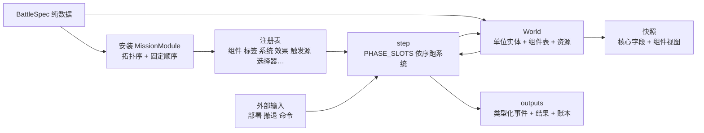
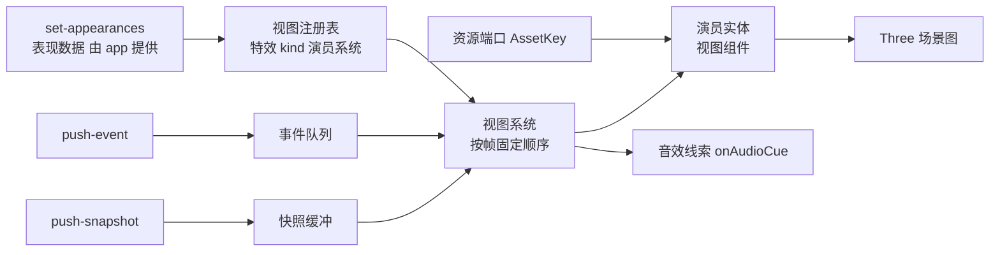
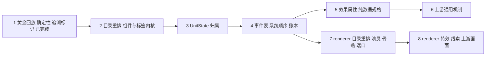

- [目标与前提](#目标与前提)
- [选库原则](#选库原则)
  - [候选库评估](#候选库评估)
  - [需同步到 ARCH 的事项](#需同步到-arch-的事项)
- [现状与问题](#现状与问题)
  - [mission-core](#mission-core)
  - [mission-renderer](#mission-renderer)
  - [ECS 思想的落实程度](#ecs-思想的落实程度)
- [mission-core 目标设计](#mission-core-目标设计)
  - [目录](#目录)
  - [实体与组件](#实体与组件)
  - [标签](#标签)
  - [系统与阶段](#系统与阶段)
  - [事件](#事件)
  - [效果与属性](#效果与属性)
  - [规格是纯数据](#规格是纯数据)
  - [扩展点](#扩展点)
  - [确定性与回放](#确定性与回放)
- [mission-renderer 目标设计](#mission-renderer-目标设计)
  - [目录](#目录-1)
  - [视图实体与视图组件](#视图实体与视图组件)
  - [视图系统](#视图系统)
  - [特效表与音效线索](#特效表与音效线索)
  - [端口与表现数据](#端口与表现数据)
  - [Spine 运行时](#spine-运行时)
  - [契约与宿主接口](#契约与宿主接口)
- [master 新增逻辑的落点](#master-新增逻辑的落点)
  - [用例对照表](#用例对照表)
  - [引擎通用机制](#引擎通用机制)
  - [内容机制（留在内容模块）](#内容机制留在内容模块)
  - [画面](#画面)
- [从 REMAIN 并入的事项](#从-remain-并入的事项)
  - [原第 1 节（数据包）](#原第-1-节数据包)
  - [原第 6 节（作战核心）](#原第-6-节作战核心)
  - [原第 7 节（作战画面）](#原第-7-节作战画面)
  - [原第 8 节（资源）](#原第-8-节资源)
  - [原第 10 节（待确认）](#原第-10-节待确认)
- [实施步骤](#实施步骤)
  - [步骤 1：黄金回放、确定性与追溯标记（已完成）](#步骤-1黄金回放确定性与追溯标记已完成)
  - [步骤 2：目录重排与组件、资源、标签内核](#步骤-2目录重排与组件资源标签内核)
  - [步骤 3：UnitState 字段归属与快照视图](#步骤-3unitstate-字段归属与快照视图)
  - [步骤 4：类型化事件表、系统顺序与账本](#步骤-4类型化事件表系统顺序与账本)
  - [步骤 5：效果与属性（类 GAS），规格纯数据](#步骤-5效果与属性类-gas规格纯数据)
  - [步骤 6：上游通用机制](#步骤-6上游通用机制)
  - [步骤 7：renderer 目录重排、演员、骨骼、表现数据与端口](#步骤-7renderer-目录重排演员骨骼表现数据与端口)
  - [步骤 8：renderer 特效表、音效线索与上游画面行为](#步骤-8renderer-特效表音效线索与上游画面行为)
- [追溯标记](#追溯标记)
- [共同约定](#共同约定)
- [不在本计划范围](#不在本计划范围)
- [探索项](#探索项)
- [待决事项](#待决事项)

本文是 `mission-core` 与 `mission-renderer` 借鉴 ECS 思想重构的计划，同时把 master（参考副本放在 `app/compat/upstream/repo/`，不入库，由用户放入）自上次同步以来的新逻辑落到新架构里。架构方向以 [ARCH.md](ARCH.md) 与 [FEATURE.md](FEATURE.md) 为准；本文与 [REMAIN.md](REMAIN.md)、[MIGRATE.md](MIGRATE.md) 冲突时，以 ARCH 与 FEATURE 为准。原 REMAIN 第 1、6、7、8、10 节中属于这两个包的条目已并入本文，REMAIN 只留指向本文的一行。

## 目标与前提

- 重写而非移植：master 只是正确行为与机制清单的参照（ARCH「目标与前提」）。本文中的 master 路径只用来找行为，不照搬结构。
- 借鉴 ECS 思想；引擎层（`mission-core`、`mission-renderer`）可以充分利用社区库来减少工作量，前提是库足够契合（见「选库原则」）。这放宽了 ARCH「目标与前提」（核心库不加运行时依赖）与「分层与 ECS」（不引入 ECS 库）的说法，待同步到 ARCH。`mission-core` 与 `mission-renderer` 仍不使用 Effect、Cordis（ARCH「运行时框架」）。`three` 是 renderer 的对等依赖，不算新增。
- 引擎机制高扩展：官方规则更新时，新机制通过注册接入，不改核心类型和分支（ARCH「目标与前提」，AGENTS「引擎机制保持扩展性」）。干员、敌人、首领的个别机制写在内容模块里，引擎里不出现任何干员名、敌人名或卫戍协议专有概念。
- 模组：只有用 `defineExtensible(id, { version, contract })` 标记的注册 id 允许 `replace` 与 `wrap`，逐步开放；不对 `mission-core` 做运行时打补丁（ARCH「行为层」）。`MissionModule` 计入 `contentHash`。
- 确定性：时间只来自拍数，随机只来自种子流；迭代顺序稳定，模块安装顺序固定；浮点按固定顺序累加（ARCH「可复现与可测试」）。
- 画面只认识资源句柄：renderer 按调用方给的 `AssetKey` 经 `assets-catalog` 申请句柄，动画角色在 `app/data` 解析，画面不打开 `chess.json`（本文「端口与表现数据」、[资源端口](../docs/development/mission-renderer/port.md)）。
- 30 Hz 作战数据留在 React 之外，renderer 直接读取（ARCH「前端」）。
- 理由（ARCH）：单场战斗只有几十个单位，性能不是瓶颈；扩展压力来自个别机制和大量特效种类，需要的是类型化注册表与模块自有状态。

## 选库原则

引擎层可以充分利用社区库，库足够契合才用；不契合时自建，不为用库而改领域模型。契合的标准：

- 确定性（只对 `mission-core`）：不读时钟、不用 `Math.random`、不依赖近似 `Math.*` 或对象键插入以外的顺序；同一输入在 Node 与浏览器上逐位一致。
- 可摇树（ESM、`sideEffects: false`），体积小，依赖少；没有全局副作用（不改原型、不注册全局单例）。
- 仍在维护（近一年有发布或提交），自带 TypeScript 类型，浏览器与 Node 都能运行。
- 许可证与 GPL-3.0-or-later 兼容（MIT、ISC、Apache-2.0、MPL-2.0 可以；附加限制的许可证需用户决定）。
- 核心库不拖入应用层框架（React、Effect、Cordis 等）；`mission-renderer` 的 `three` 仍是对等依赖。
- 已知例外：pixi-spine 带入的 `@pixi/core` 有全局副作用且摇树不掉，因 3.8 资源暂无更好选择而接受（见「Spine 运行时」）。
- 按 AGENTS.md 优先轻量库；新增依赖在提交说明与 `docs/` 中写明用途与替代方案，并通过黄金回放验证。

### 候选库评估

版本与维护情况查于 2026-10-10（npm registry、GitHub）。

| 用途 | 候选 | 现状 | 建议 | 理由 |
|---|---|---|---|---|
| 核心 ECS | bitECS 0.4.0（MPL-2.0） | 2025-12 发布，2026-08 仍有提交 | 不用 | 面向大量实体的数值 SoA，字符串与对象组件、导出导入和模块自有状态都要绕路；单场只有几十个单位 |
| 核心 ECS | miniplex 2.0.0（MIT） | 最近发布 2023-07，仓库 2026-04 有提交 | 不用 | 对象实体、查询简单，但不提供稳定序与序列化；我们需要的部分自建只有一两百行 |
| 核心 ECS | Becsy 0.16.1（MIT） | 2026-10 发布 | 不用 | 面向多线程与装饰器，体量和约束都超出需要 |
| 核心 ECS | Koota 0.6.6（ISC） | 2026-04 发布，仓库活跃 | 不用 | pmndrs 出品，偏 React 生态，0.x 接口仍在变 |
| 视图层实体 | miniplex / Koota | 同上 | 自建（已定） | 视图实体是 `Map` 加几个系统函数；查询变多时再按本原则评估 miniplex |
| 确定性数学 | `@stdlib/math-base-special-sin`、`-cos`、`-atan2`、`-hypot`（Apache-2.0，0.3.x） | 维护中 | 不用（步骤 1 实测） | `sin`、`cos` 约 46% 输入与 master 不逐位一致，其余有数千处 1 ulp 差异，共 164 个依赖；已移植 master `detmath.js` |
| 定点数 | decimal.js 10.6、big.js 7.0 | 维护中 | 不用 | 改成定点数要重写全部数值；已用正确舍入运算保证确定性 |
| 种子 PRNG | pure-rand 8.4.2（MIT）、seedrandom 3.0.5 | pure-rand 活跃；seedrandom 2019 后无发布 | 自建（沿用 `random/`） | 随机流算法决定黄金摘要，现有派生种子只有几十行；换算法会改变全部回放 |
| 类型化事件 | nanoevents 10.0.0、mitt 3.0.1、emittery 2.1.0 | nanoevents、emittery 活跃；mitt 2023 后无发布 | 核心自建；renderer 可用 nanoevents | 核心要 FIFO 重入、拍号日志与稳定顺序；renderer 的指针、相机事件只需一个小发射器 |
| 对象池 | 无合适的通用库 | — | 自建 | 按特效 kind 分池，几十行 |
| 数据结构 | mnemonist 0.40.5（MIT） | 活跃 | 暂不用 | 目前只需数组与 `Map`；需要堆或环形缓冲时再引入单个模块 |
| Spine 运行时 | `@pixi-spine/runtime-3.8`、`@pixi-spine/base` 4.0.6（Spine Runtimes License） | 2025-03 发布；`assets-extractor` 已用 | 用（已定，可替换） | 能读 3.8 数据；只用骨骼与动画计算，Three 网格适配自建并藏在骨骼端口后；会带入 `@pixi/*` 对等依赖，代价见「Spine 运行时」 |
| Spine 运行时 | `@esotericsoftware/spine-threejs` 4.3.13 | 官方，活跃，只支持 4.x 数据 | 不能直接用 | 资源是 Spine 3.8（`spineVersion` 为 `3.8.99`） |
| Spine 运行时 | spine-runtimes `3.8` 分支的 spine-ts core 与 threejs | 官方旧分支，不发 npm 包 | 暂不用，见「探索项」 | 可以去掉 Pixi，但要整份引入源码，许可证相同 |
| 规格与对照表校验 | valibot 1.5.0（MIT） | 活跃，ARCH 已为叶子库选用 | 用（规格入口与工具） | 与 ARCH 选型一致，可摇树；进入核心即成为运行时依赖，需经本原则 |
| 属性测试 | fast-check 4.10.2（MIT） | 活跃 | 用（开发依赖） | 适合拍对齐、叠加顺序、导出导入往返等不变量 |
| 补间 | @tweenjs/tween.js 25.0.0（MIT） | 2024-07 发布，零依赖 | 暂不用 | 滑行、淡出公式简单；需要时间线编排时再引入 |

### 需同步到 ARCH 的事项

本文不改 ARCH；以下待用户确认后同步：

1. ARCH「目标与前提」写「核心库不加运行时依赖」，改为：引擎层可按本文「选库原则」使用社区库。
2. ARCH「分层与 ECS」写「不引入 ECS 库」，改为：可以使用，目前评估后选择自建，理由见本文「候选库评估」。
3. renderer 暂用 pixi-spine 3.8 的运行时部分及其 `@pixi/*` 对等依赖（只做骨骼计算，不用 Pixi 渲染）：ARCH 的依赖说明需补上，并写明 Spine Runtimes License 的附加条件及其与 GPL-3.0-or-later 的关系（master 同样使用 pixi-spine）。

## 现状与问题

### mission-core

目录（约 15k 行，含测试）：

```text
mission-core/
  contract/     spec.ts（BattleSpec、UnitSpec、SkillSpec…）、event.ts、phase.ts、result.ts、snapshot.ts
  port/         content.ts（MissionModule、Registration、ContentContext 与各种 Definition）、loadout.ts、unknown-registration.ts
  battle/       create-battle.ts、engine.ts、registry.ts、context.ts、state.ts、session.ts、snapshot.ts、
                attack/ behavior/ damage/ deploy/ projectile/ skill/ space/ target/ unit/（status/ 在 unit 下）、
                block.ts cost.ts leak.ts redeploy.ts
  random/ tick/ runner/（frame.ts 帧时钟、headless.ts）
  test/         按机制分目录的 .spec.ts
```

- 注册表 `battle/registry.ts`：status、damage-step（按 priority）、element、selector、skill-trigger、skill-body、timer（带 slot）、deploy-strategy、shift、system（slot + priority + 注册序）。同 id 再注册直接覆盖，没有冲突报告，也没有可扩展 id 的标记。
- 阶段：`contract/phase.ts` 的 `PHASE_SLOTS` = schedule、spawn、cost、status、enemy、enemy-index、ally、projectile、redeploy、finale。引擎系统在 `battle/engine.ts` 以 `engine:*` 注册。`step()` 依次跑各槽的系统后 `tick += 1`。
- 模块：`MissionModule { id, dependsOn?, install(ctx) }`，按 `spec.modules` 与依赖做拓扑序安装。内置的 block、cost、deploy、leak、redeploy 也以模块导出。
- `UnitState`（`battle/unit/index.ts`）是一个大对象：身份、空间、属性与修饰、技能、状态、计时器，以及只服务单一机制的 `boomerangsOut`、`boomerangEpoch`、`shiftRun`、`routeHidden`、`hitLimit`、`overhealShield`、`bursting`、`elementCredit`、`elements`、`blocking`、`blockedBy`、`targetPriority`，外加 `moduleData: Map<string, Record<string, unknown>>` 与 `script` 黑板。
- `BattleState`（`battle/state.ts`）还带 `damagePreview`、`selectorOrigin` 两个“当前调用”的全局开关，`shared: Map<string, Record<string, unknown>>` 作模块的本场记录，`live` 与 `battle/session.ts` 的 `WeakMap` 把上下文绑回状态。
- 标志：`unit.flags: Set<string>` 由 `writeFlags` 从状态定义与技能的 `flags` 重算。查询处直接匹配字面量，约 25 种：`stun`、`sleep`、`silence`、`stealth`、`stealthOff`、`camou`、`reveal`、`invulnerable`、`untargetable`、`noBlock`、`unblockable`、`noHeal`、`noSp`、`noDisplace`、`levitate`、`float`、`liftoff`、`burstLock`、`hidden`、`isolated`、`hitCount`、`hitCountArts`、`hitSleep`、`healFree`、`tremble`。`UnitSpec.tags` 另有 `staticBody`、设备、召唤物等静态标记，同样按字面量读。
- 事件：`BattleEvent { tick, type: string, data: Record<string, unknown> }`。现有类型 `attack`、`attack-hit`、`hit`、`damaged`、`heal`、`fatal`、`downed`、`deploy`、`spawn`、`displace`、`blocked`、`unblocked`、`cost`、`leak`、`loss`、`projectile`、`skill-start`、`skill-end`、`ammo-used`、`status`、`elementHit`、`elementBurst`；命名混用 kebab-case 与 camelCase。订阅者同步回调，可在回调里再发事件（无排队、无深度策略）。
- 状态与增益：`battle/unit/status/` 有目录式定义（flags、immune、cancels、modifiers、overlap），`overlap.ts` 的“同名取最高”只保留一个等待者 `tail`。属性修饰 `AttributeModifier { op: add | percent | mul }` 按 key 挂在 `unit.modifiers`，在 finale 槽倒计时。
- 规格：`SkillSpec` 带 `onStart`、`onEnd`、`onTick`、`onHit` 函数，`BattleSpec` 因此不是纯数据。
- 确定性（步骤 1 之前）：攻击时序用 `READY_EPSILON = 1e-9` 比较，多处直接调用 `Math.hypot`，没有统一的确定性数学、禁用扫描与黄金回放。步骤 1 已补上（见「实施步骤」）。
- 内容：干员、敌人、首领、盟约、装备、设备的机制在 `app/server/content/`（约 112 个 `.ts`，其中 23 个仍带 `@ts-nocheck`），经 `content/support/battle-facade.ts` 适配 master 风格的 `battle` 对象，`fx(kind, data)` 约 340 处调用、约 140 种 kind。内容是 0.2.1 之前的 master 版本。

### mission-renderer

```text
mission-renderer/
  contract/   command.ts（set-map、set-camera、set-highlights、set-update-mode、push-snapshot、push-event、reset）、event.ts（MissionPointerHit、MissionAudioCue）、view.ts
  port/       resource.ts（createRendererResourcePort：键→句柄、回退链、重试、引用计数、Spine 缓存）
  stage/      stage.ts（createMissionStage）、cue.ts（事件→音效线索）、feed.ts（本地逐帧喂数）、pointer.ts、projection.ts、
              ground/terrain/（三维地面：layout、cells、materials、mesh、pack、atlas、palette、scene、stage、webgl）
```

- 已完成三维地面、音效线索映射、本地喂数。单位、特效、Spine 都没有画面：`MissionView.units` 只是快照里的 `UnitSnapshot[]`，舞台不为单位建任何显示对象。
- `UnitSnapshot` 缺 sp、护盾、首领与精英、朝向、高度、倒下与重部署计时，却有只服务回旋物的 `boomerangsOut`。
- `stage/cue.ts` 按 `event.type` 字符串查表，编译器发现不了遗漏。

### ECS 思想的落实程度

| 思想（ARCH） | 现状 | 缺口 |
|---|---|---|
| 组件 `defineComponent<T>(id)` | `moduleData`、`shared` 是 `Record<string, unknown>` | 无类型、无快照投影、无序列化 |
| 单一机制字段归属模块 | 十余个字段在 `UnitState` | 见上文字段清单 |
| 注册制标签 | `flags` 是字面量集合 | 无语义声明，`unit/aim.ts`、`target/`、`block.ts` 按名匹配 |
| 系统显式排序 | 阶段槽 + priority + 注册序 | 顺序未导出、未测试；同 id 覆盖无报告 |
| 类型化事件表 | `type: string` | 命名混用，订阅者与 renderer 都靠字符串 |
| 规格纯数据 | `SkillSpec` 带函数 | 不可序列化、不可哈希 |
| 类 GAS 增益 | 状态目录 + 修饰器，已部分成形 | 叠加策略写死在 overlap，独立乘区缺失，标签授予与状态耦合在 `writeFlags` |
| 稳定迭代 | `Map` 插入序，`spawnSeq` | 未成文，未加检查 |
| 视图层 ECS 风格 | renderer 没有单位视图 | 全部待建 |

## mission-core 目标设计



### 目录

顶层分三类，彼此不混放：边界（`contract/`、`port/`、`test/`）、运行时（`kernel/` 与组装用的 `battle/`）、领域组（`unit/`、`combat/`、`ability/`、`field/`、`economy/`、`ledger/`）。相关机制归入同一个领域组，组内是对等的领域目录；深度一般不超过两层。依赖方向：`contract/` 不依赖其他目录；`kernel/` 只依赖 `contract/`；领域组依赖 `kernel/`、`port/` 与 `contract/`，组之间经组件、标签、事件协作；`battle/` 组装全部。目录与文件都是 kebab-case 名词；只有一个实现的领域用 `index.ts`，不写 `random/random.ts` 这类重复名。

```text
mission-core/
  index.ts
  contract/        边界：对外纯数据（spec、event、snapshot、result、phase）
  port/            边界：内容端口（module、definition、context、loadout）
  test/            边界：golden/、replay.ts、source.ts、determinism.spec.ts、trace.spec.ts、fixture.ts，与按组分的用例 test/<组>/<领域>/
  kernel/          运行时内核，不认识具体机制
    world/         entity、component、resource、tag、query、archive
    event/         分发、FIFO 队列、cue
    registry/      index、extensible、error
    schedule/      阶段槽与系统排序
    tick/          拍、对齐比较、倒计时
    timer/         通用计时器
    math/          确定性数学（hypot、trig、powi）
    random/        种子流
  battle/          组装与推进：create、step、context、snapshot、frame（帧时钟）、headless（无头推进）
  unit/            单位与生命周期
    record/        核心记录、生成、downed 与 removed
    deploy/        部署模块、部署策略、再部署
    block/         阻挡
    leak/          漏怪
  combat/          战斗
    attack/        普攻节奏与命中、攻击形状、攻击计时（充能、弹药、回旋物）
    target/        选择器、排序键、攻击目标查询
    damage/        伤害步骤、公式、限伤、溢出护盾
    projectile/    投射物
    element/       元素损伤与爆发
  ability/         技能与效果（类 GAS）
    skill/         技力、触发与触发源、技能体、钩子、技能修饰
    effect/        效果、修饰、属性聚合、叠加策略、免疫、条件、内置状态
  field/           场地与移动
    direction/     朝向与相对坐标
    grid/          地块、寻路 field、pass、route、sight
    body/          碰撞体
    motion/        位移（推、拉、恐惧、吸引）、失衡、静态刚体
  economy/         费用（index.ts）
  ledger/          按 owner 的账本（index.ts）
```

路径别名按顶层目录写在 `package.json` 的 `imports`：`#contract/*.js`、`#port/*.js`、`#kernel/*.js`（如 `#kernel/world/component.js`）、`#battle/*.js`、`#unit/*.js`、`#combat/*.js`、`#ability/*.js`、`#field/*.js`、`#economy/*.js`、`#ledger/*.js`，测试辅助 `#test/*.js`（步骤 1 已有）。现有的 `#tick/*.js`、`#random/*.js`、`#runner/*.js` 删除，`#battle/*.js` 只指向组装目录。包只有根导出，app 没有深层引用（已查 `app/`、`examples/`），重排不影响使用方。

迁移表（现路径 → 新路径；`kernel/tick/`、`kernel/math/` 已在步骤 1 落位，其余纯移动在步骤 2 的第一个提交完成，拆分与新建随所在步骤）：

| 现路径 | 新路径 |
|---|---|
| `contract/*`、`port/loadout.ts`、`battle/context.ts`、`battle/snapshot.ts` | 不变 |
| `port/content.ts` | `port/module.ts`、`port/definition.ts`、`port/context.ts` |
| `battle/registry.ts`、`port/unknown-registration.ts` | `kernel/registry/index.ts`、`kernel/registry/error.ts` |
| `battle/state.ts` | `kernel/world/`（`World` 取代 `BattleState`），`emit` 移到 `kernel/event/` |
| `battle/session.ts` | 删除（步骤 2） |
| `battle/engine.ts` | `battle/step.ts`；排序部分到 `kernel/schedule/index.ts` |
| `battle/create-battle.ts` | `battle/create.ts` |
| `runner/frame.ts`、`runner/headless.ts` | `battle/frame.ts`、`battle/headless.ts` |
| `tick/index.ts` | `kernel/tick/index.ts`（步骤 1，已完成） |
| — | `kernel/math/`（步骤 1，已完成） |
| `random/index.ts` | `kernel/random/index.ts` |
| `battle/unit/timer.ts` | `kernel/timer/index.ts` |
| `battle/unit/status/flags.ts` | `kernel/world/tag.ts`（按来源聚合，步骤 2） |
| `battle/unit/index.ts` | `unit/record/index.ts` |
| `battle/deploy/board.ts`、`strategy.ts`、`battle/redeploy.ts` | `unit/deploy/index.ts`、`strategy.ts`、`redeploy.ts` |
| `battle/block.ts`、`battle/leak.ts` | `unit/block/index.ts`、`unit/leak/index.ts` |
| `battle/unit/attack.ts`、`battle/attack/shape.ts`、`battle/unit/clock.ts` | `combat/attack/index.ts`、`shape.ts`、`timing.ts`（`READY_EPSILON` 已在步骤 1 移到 `kernel/tick/`） |
| `battle/unit/aim.ts`、`battle/target/catalog.ts`、`selector.ts` | `combat/target/aim.ts`、`catalog.ts`、`selector.ts` |
| `battle/damage/*`、`battle/projectile/index.ts` | `combat/damage/*`、`combat/projectile/index.ts` |
| `battle/unit/element.ts` | `combat/element/index.ts` |
| `battle/skill/*` | `ability/skill/*`（文件名不变） |
| `battle/unit/status/index.ts`、`catalog.ts`、`constants.ts`、`palsy.ts` | `ability/effect/index.ts`、`catalog.ts`、`constants.ts`、`palsy.ts` |
| `battle/unit/status/overlap.ts`、`battle/unit/attribute.ts` | `ability/effect/stacking.ts`、`ability/effect/attribute.ts` |
| `battle/space/direction/`、`grid/`、`body/` | `field/direction/`、`field/grid/`、`field/body/` |
| `battle/behavior/action.ts`、`shift.ts` | `field/motion/index.ts`、`field/motion/fear.ts`（吸引点拆到 `attract.ts`） |
| `battle/cost.ts` | `economy/index.ts` |
| — | `kernel/world/`、`kernel/event/`、`kernel/registry/extensible.ts`、`ledger/index.ts` |
| `test/<领域>/` | `test/<组>/<领域>/`：`attack`、`damage`、`element`、`projectile`、`target`、`range` → `combat/`；`block`、`deploy`、`redeploy`、`leak` → `unit/`；`skill`、`status` → `ability/`；`body`、`path`、`shift` → `field/`（`path` → `field/grid/`，`shift` → `field/motion/`）；`phase`、`registration` → `kernel/`（`schedule/`、`registry/`）；`cost` → `economy/`；`snapshot` → `battle/`；`port` 不变 |

`kernel/tick/` 增加拍对齐的比较与倒计时函数，取代散落各处的 `1e-9`。

### 实体与组件

- 实体就是单位 id；`World` 持有单位的核心记录与按组件分开的表。组件表是按插入序的 `Map<unitId, T>`。
- `defineComponent<T>(id, options)` 返回带类型的键。`options`：`create(spec)`（缺省时按需创建）、`view?(value)`（写入快照的显示值，只给画面，不计入状态哈希与 `export()`；缺省不进快照）、`reset?`（再部署时如何处理）。组件 id 用 `模块id:名字`。
- `defineResource<T>(id, create)` 是本场唯一的数据，取代 `BattleState.shared`。
- `ContentContext` 提供 `component(key)` 与 `resource(key)`，返回 `get`、`ensure`、`set`、`delete`、`entries`（稳定序）。`moduleData`、`shared` 删除。
- 核心记录只保留各机制共享的事实：`id`、`side`、`kind`、`spawnSeq`、`aggroSeq`、`home`、`x`、`y`、`facing`、`hitArea`、`motion`、`attributes`/`base`、`effects`（原 statuses 与 modifiers）、`skills`、`timers`、`tags`、`fielded`、`downed`、`deployEpoch`、`script`。
- 单一机制字段迁入所属模块：

| 字段 | 去向 |
|---|---|
| `boomerangsOut`、`boomerangEpoch` | `combat/attack/` 的回旋物组件；`boomerangsOut` 经组件 `view` 进快照。世代改读通用的 `deployEpoch` |
| `shiftRun`、`routeHidden` | `field/motion/` 的位移组件、`field/grid/route` 的路线组件 |
| `hitLimit` | `combat/damage/` 的限伤组件 |
| `overhealShield` | `combat/damage/` 的溢出护盾组件 |
| `elements`、`bursting`、`elementCredit` | `combat/element/` 的元素组件 |
| `blocking`、`blockedBy` | `block` 模块的阻挡组件（快照仍输出，由组件 `view` 提供） |
| `targetPriority` | `combat/target/` 的索敌组件 |
| `attackClip`、`attackShape` | `combat/attack/` 的攻击档案组件（由规格创建，只读） |
| `immunity` | 效果模块的免疫组件 |

- `deployEpoch`：每次部署加一。回旋物世代、敌人普攻在伤害前快照目标部署（master 0.2.3 §28.25-1）、撤退清理都读它，不再各自计数。
- `damagePreview`、`selectorOrigin` 改为显式参数（预览上下文、查询来源），不再是全局开关；`session.ts` 的 `WeakMap` 随之删除。

### 标签

- `defineTag(id, { semantics })`。语义来自核心的封闭集合，查询只读语义：

| 语义 | 含义 | 现有字面量举例 |
|---|---|---|
| `untargetable` | 不可被敌方选中 | `untargetable`、`stealth`（未破隐时）、`liftoff`（对地） |
| `cannot-act` | 不能攻击、不能放技能 | `stun`、`sleep`、`freeze` |
| `cannot-attack` | 不能普攻 | `disarm` |
| `cannot-cast` | 不能放技能 | `silence` |
| `cannot-move` | 不能自主移动 | `bind`、失衡 |
| `cannot-block` | 不阻挡 | `noBlock` |
| `unblockable` | 不被阻挡 | `unblockable`、`fear`、`attract` |
| `no-heal`、`no-sp`、`no-displace` | 禁疗、阻回、失衡免疫 | `noHeal`、`noSp`、`noDisplace` |
| `airborne` | 视为空中 | `levitate`、`float` |
| `hidden` | 不在场上可见 | `hidden`、路线消失 |
| `hostile-target` | 友方单位在敌方条件里算作敌人 | 白铁「铁钳号·原型机」（master 0.2.2 §27.6） |

- 标签来源：规格的静态标签、效果授予的标签、技能授予的标签、模块直接授予的标签。`writeFlags` 改为按来源聚合；快照输出标签 id。
- 语义集合第一阶段封闭，模组不能新增语义；新增语义随核心版本发布，以后可以再开放。

### 系统与阶段

- `PHASE_SLOTS` 不变，模组暂不能新增槽，以后可以再开放。系统按（槽、priority、注册序）排序，另支持 `before`、`after` 引用同槽系统 id，解析后仍得到确定的线性序。
- 同 id 再注册：只有可扩展 id 允许，并按 `replace`/`wrap` 规则处理；其余报告冲突（`UnknownRegistrationError` 同族的 `RegistrationConflictError`）。
- `systemOrder()` 导出最终顺序，测试把它和文档里的顺序表一起锁定。
- 事件订阅者的重入：订阅者里再发的事件进入本拍的队列，按先进先出在当前处理结束后分发，不递归。这是 master 0.2.3 §28.24（余音与反击的递归）在引擎层的通用解法。

### 事件

- `contract/event.ts` 定义 `BattleEventMap`，模块经声明合并扩展。`emit<K>(type: K, data: BattleEventMap[K])`，`subscribe<K>` 同理。
- 线路上沿用 master 的 `EV` 事件名，与核心事件名的对照放在兼容层 `app/compat/upstream`；核心与 app 契约只用 kebab-case。
- 命名统一为 kebab-case：`elementHit` → `element-hit`，`elementBurst` → `element-burst`，`layerGain` → `layer-gain`；其余保持。
- 画面线索：内容的 `fx(kind, data)` 改为核心事件 `cue`，`{ kind, unitId?, x?, y?, ... }`。`kind` 来自可声明合并的 `CueMap`，renderer 的特效表与 `app/client/audio` 按 kind 查表。
- 显示元数据随事件走：`displace` 带 `duration`（失衡时长）与 `keepFacing`（master 0.2.3 §28.9）。
- 阵亡与离场：单位倒下时发 `downed`（还可能再部署或复活）；离场且不再回来时（召唤物消失、设备被摧毁、敌人漏出或被移除）发 `removed`，单位从下一拍的快照中去掉。核心保留单位记录直到战斗结束，账本仍能引用它。
- 账本：核心只按单位的 `owner` 记录击杀、漏怪、伤害、治疗、阵亡与本场计入总数的敌人（`resolved`、`killedInTotal`、`leakedInTotal`，master 0.2.2 §27.51）。`owner` 是 `UnitSpec` 上不透明的字符串 id，核心没有玩家与房间的概念。账本作为 outputs 的一部分由模块按事件累计；`BattleResult` 只放核心结论（是否结束、胜方）。app/server 把 `owner` 映射到玩家，汇总成 `perPlayer` 与对局结果，兼容层 `result/` 读取它的汇总。
- 设备单位：`spawnUnit` 统一生成 `kind: "device"` 的单位，取代 master 风格的 `battle.spawnDevice(key, x, y, stats)`；服务端的生成路径见 [REMAIN.md](REMAIN.md) 第 5 节。

### 效果与属性

借鉴 GAS 的属性、修饰器、标签模型：

- 属性：`defineAttribute(id, { base, clamp? })`。聚合按固定阶段：基础值 → 加值 → 百分比 → 直接乘算 → 独立乘区。独立乘区用于练度（自持有加成，master 0.2.2 §27.56「与其他加成独立」）等官方写明独立的系数。
- 效果：`defineEffect(id, { duration | instant | periodic, modifiers, grantsTags, immunity, stacking, onApply?, onTick?, onRemove? })`。现有状态目录改写为效果定义。
- 叠加策略是注册项：`refresh`、`stack`、`independent`、`strongest`。`strongest` 维护按强度递减、到期递增的等待链（master 0.2.2 §27.14，三个以上同名效果依次接续），不是单个 `tail`。
- 条件效果：`defineCondition(id, evaluate)`，效果在条件成立的拍挂上、不成立的拍移除。模组特性「攻击范围内存在 N 名敌人时攻击速度 +X」（master 0.2.2 §27.15）由 `app/data` 编译成「条件 id + 参数 + 效果」的数据，核心只提供“范围内敌人数 ≥ N”这类通用条件，不解析中文句子。
- 技力：`gainSp` 的选项 `ignoreLock`（master 0.2.3 §28.25-10）只给明确写明的例外使用；技力达到费用的比较走 `kernel/tick/` 的对齐函数（§27.61）。

### 规格是纯数据

- `SkillSpec` 的 `onStart`、`onEnd`、`onTick`、`onHit` 改为 `hooks: { start?: id, end?: id, tick?: id, hit?: id }`，id 指向注册的技能钩子。`BattleSpec` 因此可序列化、可哈希。
- `script`、`notes` 仍是纯数据黑板。规格上的 id（模块、技能体、触发、钩子、效果、条件、选择器、部署策略）在建战斗时全部校验，缺失即 `UnknownRegistrationError`。
- `contentHash` 的输入：规格、模块 id 与版本、可扩展 id 的替换链。

### 扩展点

- 注册表全部类型化。可扩展 id 用 `defineExtensible(id, { version, contract })` 标记；第一批开放：技能触发、技能体、选择器、伤害步骤、效果叠加策略、条件、部署策略、`cue` kind。系统与组件不开放替换。
- 触发源：`registerTriggerSource({ id, cadence: "tick" | "attack", targets })`，技能自动释放的“范围内有目标”除了自身范围，还看触发源给出的目标；`cadence: "attack"` 等到下一次普攻时点（master 0.2.3 §28.4、§28.13 的 `addTriggerRange(fn, { attackOnly })`）。治疗与攻击混合的触发（§28.10）用同一机制组合。
- 替代目标：攻击系统允许模块提供替代目标（没有敌人时治疗半血友方，§28.10），引擎不认识具体干员。
- 释放节奏：立即生效、本身不是攻击的技能两次释放至少隔一个攻击间隔（master 0.2.2 §27.18），作为技能组件的 `nextCastAt`，属于通用技能系统。
- 内容模块的边界：引擎提供机制（组件、效果、条件、触发源、位移、投射物、选择器）；具体干员的组合留在内容模块。新机制先找已有扩展点，确实没有时扩展核心契约，并在本文或 docs 记录。

### 确定性与回放

- 确定性数学 `kernel/math/`、整帧对齐 `kernel/tick/` 与禁用近似 `Math.*`、时钟与熵的扫描已在步骤 1 落地（[确定性数学与整帧对齐](../docs/development/mission-core/kernel.md)、[黄金回放与源码扫描](../docs/development/mission-core/testing.md)）。后续步骤里失衡结束、计时器等新增的时长比较同样走 `countdown`、`reached`。
- 稳定顺序：单位按插入序，同序按 `spawnSeq`；组件表、订阅者、系统、效果等待链都有确定顺序；模块安装顺序由规格与依赖决定。
- 状态导出与导入：`World` 可导出为纯数据并重建，用于检查点与状态哈希。
- 黄金回放：`test/replay.ts` 与 `test/golden/`（步骤 1 落地，见 [黄金回放与源码扫描](../docs/development/mission-core/testing.md)）。基线是 next 自身的摘要：每一步重构前后必须一致；有意变更单独提交，并在提交说明与本文记录变动的场景。与 master sim 的对拍只作一致性指标，不作验收条件（REMAIN 第 2 节「测试」）。
- 可变 `World` 与快照：`stepBattle(world, inputs) → outputs`，`outputs` 是事件、账本增量与结果。`World` 在内部可变，只经 `step` 修改；`export()` 产出可序列化的纯数据快照，`import()` 从快照重建。快照用于回放的检查点、断线重连时的状态同步与黄金比对。ARCH 中不可变的 `step(state, input, env)` 写的是对局核心，作战核心不要求不可变状态。

## mission-renderer 目标设计



### 目录

与 mission-core 同样分三类：边界（`contract/`、`port/`、`test/`）、运行时（`runtime/`：舞台组装、帧循环、喂数、相机）、领域（`ground/`、`actor/`、`effect/`、`pointer/`、`audio/`）。去掉 `stage/ground/terrain/` 这类只有一个实现的嵌套，两个同名 `stage.ts` 的问题随之消失。

```text
mission-renderer/
  index.ts
  contract/      边界：command、view、pointer（MissionPointerHit）、audio（MissionAudioCue）、appearance（表现数据）
  port/          边界：resource（资源端口）、skeleton（骨骼运行时端口）
  test/          边界：trace.spec.ts，与按组分的用例
  runtime/       舞台运行时
    stage/       createMissionStage：组装与命令分发（index）、帧循环与视图系统顺序（loop）
    feed/        快照缓冲、插值、本地喂数
    camera/      投影与相机
  ground/        棋盘表面：index（地面入口）、layout、cells、materials、mesh、pack、atlas、palette、scene、webgl
  actor/         单位画面
    entity/      演员实体、视图组件、位置、朝向与形态、骨骼动画系统
    skeleton/    骨骼端口的默认实现：atlas（3.8 图集读取）、mesh（Three 网格适配）、index
    hud/         头顶条、状态图标、重部署圈
    impostor/    替身图集
  effect/        特效表、特效实例、对象池
  pointer/       拾取与指针事件流
  audio/         事件与 cue 到音效线索
```

路径别名：`#contract/*.js`、`#port/*.js`、`#runtime/*.js`、`#ground/*.js`、`#actor/*.js`、`#effect/*.js`、`#pointer/*.js`、`#audio/*.js`；现有的 `#stage/*.js` 删除。

迁移表（纯移动在步骤 7 的第一个提交完成）：

| 现路径 | 新路径 |
|---|---|
| `stage/stage.ts` | `runtime/stage/index.ts`、`runtime/stage/loop.ts` |
| `stage/feed.ts` | `runtime/feed/index.ts` |
| `stage/projection.ts` | `runtime/camera/index.ts` |
| `stage/pointer.ts` | `pointer/index.ts` |
| `stage/cue.ts` | `audio/index.ts` |
| `stage/ground/terrain/stage.ts` | `ground/index.ts` |
| `stage/ground/terrain/` 其余文件 | `ground/`（文件名不变） |
| `contract/event.ts` | `contract/pointer.ts`、`contract/audio.ts` |
| `contract/command.ts`、`view.ts`、`port/resource.ts` | 不变 |
| — | 新建 `contract/appearance.ts`、`port/skeleton.ts`、`actor/`（`entity/`、`skeleton/`、`hud/`、`impostor/`）、`effect/` |

### 视图实体与视图组件

- 每个单位一个演员实体，键是单位 id。快照里第一次出现或收到 `spawn`、`deploy` 时创建；`downed` 播倒下姿态，收到 `removed` 后淡出并释放。
- 视图组件（普通对象，自建；查询变多时再按「选库原则」评估 miniplex）：

| 组件 | 内容 |
|---|---|
| 位置 | 从快照缓冲取样的位置、高度；站定（`stand`、`standCut`，master 0.2.2 §27.37）、滑行（`displace` 的 `duration`、`keepFacing`，§27.38、0.2.3 §28.9） |
| 骨骼 | 骨骼实例（经骨骼端口，见「Spine 运行时」）、动画角色表、当前 clip、形态（FORMS）、朝向与镜像、前摇、攻击 clip 的完整播放（§27.41）、倒下姿态、静止姿态复用（0.2.3 §28.8）、晚加载的入场动画（§28.22） |
| 表现 | 缩放 `modelScale`、`modelScaleY`、`mirrorX`、偏移、染色、是否显示血条（如香槟炸弹不显示，§27.39） |
| 头顶条 | 生命、残影、护盾、SP 与就绪光、弹匣格、狼影、负生命池（§27.42，读核心组件的快照视图） |
| 状态图标 | 冻结、眩晕、沉睡、无敌、隐身等，读标签语义 |
| 重部署圈 | 倒计时与共享数字纹理（§28.8） |
| 替身 | 替身图集槽位（共享 RenderTexture、分页、货架分配、clip 页），刷新顺序按本帧更新序（§27.45） |

### 视图系统

每帧固定顺序：摄取（事件进队列、快照进缓冲）→ 生命周期（建、删演员）→ 位置 → 朝向与形态 → 骨骼动画 → 头顶条与图标 → 特效 → 音效线索 → 剔除与 LOD → 释放。系统以 id 注册在 `actor/` 与 `effect/`，顺序表导出并测试。

### 特效表与音效线索

- `registerEffectKind(kind, factory)`：每种 `cue` kind 一个工厂，产出带寿命的特效实例。弹道、命中火花、伤害数字、死亡溶解、部署环、持续光环、范围预警、光束与链、炮台开火与后坐、箱子与炮台碎裂、雪暴（§27.32）、剑气（§27.36）、克莱门莎的爆炸占位（0.2.3 §28.1）都是 kind。
- 未注册的 kind 不画，开发模式下每种只报告一次；kind 清单从核心 `CueMap` 与内容的声明合并得到，测试检查每个声明的 kind 都有工厂或明确标为无画面。
- 音效线索：`audio/` 按事件类型与 `cue` kind 产出 `MissionAudioCue`，类型由事件表推导，遗漏在编译期报错。renderer 不加载音频；`app/client/audio` 按清单 `refs` 把线索映射到 `audio:` 键。技能期间的攻击、命中音按技能槽选择音库（0.2.3 §28.17）时，线索带上技能槽，选择规则在 app。
- master 的 `theme` / `fx` 材质表不迁移（master 只加载、不使用）。

### 端口与表现数据

- renderer 只认识 `AssetKey`。表现数据由 app 经命令 `set-appearances` 传入：`{ unitId → { spine: AssetKey, roles: AnimRoleTable, scale, scaleY, mirrorX, offset, tint?, hpBar? } }`。动画角色表 `json:anim-roles/<seasonId>` 由 `app/data` 派生（[编译](../docs/app/data/compiler.md#派生文件)），app 解析后传入；renderer 不读 `chess.json`、`enemies.json`。
- `modelScaleY`、`mirrorX`、敌人缩放与偏移是表现数据，不计入 `contentHash`，由 `app/data` 编译进赛季包的表现字段。
- 资源种类策略：`texture`（棋盘颜色、法线、粗糙度、遮罩）与 `image`（界面与精灵）由端口按种类设置色彩空间、各向异性与 mipmap，地面不再逐处设置。
- 染色 `tint` 可选，由 app 决定是否使用（备用模型与别名染色，master `ALIAS_TINT`）；master 的 `theme` / `fx` 材质表不迁移。
- Spine 缓存、回退与重试沿用 [资源端口](../docs/development/mission-renderer/port.md)。

### Spine 运行时

资源是 Spine 3.8（`assets-catalog` 的 `spine-meta` 中 `spineVersion` 为 `3.8.99`）。第一版借用 pixi-spine 的 3.8 运行时做骨骼与动画计算，画面由自建的 Three 网格适配器绘制，二者都在骨骼端口后面，以后可以整体替换（见「探索项」）。

- 依赖：`@pixi-spine/runtime-3.8`、`@pixi-spine/base`（4.0.6），以及它们声明的对等依赖 `@pixi/core`、`@pixi/display`、`@pixi/graphics`、`@pixi/mesh`、`@pixi/mesh-extras`、`@pixi/sprite`（7.4.3，与 `assets-extractor` 锁定的版本一致），列为 `mission-renderer` 的 `dependencies`。只有 `actor/skeleton/` 可以引用这些包。
- 只用运行时部分：`SkeletonBinary`、`SkeletonJson`、`AtlasAttachmentLoader`、`Skeleton`、`AnimationState`、`AnimationStateData` 与各附件的 `computeWorldVertices`。不创建 `Spine` 显示对象、Pixi 渲染器、`Texture` 或 `BaseTexture`。
- 图集：`actor/skeleton/atlas.ts` 读取 3.8 的 `.atlas` 文本，产出普通对象的区域（`u`、`v`、`u2`、`v2`、`rotate`、`width`、`height`、`offsetX`、`offsetY`、`originalWidth`、`originalHeight` 与页）。附件只读这些字段（已查 `RegionAttachment`），不需要 Pixi 贴图；页贴图是经资源端口申请的 Three 纹理。
- 网格适配：`actor/skeleton/mesh.ts` 为每个骨骼实例维护一份 `BufferGeometry`（位置、UV、颜色为动态属性）。每帧 `state.update(dt)`、`state.apply(skeleton)`、`skeleton.updateWorldTransform()` 后按 `drawOrder` 遍历插槽，把区域附件与网格附件的世界顶点写入几何体，按页纹理与混合模式（normal、additive、multiply、screen 对应 Three 的混合设置）分组绘制，预乘透明度按图集设置。裁剪附件用模板缓冲实现（pixi-spine 依赖 Pixi 遮罩，这部分自建）；无模板遮罩时闭眼（§27.40）在这里处理。
- 端口：`port/skeleton.ts` 定义 `SkeletonRuntime`：`load`（骨骼数据、图集、页纹理 → 骨骼数据句柄）、`create`（实例：设置与排队动画、`update(dt)`、动画事件、包围盒、`object3d`）、`dispose`。`actor/` 只经端口使用骨骼；资源端口的 Spine 缓存存放端口产出的骨骼数据句柄。默认实现在 `actor/skeleton/`，换运行时只换这一处。
- 代价（2026-10-10 用 esbuild 实测，只引入上面的类，压缩后）：约 422 KB，gzip 约 122 KB。其中 `runtime-3.8` 约 105 KB，`@pixi/core` 约 138 KB，其余是 `@pixi/graphics`、`display`、`utils`、`math` 与 `url`、`qs` 等传递依赖。包入口重导出了 `Spine` 显示对象，`@pixi/*` 又没有声明 `sideEffects: false`，摇树去不掉；`@pixi/core` 导入时注册全局扩展与设置，不满足「选库原则」的“无全局副作用”，作为已知例外接受。运行时本身只有 3 个文件用到 `@pixi/core`（`SkeletonJson`、`SkeletonBinary` 的混合模式常量，`Bone` 的 `Matrix`）。在 Node 中可以导入，端口与演员逻辑可以无头测试。
- 许可证：Spine Runtimes License（附加条件），见「需同步到 ARCH 的事项」。

### 契约与宿主接口

- 快照：核心快照提供 sp、护盾、首领与精英标记（由内容组件的 `view`）、朝向、高度、倒下与重部署计时；回旋物数量等单一机制的值只经组件视图出现。
- 指针：拾取取最近、最上层的单位；提供指针事件流（按下、移动、抬起，单位或格子），坐标相对视口；导出 `calculateBoardTransform` 供 HTML 覆盖层定位。
- 命令：`set-highlights` 由地面绘制；`set-update-mode` 不丢弃缓冲帧与待放事件；增加调速命令。
- 公开导出与前缀统一（`Mission*`），去掉 `TERRAIN_IMAGE_SLOTS` 中的缩写。
- 生产侧：mission-core 快照与事件到 renderer 输入的转换在 `app/client/field`（MIGRATE「field」），本文只保证契约足够。

## master 新增逻辑的落点

上次同步基线：master 参考副本在 2026-10-08 22:23 为 `3eced7bd`（`v0.2.1-1`），REMAIN 第 1 节的核对也基于 0.2.1。当前 master 为 `1db8e510`（`v0.2.3`，2026-10-10）。范围是 `git diff 3eced7bd 1db8e510`：`server/sim/` 108 个文件，`public/js/render/`、`battle/`、`audio.js` 17 个文件。设计记录见 master 的 `docs/history/0.2.2.md`（§27）与 `0.2.3.md`（§28）。

### 用例对照表

已在步骤 1 落地，用法与格式见 [连接 master 后端 · 用例对照表](../docs/app/compat/upstream.md#用例对照表)。本节只记计划层面的约定与现状。

- 用途：每次同步 master 后列出新增或尚未在 next 中找到对应的用例。对照只记在 `app/compat/upstream/case-map/mapping.json`：不改 master 的测试，也不在 next 的测试名或注释里写 master 引用。
- master 参考副本：缺省读取 `app/compat/upstream/repo/`（已列入该包 `.gitignore`，由用户放入并在其中运行 `npm ci`；`--repo` 可指定别的检出目录）；命令入口是 `case-map/cli.ts`，在 `app/compat/upstream` 内运行 `pnpm build && pnpm case-map`。
- 枚举 master：用 `node --import` 预加载替换 `node:test` 的 `test`、`describe`、`it`，只记全名、不执行用例体。原先设想的 `--test-name-pattern` 加 TAP 的做法在 Node 22 上不可用，已放弃。导入失败计为枚举错误，命令以非零码退出。
- 现状（对 master `1db8e510`）：6179 条，逐条 844（`sim/` 全部），规则 5335（10 条）；未对应、悬空、枚举错误均为 0。状态：`covered` 9、`rewritten` 2、`moved` 5023、`not-migrated` 18、`pending` 1127；next 侧 2037 条。
- `sim/` 中只有 `detmath`、整帧容差两组按用例与 next 核对过；其余按文件归类：内容用例 `moved`，引擎通用用例 `pending`，`step` 为 `ECS 2`～`ECS 6`（29、9、60、101、266 条）。`render/**` 由规则标为 `pending`（`ECS 8`）。步骤 2～6、8 的验收要求把本步的 `pending` 条目逐条核对，改为 `covered` 或 `rewritten` 并写 `next` 引用。
- 没有采用的做法：在 next 测试里写 `@covers` 或在测试名里带 master id（违反 AGENTS 的测试命名约定）；YAML 或表格式追踪矩阵（难以按用例校验与 diff）；用 JUnit XML 或 TAP 存对照（适合枚举，不适合人工维护）；按行号映射（测试一改就失效）。

### 引擎通用机制

| 机制 | master 位置 | 落点 |
|---|---|---|
| 确定性数学（§27.1） | `server/sim/detmath.js`，lint 禁用近似 `Math.*` | `mission-core/kernel/math/`，步骤 1（已完成） |
| 整帧对齐：攻击倒计时与时间技力（§27.61） | `sim/ai.js attackCountdown`、`sim/skills.js gainSp/_normalize`、`content/devices.js tickTurret` | `kernel/tick/` 的 `countdown`、`reached`，步骤 1（已完成；攻击倒计时与技力已替换） |
| 同名取最高的等待链（§27.14） | `sim/battle/status.js _applyValuedStatus` | 效果叠加策略 `strongest`，步骤 5 |
| 模组特性的条件攻速由引擎处理（§27.15） | `sim/content/traitMods.js`、`battle/players.js _setupUnit` | 通用条件效果，句子解析在 `app/data` 编译器，步骤 5 |
| 失衡状态机与静态刚体（§27.22） | `battle/displacement.js push/pull/_unbalance/_staticForce`、`ai.js updateEnemy`、`constants.js PUSH_UNBALANCE…` | `field/motion/` 的失衡组件，授予 `cannot-move`、`cannot-attack`、`cannot-cast`；时长表是数据，步骤 6 |
| 立即技能的释放间隔（§27.18） | `sim/skills.js nextCastAt` | 技能组件，步骤 6 |
| 触发源与 `attackOnly`（§28.4、§28.13） | `sim/skills.js addTriggerRange` | `registerTriggerSource`，步骤 6 |
| 治疗与攻击混合触发、无敌人时的替代目标（§28.10） | `ai.js updateAlly`、`skills.js` | 触发源组合与替代目标扩展点，步骤 6 |
| 友方装置在敌方条件里算作敌人（§27.6） | `skills.js _allyTargetIn`、`battle/queries.js allyTargetsInKeys` | 标签语义 `hostile-target`，步骤 2、6 |
| `keepSp` 再部署保留免费技能的层数（§27.7） | `battle/deploy.js _deploy` | `unit/deploy/redeploy.ts` 与技能组件的 `reset`，步骤 6 |
| `gainSp` 的 `ignoreLock`（§28.25-10） | `skills.js gainSp` | 技能系统选项，步骤 5 |
| 普攻在伤害前快照目标部署（§28.25-1） | `ai.js`、`battle/deploy.js` | `deployEpoch`，步骤 3、6 |
| 持续光环只看在场、不看能否行动（§28.25-7） | 吟游者特性、浊心斯卡蒂 | 标签语义区分 `cannot-act` 与在场，步骤 2；具体光环在内容 |
| 订阅回调的重入改为队列（§28.24） | `content/bosses.js` 余音、刺玫与泡泡反击 | 事件分发 FIFO，步骤 4 |
| 位移事件的 `keepFacing`、`dur`（§28.9、§27.22） | `battle/displacement.js displace` | `displace` 事件字段，步骤 4 |
| 计入总数的敌人与 `resolved`（§27.51） | `battle/spawns.js inTotal`、`deploy.js killedInTotal/leakedInTotal`、`Battle.js resolved` | `SpawnSpec` 的计数标记与账本，步骤 4；按玩家归属在 app |
| 攻击后摇站定的显示元数据（§27.37） | `battle/events.js stand/standCut` | 攻击组件的快照视图，步骤 4、8 |
| 头顶条读数：弹匣、狼影、负生命池（§27.42） | `sim/snapshot.js ammoView/wolfView/negView` | 技能组件与内容组件的 `view`，步骤 3、8 |
| 传送门：路线终点在入口时传送到出口再走向蓝门；补写缺失的 APPEAR（§27.23） | `ai.js advanceRoute/portalPickup`、`simdata.js normalizeRoute` | 核心路线已有 `disappear`/`appear`/`wait`；补写与终点改道由 `app/data` 编译路线或 app 拼规格，核心只执行路线，步骤 6 核对 |
| 寻路的同分不多踩深水（§27.26） | `sim/grid.js _buildField` | `field/grid/field.ts`，步骤 6 |
| 速射手优先射阻挡外的飞行单位（§27.20） | `sim/targeting.js sortEnemyTargets` | 选择器排序，内容注册排序键，步骤 6 |
| 潜能与练度（§27.56） | `shared/potential.js`、`sim/units.js`、`sim/spec.js` | 数值合成在 `port/loadout.ts`；练度走独立乘区，步骤 5 |

### 内容机制（留在内容模块）

以下行为写在内容模块（`app/server/content` 或 `app/season/<id>/content`），本计划只保证引擎有对应扩展点；内容改写按 ARCH「分层与 ECS」的另一项工作进行。

| 机制 | master 位置 | 需要的扩展点 |
|---|---|---|
| 克莱门莎：暴击概率、方向减伤、S2 运送舱与涡流、S3 标记与轰炸、舱位释放（§28.1、§28.27） | `content/kits/ops/op-clemnt.js` | 组件、位移、条件、投射物、`cue` |
| 黍「好时节」、乌尔比安「前路」（§28.2） | `op-shu.js`、`chess_char_5_05-ulpia.js` | 条件效果、击杀账本 |
| 蕾缪安通缉的触发与来源清理（§28.4） | `chess_char_6_01-lemuen.js` | 触发源 `attack`、组件按来源记录 |
| 死芒召唤物阻挡的目标触发（§28.13） | `op-necras.js` | 触发源 `attack` |
| 远牙在替身切换时叠层（§28.5） | `content/bonds/addon/battle.js`、`chess_char_4_20-fartth.js` | 事件 `doll-swap` |
| 赤刃明霄陈 S3 对空自动开启、剑气（§28.26、§27.36） | `op-chen3.js` | 技能的索敌档案、`cue` |
| 望开战时铸子落位（§27.10） | `op-wang.js` | 开局钩子、站位策略 |
| 引星棘刺炼金单元的生命回复速度、DEF（§27.8、§27.31） | `chess_char_5_15-thorn2.js` | 属性 |
| 香槟炸弹：禁疗、不掉血、隐匿敌人不引爆（§27.12、§27.13） | `content/tokens.js`、`chess_char_3_04-swire2.js` | 标签语义、选择器 |
| 不可对空效果放过炎佑（§27.9） | `enemies/archetypes.js`、`special.js`、`fly.js`、`dot.js`、`bosses.js` | 伤害的对地限定 |
| 假想敌骨刺索敌、先兆者炮弹碰撞（§27.17b、§27.19） | `enemies/invisible.js`、`enemies/fly.js` | 选择器、碰撞查询 |
| 碎铳之簧追随、铳的减伤同伴（§27.24、§28.25-9） | `content/bosses.js` | 组件、条件 |
| 异客、歌蕾蒂娅、信仰搅拌机、大帝、耀骑士临光（§27.16、§27.25） | 各 kit、`bands/battle.js`、`garrisons/battle.js` | 已有扩展点 |
| 崇高牺牲在盟约未激活时不加层（§28.25-5）、余【文火慢炖】（§27.21） | `bands/meta.js`、`bonds` | 对局层 |

### 画面

| 行为 | master 位置 | 落点 |
|---|---|---|
| 骨刺按有效隐匿切换 A/B 形态（§27.17a） | `render/units.js FORMS/STEALTH_FORMS`、`render/spine.js syncFormPose` | 骨骼组件的形态，形态表是表现数据，步骤 8 |
| 攻击后摇站定的插值（§27.37） | `render/interp.js movementStart` | 位置系统，步骤 8 |
| 推拉滑行、飞行单位死亡悬停、死亡 clip 上限 8 s（§27.38） | `render/units.js DISPLACE_SLIDE/slideTo/DIE_CLIP_MAX`、`render/app.js` | 位置系统、骨骼系统，步骤 8 |
| 不显示血条（§27.39） | `render/units.js NO_HP_BAR` | 表现数据 `hpBar`，步骤 7 |
| 无模板遮罩时闭眼（§27.40） | `render/spine.js _eyeMaskFallback` | 骨骼系统，步骤 8 |
| 迟到的攻击完整播放（§27.41） | `render/spine.js attack` | 骨骼系统，步骤 8 |
| 头顶条三种读数（§27.42） | `render/units.js`、`render/fx/rings.js` | 头顶条组件，步骤 8 |
| 替身刷新按本帧更新序（§27.45） | `render/app.js impostorSlot` | 替身组件，步骤 8 |
| 静止姿态复用、重部署数字共享纹理（§28.8） | `render/spine.js`、`render/textures.js` | 骨骼系统、重部署圈，步骤 8 |
| 推拉时保持朝向（§28.9） | `render/units.js`、`render/app.js` | 朝向系统，步骤 8 |
| 晚加载模型的入场动画（§28.22） | `render/units.js` | 骨骼系统，步骤 8 |
| 雪暴、剑气、克莱门莎爆炸占位（§27.32、§27.36、§28.1） | `render/fx/zones.js`、`fx/simfx.js`、`fx/kinds.js` | 特效表，步骤 8 |
| 技能期间的攻击与命中音库（§28.17）、先到的技能音（§27.44） | `public/js/audio.js` | 线索带技能槽，选择在 `app/client/audio` |
| 拖动时干员站在将落下的格子（§27.62） | `render/app.js moveDragVisual`、`render/drag.js` | `app/client/preparation`（MIGRATE） |

对局、房间与界面的新功能（开局重刷、恢复本机对局、AI 表情与合作购卡、50 秒策略选择、文字大小、逐干员语音语言、安装图标、统计页、调配表格、教鞭、调度中心空位、装置说明等）不在本计划，归 app/server 与 app/client（[REMAIN.md](REMAIN.md) 第 1、5 节，[MIGRATE.md](MIGRATE.md)）。

## 从 REMAIN 并入的事项

以下条目原在 REMAIN，现以本文为准。

### 原第 1 节（数据包）

- `enemies.json` 的 `modelScaleY`、`mirrorX` 未迁：属于表现数据，由 `app/data` 编进赛季包的表现字段，经 `set-appearances` 传给 renderer（步骤 7）。`attackAnim` 是规则数据，仍在 REMAIN 第 8 节「探索」。

### 原第 6 节（作战核心）

- 接入服务端：统一 `spawn`、`damaged`、`heal`、`downed`、`leak`、`finish` 的事件字段；把击杀、漏怪、伤害、治疗、阵亡与 Boss 共享血池整理成账本；明确核心 `BattleResult` 与服务端 `perPlayer` 结果的边界（已定：核心按单位 `owner` 记账，app/server 汇总），再接官方地图、联防、Boss 与盟约层。在事件与结果契约确定前，不靠增加未声明字段或 `any` 修复类型错误。该边界同时决定兼容层 `result/` 的形状（REMAIN 第 2 节），两者一起定。→ 步骤 4。
- 事件命名：`attack-hit`、`skill-start` 与 `elementHit`、`elementBurst`、`layerGain` 并存；`BattleEvent.type` 是 `string`，`stage/cue.ts` 按名查表，编译器发现不了遗漏。→ 步骤 4、8。
- 设备生成：`battle.spawnDevice` 未定义；核心以 `spawnUnit` 生成 `kind: "device"` 单位，服务端生成路径与地图箱子接管在 REMAIN 第 5 节。→ 步骤 4。
- 地图与属性兼容：内置部署只处理 `height`、`deployable`、`walkableBy` 和部署策略。高台、近战位、远程位由 app 的地图数据和内容策略解释，不向核心地块规格增加模式专用字段。核心使用 `taunt`，数据包中的 `tauntLevel` 或旧字段在 app 兼容层中转换，核心不保留多个别名。→ 共同约定。
- 工具边界：`tools/simrun.mjs`、`tools/record-battle.mjs` 属于 app/server 的仓库工具，不迁入本包；用棋子名、回合配置、官方波次和联防拼装 `BattleSpec` 留在 app；干员、敌人、装备、盟约的内容用例留在 `app/server/content`，作战核心只验证通用机制。→ 共同约定。

### 原第 7 节（作战画面）

- 目录设计：`ground/`、`actor/`、`effect/`、`pointer/` 同级装进同一个三维舞台；不用 Pixi 渲染，不保留二维棋盘；Spine 骨骼与动画暂用 pixi-spine 3.8 的运行时部分，由 Three 网格适配器绘制（见「Spine 运行时」）。`contract/` 的命令来源于 master `public/js/render/app.js` 头注释里的视图 API（去掉休整参数）。`stage/` 的入口来自 `render/app.js` 中创建舞台、切换相机、处理缩放的部分与 `render/projection.js`；相机种类由调用方传入矩形和边距，联防、首领半场机位由主应用计算。`actor/` 与 `mission-core` 的单位模型分开，负责插值、骨骼和形态切换；`effect/`、`pointer/` 同时用到地面和演员，与它们同级。`port/` 按资源键申请句柄并抛出音效线索。休整棋盘（`render/drag.js`、`prepfield.js`、`pen.js`、`promote.js`、`ui/facing*.js`）属于 `app/client/preparation`。`test/` 接收 master `test/render/` 中只喂快照和事件的用例。现状与设计不符：`actor/`、`effect/`、`pointer/` 未建，两个同名 `stage.ts`。→ 本文「mission-renderer 目标设计 / 目录」，步骤 7。
- 单位：快照字段不足；死亡单位 `state.units` 只增不删、`readSnapshot` 写入全部单位；状态图标（冻结、眩晕、沉睡、无敌、隐身）、SP 条与就绪光、护盾条、残影血条、boss 与精英框、受击抖动；朝向（部署朝向、镜像、按速度翻面、正背面模型）、形态（FORMS）、攻击前摇、技能 clip、倒下姿态、重部署圆环、高度与遮挡、视口剔除与 LOD、`modelScale`；Spine 演员使用动画角色表（`json:anim-roles/<seasonId>`，在赛季包的 `refs.animRoles`，端口经 `RendererResourcePort.json` 读取）；备用模型与别名染色（master `ALIAS_TINT`）：renderer 支持可选的表现数据 `tint`，是否使用由 app 决定。→ 步骤 7、8。
- 替身、设备、特效：替身图集（master `impostor.js` 的共享 RenderTexture、分页、货架分配、clip 页）；炮台开火闪光、后坐与倒下碎裂，箱子碎裂；`fx` 事件完全未接入（约 340 处调用、约 140 种 kind），弹道、命中火花、伤害数字、死亡溶解、部署环、持续光环、范围预警、光束与链都没有画面；`fx` 中的击中音、`layer` 增益、`spawn` 没有音效线索。设备词表在三维地面的绘制仍在 REMAIN 第 7 节。→ 步骤 8。
- 已迁移部分的缺陷：`stage/pointer.ts` 的 `pickBoard` 按数组顺序返回首个 0.4 格内的单位，不取最近或最上层；`set-highlights` 与 `reset` 只改 `highlightedTiles`，三维地面不绘制高亮；`set-update-mode` 每次新建 feed，缓冲帧与待放事件被丢弃，没有调速命令；贴图颜色空间、各向异性与 mipmap 应按资源种类决定。→ 步骤 7。
- 契约与宿主接口：`TileSpec` 不声明 glyph、surface、device，地面在 `ground/terrain/cells.ts` 把格子读成 `BoardTile`；`UnitSnapshot`、`BattleSnapshot` 缺倒下与计时信息；指针只有同步的 `pick(screenX, screenY)`，没有事件流，坐标相对视口；`calculateBoardTransform` 未导出；`MissionAudioCue` 定义在 `contract/event.ts`、映射在 `stage/cue.ts`，映射文件位置待定，renderer 不加载音频；公开导出 `createLocalFeed`、`createTerrainStage`、`audioCueFor`、`effectCueFor`，`MissionBoard.terrain` 暴露 `setAvailable`、`flashObjective`、`canvas`；`app/server` 不引用 renderer，仓库里没有快照与事件到 renderer 输入的转换，唯一消费者是 `examples/apps` 的手写模拟战斗。→ 步骤 7、8。
- 目录、命名与依赖：两个同名 `stage.ts`；`stringValue` 重复，`TILE_SIZE = 64` 与地形的 `TILE_HEIGHT` 分处；`TERRAIN_IMAGE_SLOTS` 导出 `D`、`N`、`R`、`E`、`BG`、`commonE`、`waterN` 等缩写，前缀 `Mission*`、`Renderer*`、`Terrain*` 不统一；注释写了 master 文件路径（`pack.ts`、`layout.ts`、`palette.ts`、`materials.ts`），`materials.ts` 的 JSDoc 为中文、其余英文；`createMissionStage` 的 `dispatch` 与 `update` 没有测试；`three` 运行时引入但只在 `peerDependencies`，`@types/three` 在 `optionalDependencies`，`vite` 是 devDependency 但包内无引用；`dist/`、`dist-test/` 可能残留已删源码的产物，`tsconfig.json` 的 `include` 为 `**/*.ts`，同目录 `.test.ts` 会被编进 `dist/`。→ 步骤 7。

### 原第 8 节（资源）

- 渲染器按种类的贴图设置：`texture` 与 `image` 是两个种类，现在 `createRendererResourcePort` 对两者调用同一个 `image` 加载器，色彩空间只在 `stage/ground/terrain/materials.ts` 逐处设置。→ 步骤 7。
- 敌人模型缩放与偏移的自动化：把 `enemy_scales.py`、`enemy_model_offsets.py` 的结果变成 `json:prefab/*` 派生数据，取代手写表；结果是表现数据，经 `set-appearances` 进入 renderer。提取器诊断命令的恢复仍在 REMAIN 第 8 节「本机客户端来源」。→ 步骤 7 的前置数据，由 `app/data` 提供。

### 原第 10 节（待确认）

- 死亡单位由 mission-core 过滤还是由 renderer 淡出：已定，见「事件」中的 `downed` 与 `removed`。renderer 目录布局、备用模型与别名染色、master 的 `theme` / `fx` 材质表：已定，见「mission-renderer 目标设计」的「目录」与「端口与表现数据」。

## 实施步骤

每一步可以单独指派。顺序：1 → 2 → 3 → 4 → 5 → 6；7 在 4 的事件与快照契约确定后开始，8 在 7 之后。目录重排并入步骤 2（mission-core）与步骤 7（mission-renderer），各自的第一个提交只做移动与别名更新。



### 步骤 1：黄金回放、确定性与追溯标记（已完成）

- 落地记录（2026-10-10）：
  - `kernel/math/`：移植 master `detmath.js`（`hypot`、`powi`、`sin`、`cos`、`atan2`）；`kernel/tick/`：`TICK`、`READY_EPSILON`、`countdown`、`reached`，别名 `#kernel/*.js`。见 [确定性数学与整帧对齐](../docs/development/mission-core/kernel.md)。
  - 黄金回放 `test/replay.ts` 与 `test/golden/`（10 个场景），确定性扫描 `test/determinism.spec.ts`，测试别名 `#test/*.js`。见 [黄金回放与源码扫描](../docs/development/mission-core/testing.md)。
  - 追溯标记 `test/trace.spec.ts` 与 [追溯标记](../docs/development/trace.md)；mission-core 原有的注释违例已改为标记。
  - 用例对照表 `app/compat/upstream/case-map/`，见上文「用例对照表」。
  - `@stdlib/math-base-special-*` 不采用：`sin`、`cos` 约 46% 的输入与 master 不逐位一致，`atan2`、`hypot`、`powi` 有数千处 1 ulp 差异，且共 164 个依赖。
  - 换用确定性数学后的黄金摘要变动（事件流与最终快照不变）：`motion` `44760db29d2ba86c` → `3dfc52a0ba7db385`，`block` `c5000dec4aced6da` → `0c40726ec9cf0cb5`。由用户单独提交。
- 遗留到后续步骤：`sim/` 的 `pending` 条目按步骤逐条核对（见各步验收）；mission-renderer 的追溯扫描在步骤 7 启用。

### 步骤 2：目录重排与组件、资源、标签内核

- 目标：mission-core 按「边界、运行时、领域组」重排目录；落地 `defineComponent`、`defineResource`、`defineTag` 与语义查询。
- 前置：步骤 1。
- 范围：整个 `mission-core`（按「mission-core 目标设计 / 目录」的迁移表）、`package.json` 的 `imports`、`test/` 按组分目录；`kernel/world/`、`kernel/event/`、`kernel/registry/`、`kernel/schedule/`、`battle/context.ts`、`battle/state.ts` 与 `battle/session.ts`（本步拆入 `kernel/world/`、`kernel/event/` 或删除）、原 `battle/unit/status/flags.ts`（并入 `kernel/world/tag.ts`）、`combat/target/`、`unit/block/`、`port/`；`docs/development/mission-core/`（路径与目录说明）。
- 交付：第一个提交只做移动与别名更新（迁移表中的纯移动，不改行为）；之后组件与资源表（稳定序、快照视图、导出导入）；删除 `moduleData`、`shared`；标签注册与语义集合（第一阶段封闭），现有状态与技能的 flags、规格的静态标签全部注册；所有字面量查询改读语义；`damagePreview`、`selectorOrigin` 改为显式参数，删除 `session.ts`；`port/content.ts` 拆分、`kernel/registry/` 成形。
- 验收：`mission-core` 内 `pnpm test`、`pnpm lint` 通过，追溯扫描通过；移动提交前后黄金摘要逐字节一致、用例数不变；别名只剩「目录」列出的按顶层目录的一组，`#battle/*` 只指向组装目录，`#tick/*`、`#random/*`、`#runner/*` 已删除；之后的提交黄金摘要仍一致；未注册的标签在建战斗时报错的用例。；用例对照表中 `step` 为 `ECS 2` 的 `pending` 条目（29 条）逐条与 next 用例核对，改为 `covered` 或 `rewritten` 并写 `next` 引用（`rewritten` 写 `reason`），确实不迁移的改为 `not-migrated` 并写原因，在 `app/compat/upstream` 内 `pnpm build && pnpm case-map` 通过
- 候选库：自建 `World`（组件表、资源、标签、稳定序、`export()`/`import()`）；bitECS、miniplex、Becsy、Koota 均不采用，理由见「候选库评估」。

### 步骤 3：UnitState 字段归属与快照视图

- 目标：单一机制字段迁入所属模块组件，快照改由核心字段加组件视图组成。
- 前置：步骤 2。
- 范围：`unit/record/index.ts` 与字段使用处（`combat/attack/`、`combat/projectile/`、`field/motion/`、`field/grid/route.ts`、`combat/damage/`、`combat/element/`、`unit/block/`、`combat/target/`）、`battle/snapshot.ts`、`contract/snapshot.ts`。
- 交付：上文字段去向表全部完成；`deployEpoch`；`UnitSnapshot` 去掉 `boomerangsOut`，增加 `components` 视图（只给画面，不计入状态哈希与 `export()`）与 renderer 需要的 sp、护盾、朝向、高度、倒下与重部署计时。
- 验收：`mission-core` 内测试通过，追溯扫描通过；事件摘要一致，快照摘要只因结构变化而变（对照前后字段一一对应，在提交说明中给出映射）；不放宽任何断言。；用例对照表中 `step` 为 `ECS 3` 的 `pending` 条目（9 条）逐条与 next 用例核对，改为 `covered` 或 `rewritten` 并写 `next` 引用（`rewritten` 写 `reason`），确实不迁移的改为 `not-migrated` 并写原因，在 `app/compat/upstream` 内 `pnpm build && pnpm case-map` 通过
- 候选库：无，纯重构。

### 步骤 4：类型化事件表、系统顺序与账本

- 目标：事件与系统成为可编译检查的契约。
- 前置：步骤 3。
- 范围：`contract/event.ts`、`contract/result.ts`、`kernel/event/`、`ledger/`、`kernel/registry/`、`battle/step.ts`、`kernel/schedule/index.ts`、`battle/context.ts`、`kernel/world/archive.ts`、`port/`、`app/server/content/support/battle-facade.ts` 的 `fx` 转发。
- 交付：`BattleEventMap` 与 `CueMap`（声明合并）；事件改名为 kebab-case（线路上 master 的 `EV` 名不变，对照在兼容层，不在本步）；订阅重入改为 FIFO 队列；系统 `before`/`after`、冲突报告、`systemOrder()`；`displace` 的 `duration`、`keepFacing`；`UnitSpec.owner`；按 `owner` 记录的账本（击杀、漏怪、伤害、治疗、阵亡、`resolved` 计数）与 `SpawnSpec` 的计数标记；`downed` 与 `removed`，`removed` 的单位从快照去掉；`World` 的 `export()`、`import()`；`spawnUnit` 生成设备单位；`stand`/`standCut` 视图。
- 验收：`mission-core` 内测试与 `tsc --noEmit` 通过，追溯扫描通过；改名后的黄金摘要按名称映射比对一致后再重新生成；系统顺序表测试；递归反击的队列用例；`export()` 后 `import()` 继续推进与不中断推进的摘要一致；账本只出现 `owner`，核心不引用玩家或房间。；用例对照表中 `step` 为 `ECS 4` 的 `pending` 条目（60 条）逐条与 next 用例核对，改为 `covered` 或 `rewritten` 并写 `next` 引用（`rewritten` 写 `reason`），确实不迁移的改为 `not-migrated` 并写原因，在 `app/compat/upstream` 内 `pnpm build && pnpm case-map` 通过
- 候选库：事件表自建（需要 FIFO 重入、拍号日志与稳定顺序）；nanoevents、mitt、emittery 不满足这些语义。

### 步骤 5：效果与属性（类 GAS），规格纯数据

- 目标：状态与修饰统一为效果，`BattleSpec` 可序列化、可哈希。
- 前置：步骤 4。
- 范围：`ability/effect/`、`ability/skill/`、`contract/spec.ts`、`port/`、`kernel/registry/extensible.ts`。
- 交付：`defineAttribute`、`defineEffect`、叠加策略注册（含 `strongest` 等待链）、条件效果、独立乘区；`SkillSpec` 钩子改为 id；规格校验与 `contentHash` 输入；`defineExtensible` 标记第一批扩展点；`gainSp` 的 `ignoreLock`。
- 验收：`mission-core` 内测试通过，追溯扫描通过；等待链按 master §27.14 的三次叠加用例与随机参考模型对拍；摘要除等待链的有意变化外一致，有意变化单独提交；规格的 JSON 往返测试。；用例对照表中 `step` 为 `ECS 5` 的 `pending` 条目（101 条）逐条与 next 用例核对，改为 `covered` 或 `rewritten` 并写 `next` 引用（`rewritten` 写 `reason`），确实不迁移的改为 `not-migrated` 并写原因，在 `app/compat/upstream` 内 `pnpm build && pnpm case-map` 通过
- 候选库：属性与效果自建（类 GAS，聚合阶段与叠加策略是领域规则）；规格校验可用 `valibot`（ARCH 已为叶子库选用），只用在规格入口。

### 步骤 6：上游通用机制

- 目标：把 master 0.2.2、0.2.3 的引擎通用机制接入新架构。
- 前置：步骤 5。
- 范围：`field/motion/`（失衡、静态刚体）、`ability/skill/`（释放间隔、触发源、混合触发、`keepSp`）、`combat/attack/`（替代目标、部署快照）、`field/grid/`（深水同分、路线核对）、`combat/target/`（排序键）、`unit/deploy/redeploy.ts`、`docs/development/trace.md`。
- 交付：「引擎通用机制」表中标为步骤 6 的每一项，每项一个提交，带用例；需要内容配合的项给出扩展点文档与最小内容样例（放在测试夹具，不进 `app/server/content`）；master 标为 [ASSUMED] 的规则照搬，代码处加 `// TRACE: assumed/<名字>`，说明表补对应行。
- 验收：`mission-core` 内测试通过，追溯扫描通过；每项用例对照 master 的设计记录（时长表、帧数、触发时点）；摘要变动按项记录；断言不放宽。；用例对照表中 `step` 为 `ECS 6` 的 `pending` 条目（266 条）逐条与 next 用例核对，改为 `covered` 或 `rewritten` 并写 `next` 引用（`rewritten` 写 `reason`），确实不迁移的改为 `not-migrated` 并写原因，在 `app/compat/upstream` 内 `pnpm build && pnpm case-map` 通过
- 候选库：无；各机制是领域规则，依赖步骤 1 的数学与 PRNG。

### 步骤 7：renderer 目录重排、演员、骨骼、表现数据与端口

- 目标：renderer 按「边界、运行时、领域」重排目录；单位有画面，renderer 只认识资源句柄。
- 前置：步骤 4（事件与快照契约）；表现数据与动画角色表由 `app/data` 提供，可先用夹具。
- 范围：整个 `mission-renderer`（按「mission-renderer 目标设计 / 目录」的迁移表）、`contract/`、`port/resource.ts`、`port/skeleton.ts`、`runtime/`、`actor/`（`entity/`、`skeleton/`、`hud/`、`impostor/`）、`effect/`、`package.json` 的依赖与 `imports`、`tsconfig.json`、`examples/`、`test/trace.spec.ts`、`docs/development/mission-renderer/`、`docs/development/trace.md`。
- 交付：第一个提交只做移动与别名更新；演员实体与视图组件（自建）、视图系统顺序；`set-appearances` 与表现数据类型（`modelScale`、`modelScaleY`、`mirrorX`、偏移、可选 `tint`、`hpBar`）；骨骼端口与默认实现（pixi-spine 3.8 运行时 + Three 网格适配，见「Spine 运行时」）、动画角色表；`downed` 播倒下姿态、`removed` 后淡出；按种类的贴图策略；拾取取最近与最上层、指针事件流、导出 `calculateBoardTransform`；高亮由地面绘制、`set-update-mode` 保留缓冲、调速命令；命名整理、依赖与产物修正；`mission-renderer` 的追溯扫描，地面注释里的 master 文件名改为标记或删去。
- 验收：在 `mission-renderer` 内 `pnpm test`、`pnpm lint` 通过，追溯扫描通过；移动提交前后用例数与结果不变；用录制的快照与事件流配合假时钟测试演员生命周期与系统顺序（骨骼用端口的假实现）；真实 3.8 资源经默认实现加载、播放、写入网格的用例；`dispatch`、`update` 有用例；`@pixi/*` 与 `@pixi-spine/*` 只被 `actor/skeleton/` 引用（依赖扫描用例），不创建 Pixi 渲染器与显示对象。
- 候选库：Spine 用 pixi-spine 3.8 运行时加自建 Three 网格适配（已定）；视图实体自建（已定）；对象池自建（几十行，按 kind 分池）。

### 步骤 8：renderer 特效表、音效线索与上游画面行为

- 目标：`cue` 都有画面或明确无画面，上游画面行为到位。
- 前置：步骤 7。
- 范围：`effect/`、`audio/`、`actor/`、`contract/`、`docs/development/trace.md`。
- 交付：特效表与第一批 kind（见「特效表与音效线索」）；线索由事件表推导；替身图集；炮台与箱子动画；「画面」表中标为步骤 8 的每一项（滑行时长等 [ASSUMED] 规则加 `TRACE: assumed/*`）；头顶条三种读数。
- 验收：`mission-renderer` 内测试通过，追溯扫描通过；kind 覆盖测试；master `test/render/` 中只喂快照和事件的对应用例按新接口改写通过；`docs/development/mission-renderer/` 同步。；用例对照表中 `render/**` 的 `pending` 规则（`ECS 8`）换成逐条条目：按新接口改写的写 `next` 引用，依赖 Pixi 显示对象的标为 `not-migrated`，`pnpm case-map` 通过
- 候选库：特效表与线索自建；补间与缓动先用 `three` 的 `MathUtils` 与自写缓动函数，需要时间线编排再评估 `@tweenjs/tween.js`（25.0.0，零依赖）。

## 追溯标记

写法、种类、说明表与扫描规则已在步骤 1 落地，见 [追溯标记](../docs/development/trace.md)。计划层面的约定：

- `interim` 标记的说明只写在 `plans/` 的对应步骤里（AGENTS 第 49 行），步骤完成时删除标记。
- 照搬 master 标为 [ASSUMED] 的规则（克莱门莎的若干参数、滑行时长 T = 0.14·√D、余音队列顺序、条件攻速的检查频率等）时加 `// TRACE: assumed/<名字>`，并在说明表补一行（步骤 6、8）。
- mission-renderer 在步骤 7 启用 `test/trace.spec.ts`；现有违例是 `stage/ground/terrain/` 下 `cells.ts`、`atlas.ts`、`palette.ts`、`layout.ts`、`pack.ts` 注释里的 master 文件名，届时改为标记或删去。内容模块改写时沿用同一规则。

## 共同约定

- 遵循 [AGENTS.md](../AGENTS.md)：领域驱动、按做游戏的思路设计；按「选库原则」选用社区库，优先轻量库，新增依赖在提交说明与 `docs/` 中写明理由；同一目录里的文件或文件夹对等；文件与目录用名词、kebab-case，单实现的领域不重复目录名；用路径别名（`#battle/*.js` 等）引用，不写 `../`；区块用 `// MARK:`，不用装饰性注释。
- 注释、文档、测试名与报错只写当前代码在做什么；过渡期说明只写在 `plans/`。需要指向依据或临时说明时用 `// TRACE: <种类>/<名字>` 标记，说明集中在 `docs/development/trace.md`（`interim` 写在 `plans/`），见「追溯标记」；每步的验收都包括追溯扫描与确定性扫描。
- 测试：单文件单元测试 `.test.ts` 放在代码边上；两个及以上文件参与的放 `<module>/test`，用 `.spec.ts`；端到端用 `.e2e.ts`。命令在子包内运行（如在 `mission-core/` 里 `pnpm test`），不在仓库根目录跑全量。
- 不放宽断言，不跳过失败用例，不为通过测试改断言数值；行为有意变化时更新期望并在提交与本文记录原因（对应 master 的设计记录小节）。
- 不写桩文件、兼容层或中间代码；不保留旧接口的别名。
- 核心地块与单位规格不加模式专用字段：高台、近战位、远程位由 app 的地图数据与内容策略解释；核心用 `taunt`，数据中的 `tauntLevel` 等在 app 兼容层转换。
- 工具与内容的边界：`simrun`、`record-battle` 等仓库工具与 `BattleSpec` 的拼装留在 app；干员、敌人、装备、盟约的内容用例留在内容模块，作战核心只验证通用机制。
- 引擎（`mission-core`、`mission-renderer`）不引用 `app/compat`、`app/client`、`app/server`。
- 文档：完成的工作同步写进 `docs/`（`docs/development/mission-core/`、`docs/development/mission-renderer/`，涉及使用方式时也更新 `docs/guides/`、`docs/app/`），站在使用者角度写，参考 Vue、Zod 的文档风格。
- 每一步完成后停下，报告：改了什么、测试与黄金摘要结果、摘要变动及原因、发现的设计问题与修改建议，等确认后再开始下一步。实施中发现设计不合理时，先指出并更新本文，再实施。

## 不在本计划范围

- 内容模块的整体改写（`app/server/content` 去掉 `@ts-nocheck` 与 `battle-facade.ts`、迁入 `app/season`）：本计划只提供扩展点与最小样例。
- `app/server` 的对局层、`app/client` 的 field、playback、audio 与快照转换（MIGRATE）。
- 三维地面的剩余工作（雾、区域裁剪、画质开关、资源释放等，REMAIN 第 7 节）。
- 兼容层 `app/compat/upstream` 的 `battle/`、`result/`（REMAIN 第 2 节）；`result/` 读取 app/server 按 `owner` 汇总的结果。
- `attackAnim` 的官方来源与 `backups.json` 等规则数据迁移（REMAIN 第 1、8 节）。
- master 对局与界面的新功能（见「master 新增逻辑的落点」末段）。
- `app/server/package.json` 依赖 `effect`，与 ARCH「任何一层都不引入 Effect」不符；属于 app/server，在此仅记录。

## 探索项

1. 阵亡与离场的官方概念：探索提取器与官方数据时（gamedata、prefab、动画控制器），查清官方如何区分倒下、撤退、死亡、移除（例如召唤物消失、设备被摧毁、敌人漏出），据此确认 `downed`、`removed` 的语义与命名，并同步事件表与 renderer 的淡出规则。

2. Spine 运行时替换：熟悉 Spine 之后，比较（a）引入 spine-runtimes `3.8` 分支的 spine-ts core 源码，去掉 `@pixi/*`；（b）资源转到 4.x 后使用官方 `@esotericsoftware/spine-threejs`；（c）继续用 pixi-spine。比较体积、维护、许可证与画面一致性；替换只改 `actor/skeleton/` 的端口实现，用演员的录制用例与截图对比验收。

## 待决事项

暂无。

已定（2026-10-10）：阵亡与离场用 `downed` 与 `removed`，renderer 收到 `removed` 淡出；作战核心用可变 `World` 加可序列化的 `export()`/`import()`；账本按单位 `owner` 记，玩家与 `perPlayer` 由 app/server 汇总；黄金基线是 next 自身的摘要，master 对拍只是一致性指标；模组暂不能新增阶段槽；引擎层可以按「选库原则」使用社区库；mission-core 与 mission-renderer 都按领域重排目录（迁移表见各自的「目录」，并入步骤 2、7）；染色 `tint` 为可选表现数据，由 app 决定，master `theme` / `fx` 材质表不迁移；核心事件用 kebab-case，线路沿用 master `EV` 名，对照在兼容层；[ASSUMED] 规则照搬，用 `TRACE: assumed/*` 标记，说明在 `docs/development/trace.md`；标签语义第一阶段封闭；显示元数据走组件 `view`，不计入状态哈希；Spine 暂用 pixi-spine 3.8 运行时加自建 Three 网格适配，藏在骨骼端口后；renderer 视图实体自建。
